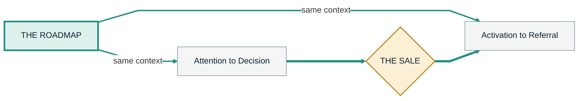
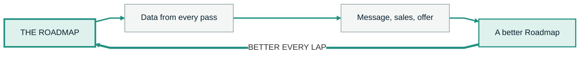

<!-- slide:s10-assemble-01 -->

SECTION 10 &middot; THE ASSEMBLY LINE

Most funnels are designed to find high-quality clients.

The Roadmap System is designed to assemble them.

<!--
HOOK: one verb changes the entire category. Find is a search problem. Assemble is a manufacturing problem.
BEATS:
  - Most funnels are designed to find high-quality clients. The Roadmap System is designed to assemble them.
TIMING: 12 sec
TRANSITION: and if it assembles them, it has to have stations. So here is the line, empty.
PACE: say the first half, click, then leave two full beats of silence on the second half. This is the thesis of the section and it is one sentence long.
-->

---

<!-- slide:s10-line-01 -->

NINE STATIONS

The line, before anything is on it.

<svg viewBox="0 0 340 44" class="w-full mt-16" xmlns="http://www.w3.org/2000/svg">
  <line x1="6" y1="30" x2="334" y2="30" stroke="#209080" stroke-width="4" stroke-linecap="round" />
  <g stroke="#7A9199" stroke-width="2">
    <line x1="26" y1="18" x2="26" y2="30" /><line x1="64" y1="18" x2="64" y2="30" />
    <line x1="102" y1="18" x2="102" y2="30" /><line x1="140" y1="18" x2="140" y2="30" />
    <line x1="178" y1="18" x2="178" y2="30" /><line x1="216" y1="18" x2="216" y2="30" />
    <line x1="254" y1="18" x2="254" y2="30" /><line x1="292" y1="18" x2="292" y2="30" />
    <line x1="322" y1="18" x2="322" y2="30" />
  </g>
</svg>

<!--
HOOK: an empty belt with nine bare posts. They will try to guess what goes on it, which is exactly the state you want them in.
BEATS:
  - Nine stations.
TIMING: 11 sec
TRANSITION: name the stations, one at a time, and do not rush a single one of them.
DRAW: tap each of the nine posts once, left to right, before you name anything. Silent. It sets the count in their head.
SOURCE: those two words are the only authored line in this section. The script has no dialogue on the empty belt. If Take Zero flows better with this frame held in silence, cut the line and keep the frame.
-->

---

<!-- slide:s10-line-02 -->

THE ASSEMBLY LINE

Nine stations. One client.

<v-clicks>

STATION 01

Attention

STATION 02

Self-recognition

STATION 03

Problem ownership

STATION 04

Belief shift

STATION 05

Meaningful action

STATION 06

Identity reinforcement

STATION 07

Readiness

STATION 08

Decision

STATION 09

Transformation

</v-clicks>

<!--
HOOK: the signature visual of the whole training. Nine stations, one per click, and the last one is the only teal card on the frame.
BEATS:
  - Attention. Self-recognition. Problem ownership. Belief shift. Meaningful action. Identity reinforcement. Readiness. Decision. Transformation.
TIMING: 23 sec
TRANSITION: now look at the state somebody is in when they step onto station one.
PACE: rhythm beat. Same cadence on all nine, no rising inflection, no commentary between them. The list IS the argument. Nine clicks, nine names, then stop and let the grid sit complete for two seconds before you say anything else.
DRAW: nothing here. The build is the animation. Do not annotate a slide that is already moving.
-->

---

<!-- slide:s10-enter-01 -->

HOW THEY ARRIVE

Nobody steps onto the line finished.

<v-clicks>

Interested but unclear

Skeptical

Distracted

At the wrong level of awareness

</v-clicks>

Each station adds context, conviction, participation, or readiness.

<!--
HOOK: four honest descriptions of a real lead. Every one of them is a defect the line is built to correct.
BEATS:
  - The person may enter interested but unclear, skeptical, distracted, or at the wrong level of awareness.
  - Each station adds context, conviction, participation, or readiness.
TIMING: 21 sec
TRANSITION: which means the sales call is not where the work happens.
-->

---
layout: center
class: text-center
---

<!-- slide:s10-sales-01 -->

You are not asking a cold prospect to become an ideal client in sixty minutes.

You have been assembling them the whole way.

<!--
HOOK: the single most expensive assumption in this industry is that a call can do this. Sixty minutes against months of belief is not a fair fight.
BEATS:
  - By the time they reach sales, you are not asking a cold prospect to become an ideal client in sixty minutes. You have been progressively assembling a high-quality client throughout the journey.
TIMING: 19 sec
TRANSITION: and there is a simpler way to say what assembling somebody actually means.
-->

---

<!-- slide:s10-runner-01 -->

THE RUNNER

One run, or a runner.

<v-clicks>

Help somebody run once

They may stop next month

Help somebody become a runner

Running becomes part of who they are

</v-clicks>

The same principle applies here.

<!--
HOOK: everybody already believes this about fitness. Borrow the belief they have and move it onto buying behaviour.
BEATS:
  - If you help somebody run once, they may stop next month. If you help them become a runner, running becomes part of who they are. The same principle applies here.
TIMING: 20 sec
TRANSITION: so the goal was never the click, the form, or the call.
-->

---

<!-- slide:s10-runner-02 -->

WHAT THEY BECOME

Not somebody who watched a video.

<v-clicks>

Understands the problem

Follows through

Accepts useful feedback

Participates in the solution

More likely to get the outcome

</v-clicks>

<!--
HOOK: five properties of a client, not five properties of a lead. The last one is the only one that matters to them and the first four are how you get it.
BEATS:
  - You are not only getting somebody to watch a video, fill out a form, book a call, or buy a product.
  - You are helping them become somebody who understands the problem, follows through, accepts useful feedback, participates in the solution, and is more likely to get the outcome.
TIMING: 31 sec
TRANSITION: and that last one is why I am comfortable calling this a high-integrity sales system.
-->

---

<!-- slide:s10-integrity-01 -->

HIGH INTEGRITY

It works on beliefs, in both directions.

<v-clicks>

Removes the beliefs that block

The same beliefs block the sale and block the transformation. They are not two problems

Installs the beliefs that move

Whether or not the person ever works with you

</v-clicks>

Not cornered. Not pressured. Better informed.

<!--
HOOK: the blocking belief and the failure belief are the same belief. That is the whole reason this can be ethical and still convert.
BEATS:
  - That is why this is a high-integrity sales system.
  - The Roadmap removes beliefs that block both the sale and the transformation, and installs beliefs that help the person move forward whether or not they ultimately work with you.
  - The person should leave more empowered and better informed. Not cornered. Not pressured. Not pushed into a program they are unlikely to use.
TIMING: 33 sec
TRANSITION: and when the sale does happen, the Roadmap does not disappear.
PACE: rehook lands on the transition line. Drop your volume on "not cornered, not pressured" instead of raising it.
-->

---
layout: center
class: text-center
---

<!-- slide:s11-bowtie-01 -->

SECTION 11 &middot; THROUGH THE SALE

Most funnel diagrams stop at the sale.

The Roadmap continues through it.

<!--
HOOK: every funnel picture they have ever seen ends at a credit card. That ending is why fulfilment feels like a different company.
BEATS:
  - Most funnel diagrams stop at the sale. The Roadmap continues through it.
TIMING: 10 sec
TRANSITION: here is the left-hand side, which is the half everybody already draws.
-->

---

<!-- slide:s11-left-01 -->

LEFT OF THE SALE

The half everybody already builds.

<v-clicks>

Attention

Entry

Consumption

Discovery

Decision

</v-clicks>

<!--
HOOK: five stations, and the fifth one is gold because it is the only gate on this side of the picture.
BEATS:
  - Attention. Entry. Consumption. Discovery. Decision.
TIMING: 14 sec
TRANSITION: now the side almost nobody diagrams, which is where the money actually gets kept.
DRAW: draw the belt line under the five cards, left to right, as you name them.
-->

---

<!-- slide:s11-right-01 -->

RIGHT OF THE SALE

The half that decides what the business is worth.

<v-clicks>

Activation

Fulfillment

Transformation

Retention

Ascension

Referral

</v-clicks>

<!--
HOOK: six stations past the sale. Most funnel builds have zero assets pointed at any of them.
BEATS:
  - Activation. Fulfillment. Transformation. Retention. Ascension. Referral.
TIMING: 15 sec
TRANSITION: and one asset runs the whole length of that picture.
-->

---

<!-- slide:s11-bowtie-02 -->

ONE CONTEXT, BOTH SIDES

The same map carries through the sale.

<!--
HOOK: the sale is a gate in the middle of one journey, not the finish line of one and the start line of another.
BEATS:
  - The Roadmap continues through it.
TIMING: 10 sec
SOURCE: restatement, not a new line. The full sentence was said three frames ago. Here you say only the second half, once, on the stroke.
TRANSITION: so what exactly travels across that gate? Six things.
DRAW: trace from the Roadmap node through the sale and out the right-hand side in one unbroken stroke. One stroke matters here. If you lift the pen, the point is gone.
-->

---

<!-- slide:s11-continuity-01 -->

WHAT TRAVELS WITH THEM

Sales already knows. Now delivery does too.

<v-clicks>

Their stated goal

Their current situation

Their constraints

Their commitments

Their language

Their expectations

</v-clicks>

<!--
HOOK: six fields that normally die on a sales call and get re-asked in week one of onboarding.
BEATS:
  - The same Roadmap can carry the person's stated goal, current situation, constraints, commitments, language, and expectations into the delivery team.
TIMING: 21 sec
TRANSITION: and that buys you three things at once.
-->

---

<!-- slide:s11-continuity-02 -->

THREE CONSEQUENCES

One asset, three problems solved.

<v-clicks>

Sales gets simpler

The call already has context

Training gets simpler

Everybody learns the same argument

Fulfillment gets congruent

They do not buy one promise and enter a different process

</v-clicks>

<!--
HOOK: the third one is the quiet killer of most programs. People churn because the thing they bought and the thing they entered were not the same thing.
BEATS:
  - That makes sales simpler because the call has context. It makes team training simpler because everybody learns the same argument. And it makes fulfillment more congruent because the client does not buy one promise and enter a completely different process.
TIMING: 24 sec
TRANSITION: which is only possible if the team is actually working from one version of the argument.
-->

---

<!-- slide:s11-team-01 -->

INTERNAL ENABLEMENT

The team cannot continue one argument if everybody learned a different version of it.

<v-clicks>

Copywriters

Media buyers

Setters

Closers

Customer success

Fulfillment

Leadership

One argument

</v-clicks>

The same asset teaches the audience, the sales process, and the team.

<!--
HOOK: this is the slide that turns a marketing asset into an operations asset. Same document, three jobs.
BEATS:
  - The team cannot continue one argument if every person learned a different version of it.
  - So the SAGE training and Roadmap also become internal enablement for copywriters, media buyers, setters, closers, customer success, fulfillment, and leadership.
  - The same central asset teaches the audience, the sales process, and the team.
TIMING: 37 sec
TRANSITION: and here is the part that makes the whole thing compound instead of just holding still.
-->

---
layout: center
class: text-center
---

<!-- slide:s12-loop-01 -->

SECTION 12 &middot; THE SELF-PROVING LOOP

Every person who moves through it produces information.

<!--
HOOK: say it flat. It sounds obvious until you see the list of what "information" actually means.
BEATS:
  - Every person who moves through the Roadmap produces information.
TIMING: 10 sec
TRANSITION: and this is what that information is. Not analytics. This.
-->

---

<!-- slide:s12-loop-02 -->

WHAT EVERY PASS PRODUCES

Eleven things you were guessing at last quarter.

<v-clicks>

Voice-of-customer language

Desired outcomes

Existing beliefs

Failed solutions

Objections

Drop-off points

Completion data

Booking behavior

Sales-cycle length

Client quality

Fulfillment patterns

</v-clicks>

<!--
HOOK: eleven data points, and only four of them are things a normal funnel dashboard can see.
BEATS:
  - Voice-of-customer language. Desired outcomes. Existing beliefs. Failed solutions. Objections. Drop-off points. Completion data. Booking behavior. Sales-cycle length. Client quality. Fulfillment patterns.
TIMING: 30 sec
TRANSITION: and none of that is worth anything sitting in a spreadsheet, so watch where it goes.
PACE: rhythm beat, same cadence on all eleven. Do not explain any single one of them here. The volume is the point.
-->

---

<!-- slide:s12-loop-03 -->

WHERE IT FLOWS BACK

Eight places, from one source.

<v-clicks>

The message

The FAQs

The emails

The content

The sales process

The offer

Onboarding

Product development

</v-clicks>

<!--
HOOK: eight surfaces that normally get updated on vibes, all fed from one source of truth.
BEATS:
  - That information flows back into the message, the FAQs, the emails, the content, the sales process, the offer, onboarding, and product development.
TIMING: 25 sec
TRANSITION: draw that as a loop and it is the mirror image of the picture we started this training with.
-->

---

<!-- slide:s12-loop-04 -->

THE OTHER LOOP

Same shape as The Restart. Opposite direction.

Feed it long enough and it becomes a conveyor belt.

<!--
HOOK: the restart loop and this loop are both circles. One of them costs you a year per lap and the other one pays you.
BEATS:
  - You keep feeding the system until it becomes a conveyor belt, an assembly line that produces higher-quality clients every day.
TIMING: 16 sec
TRANSITION: and after enough laps you stop guessing about four specific things.
DRAW: trace the return edge and say the label out loud. Then point back over your shoulder at where the red loop was. The audience remembers that picture.
-->

---

<!-- slide:s12-belt-01 -->

WHAT YOU KNOW AFTER ENOUGH LAPS

Four things you currently have an opinion about.

<v-clicks>

The economics

The sales cycle

Where the journey loses people

Which objections to move further up the funnel

</v-clicks>

<!--
HOOK: the difference between an opinion and a number is how many people have been through the same sequence.
BEATS:
  - You know the economics. You know the sales cycle. You know where the journey loses people. You know which objections to move further up the funnel.
TIMING: 20 sec
TRANSITION: so the decision at the end of a bad month changes completely.
-->

---
layout: center
class: text-center
---

<!-- slide:s12-belt-02 -->

Instead of throwing away the experiment and building another funnel,

you keep improving one central system.

It gets better every time somebody travels through it.

<!--
HOOK: this is the exact fork where the last ten years of their business were decided. Same data, two responses.
BEATS:
  - And instead of throwing away the experiment and building another funnel, you keep improving one central system.
  - All roads lead to the Roadmap. And the Roadmap gets better every time somebody travels through it.
TIMING: 21 sec
TRANSITION: now let me tell you where this actually came from, because it is not a theory we invented last week.
PACE: register change coming. Slow down on the last line and stop moving. The next beat is camera, not slides.
-->

---
layout: center
class: text-center
---

<!-- slide:s13-story-01 -->

WHERE THIS CAME FROM

This is not a funnel theory we invented last week.

<!--
HOOK: hard register change. Tactical to personal. The slide holds one line so the face carries the beat.
BEATS:
  - This is not a funnel theory we invented last week.
TIMING: 10 sec
TRANSITION: about ten years ago I was trying to build something completely different.
CAMERA: cut to talking head, full frame, from here to the end of this section. This is one of the two planned format changes in the deck. The slides behind you are a fallback, not the show.
-->

---

<!-- slide:s13-story-02 -->

ABOUT TEN YEARS

A long and occasionally ridiculous journey.

<v-clicks>

Gamification in cryptocurrency

Made money, lost money, overreached, failed, learned a lot

Corporate, sales training, closing programs

Marketing programs, software, SaaS economics, funnel strategy

Years of implementation across different offers and companies

</v-clicks>

<!--
HOOK: the failure goes first and it is the only ember card on the frame. A credential list that starts with a loss is a credential list people believe.
BEATS:
  - About ten years ago, I was trying to build a gamification service in cryptocurrency. I made money, lost money, overreached, failed, and learned a lot about progress, incentives, feedback, identity, and how people move through a sequence.
  - Then came corporate, sales training, closing programs, marketing programs, software, SaaS economics, funnel strategy, and years of implementation across different offers and companies.
TIMING: 34 sec
TRANSITION: and somewhere in the middle of all of that, there was a floor in Bangkok.
CAMERA: stay on camera. Let the cards build behind you in the corner treatment rather than cutting back to full slide.
-->

---
layout: center
class: text-center
---

<!-- slide:s13-story-03 -->

A floor in Bangkok. A WeWork. Milk in a cupboard.

There was no fridge.

<!--
HOOK: the humanising beat of the entire training. Do not dress it up and do not draw a lesson from it. The detail does the work on its own.
BEATS:
  - At one point I was sleeping on a floor in Bangkok, working from a WeWork, and drinking milk I had stored in a cupboard because I did not have a fridge.
  - It has been a long and occasionally ridiculous journey.
TIMING: 22 sec
TRANSITION: but the same principles kept appearing, no matter which of those things I was doing.
CAMERA: camera, full frame, and let yourself find this slightly funny. If you deliver this line as proof of hardship it dies. It is a joke at your own expense that happens to be true.
-->

---

<!-- slide:s13-principles-01 -->

WHAT KEPT APPEARING

Five things, in every market I worked in.

<v-clicks>

- People need to understand where they are
- They need to see where they are going
- They need a reason to take the next step
- The message has to remain congruent
- The system has to learn from what they do

</v-clicks>

<!--
HOOK: five principles that predate every tactic in this training. They are also the five things the Roadmap is made of, which is not a coincidence.
BEATS:
  - But the same principles kept appearing. People need to understand where they are. They need to see where they are going. They need a reason to take the next step. The message has to remain congruent. And the system has to learn from what they do.
TIMING: 30 sec
TRANSITION: and we kept seeing versions of this work.
-->

---

<!-- slide:s13-proof-01 -->

WE KEPT SEEING VERSIONS OF THIS WORK

Over $1.2M

Tracked across 2025 and 2026, one tutoring client

About $2.4M

Across the engagement, one email client

<!--
HOOK: two engagements, two figures, said in their exact approved wording and then left alone.
BEATS:
  - We kept seeing versions of this work.
TIMING: 10 sec
TRANSITION: and then we did what most founders do.
CLAIM LOCK: read these two figures exactly as written on the frame. "Over $1.2M tracked across 2025 and 2026" and "about $2.4M across the engagement". Do not round them, do not add a third number, and do not say "over a million" as shorthand. Two engagements carry these two numbers, so say "one client" out loud both times. Nothing on this frame implies a portfolio.
-->

---

<!-- slide:s13-restart-01 -->

AND THEN

We did what most founders do.

<v-clicks>

We got distracted

We switched models

We built another asset

We started learning from zero

</v-clicks>

We were in the loop too.

<!--
HOOK: the owned failure. Four ember cards with our name on them, in the same colour as every failure earlier in the deck.
BEATS:
  - We kept seeing versions of this work. Then we did what most founders do. We got distracted. We switched models, built another asset, and started learning from zero again.
TIMING: 23 sec
TRANSITION: eventually we decided to stop doing that.
PACE: no defensiveness and no comedy here. Flat delivery. This is the slide that earns the right to the last third of the training.
-->

---
layout: center
class: text-center
---

<!-- slide:s13-onesystem-01 -->

One system.

One central asset.

One place everything leads.

That is what we are building Funnel Futurist around.

<!--
HOOK: the decision, in three short sentences and one commitment. Callback to the "one thing" frame from earlier in the training, deliberately.
BEATS:
  - Eventually, we decided to stop doing that. One system. One central asset. One place everything leads.
  - That is the Roadmap System. And that is what we are building Funnel Futurist around.
TIMING: 21 sec
TRANSITION: so let me show you what installing it actually involves, because one part of it cannot be templated.
CAMERA: last camera beat of the section. Return to slides on the next frame.
-->

---
layout: center
class: text-center
---

<!-- slide:s14-install-01 -->

SECTION 14 &middot; HOW WE INSTALL IT

The structure can be templated.

The argument cannot.

<!--
HOOK: the honest limit of any done-for-you system, stated by us before anybody else says it.
BEATS:
  - The structure can be templated. The argument cannot.
TIMING: 10 sec
TRANSITION: and I want to be specific about what that rules out.
-->

---

<!-- slide:s14-install-02 -->

WHAT WE DO NOT DO

Two ways to arrive at a Roadmap.

<v-clicks>

Take a generic script, replace the company name

And call it a proprietary funnel

Build the foundational argument first

Then build the Roadmap on top of it

</v-clicks>

<!--
HOOK: everybody in the audience has bought the left-hand card at least once. Name it precisely enough that they recognise the receipt.
BEATS:
  - We do not take a generic script, replace the company name, and call it a proprietary funnel.
  - Before the Roadmap is built, we build the foundational argument underneath it. We get inside the head of the buyer.
TIMING: 22 sec
TRANSITION: and getting inside the head of the buyer comes down to two questions.
-->

---
layout: center
class: text-center
---

<!-- slide:s14-buyer-01 -->

What do they comfortably say they want?

And what is the private reason underneath it?

The thing they think about lying in bed, staring at the ceiling, when nobody else is there to hear it.

<!--
HOOK: the two-layer question. The first answer goes in the testimonial. The second answer is what actually makes somebody buy.
BEATS:
  - What do they comfortably say they want? And what is the private reason underneath that? The thing they think about when they are lying in bed, staring at the ceiling, and nobody else is there to hear it.
TIMING: 22 sec
TRANSITION: from those two answers we map seven things.
PACE: slowest frame in this section. Full stop after the second question before you click the third line. Then almost whisper the third line.
-->

---

<!-- slide:s14-map-01 -->

WHAT WE MAP

Seven layers, before a single page is written.

<v-clicks>

The visible symptoms

The root problem

The failed solutions

The new mechanism

The required beliefs

The desired identity

The honest path to the outcome

</v-clicks>

<!--
HOOK: seven layers, and the last one is teal because it is the only one the client can be held to.
BEATS:
  - We map the visible symptoms, the root problem, the failed solutions, the new mechanism, the required beliefs, the desired identity, and the honest path to the outcome.
  - Then we create a strong first draft.
TIMING: 28 sec
TRANSITION: but a strong first draft is not written the same way for every market.
-->

---

<!-- slide:s14-voice-01 -->

NOT ONE VOICE FOR EVERY MARKET

The structure holds. The writing does not.

<v-clicks>

- B2B is not written exactly like B2C
- Health is not written exactly like wealth or relationships
- A sophisticated niche market is not written like a broad consumer market
- Selling to men and selling to women may need different language, framing and emotional weighting

</v-clicks>

Without reducing anybody to a stereotype.

<!--
HOOK: four real differences, then the guardrail. The guardrail is not a disclaimer, it is the standard.
BEATS:
  - B2B is not written exactly like B2C. Health is not written exactly like wealth or relationships. A sophisticated niche market is not written like a broad consumer market.
  - And selling to men or selling to women may require different language, framing, emotional weighting, and front-end naming without reducing anybody to a stereotype.
  - We have templated sections, scripts, assets, and matrices to do the heavy lifting.
TIMING: 38 sec
TRANSITION: then we sit down with the client and go through the entire thing.
-->

---

<!-- slide:s14-client-01 -->

THEN WE GO THROUGH IT WITH THEM

Five questions, line by line.

<v-clicks>

What sounds like you?

What would you never say?

Where do you naturally explain it better?

What feels untrue?

What needs proof?

The strongest version of what they already believe

</v-clicks>

<!--
HOOK: two of these five questions are looking for reasons to delete our own work. That is what makes the other three worth answering.
BEATS:
  - Then we go through the entire thing with the client. What sounds like you? What would you never say? Where do you naturally explain it better? What feels untrue? What needs proof?
  - We refine it until it feels like the strongest, clearest version of what they already believe.
TIMING: 32 sec
TRANSITION: and then the market gets a vote, which is the pass most people never run.
-->

---

<!-- slide:s14-three-01 -->

THREE PASSES

Then the market makes it better.

<v-clicks>

PASS ONE

We write the first complete version

PASS TWO

The client makes it true to their voice

PASS THREE

The market makes it increasingly resonant

</v-clicks>

<!--
HOOK: three passes, and only the third one never finishes.
BEATS:
  - Then the market makes it better. We write the first complete version. The client makes it true to their voice. The market makes it increasingly resonant.
TIMING: 19 sec
TRANSITION: so the implementation itself is simple to understand. Three phases.
-->

---
layout: center
class: text-center
---

<!-- slide:s15-simple-01 -->

SECTION 15 &middot; THE IMPLEMENTATION

The implementation is simple to understand.

<!--
HOOK: a complicated install is a red flag, so say the opposite out loud before you show the three phases.
BEATS:
  - The implementation is simple to understand.
TIMING: 11 sec
TRANSITION: three phases, and here they are.
-->

---

<!-- slide:s15-ivs-01 -->

THREE PHASES

Install. Validate. Scale.

<v-clicks>

ONE

Install

Built at the level you would want it built if you were already an expert

TWO

Validate

Run it and collect useful data, not opinions

THREE

Scale

Distribution into one validated system

</v-clicks>

<!--
HOOK: three words. The whole implementation fits on one frame, and the next three slides just open each one up.
BEATS:
  - One: Install. Two: Validate. Three: Scale.
TIMING: 11 sec
TRANSITION: so what actually gets installed in phase one?
SOURCE: the script's three phase labels, read as an overview before each phase is expanded. The full sentences for each one live on the next three frames.
-->

---

<!-- slide:s15-install-01 -->

ONE &middot; INSTALL

Six pieces, built for you.

<v-clicks>

The expert version of the argument

The Roadmap

The checkpoints

The follow-up

The sales handoff

The measurement system

</v-clicks>

You do not have to become a funnel technician first.

<!--
HOOK: six deliverables, and the reason the list matters is the sentence after it. Nothing here waits on the client learning software.
BEATS:
  - One: Install. We install the expert version of the argument, the Roadmap, the checkpoints, the follow-up, the sales handoff, and the measurement system.
  - Not so the client has to become a funnel technician before anything can go live. We build the first version at the level they would want it built if they were already an expert.
TIMING: 38 sec
TRANSITION: then we run it, and we watch specific things.
-->

---

<!-- slide:s15-validate-01 -->

TWO &middot; VALIDATE

Useful data. Not random opinions.

Left of the sale

<v-clicks>

- Message response
- Consumption
- Checkpoint completion
- Bookings
- Show rate
- Sales
- Client quality

</v-clicks>

Then across the bowtie

<v-clicks>

- Activation
- Retention
- Ascension
- Referral

</v-clicks>

Not one bad day interpreted as a failed model.

<!--
HOOK: seven readable measures, then the discipline line. One bad day is the most expensive misread in this business, because it triggers the restart.
BEATS:
  - Two: Validate. Then we run it and collect useful data. Not random opinions. Not one bad day interpreted as a failed model.
  - Message response. Consumption. Checkpoint completion. Bookings. Show rate. Sales. Client quality. And eventually activation, retention, ascension, and referral across the bowtie.
TIMING: 35 sec
TRANSITION: and once the message and the economics are readable, phase three is almost boring.
CLAIM LOCK: no improvement figures, no percentages, no benchmark numbers on this beat. Name the measures only. The cohort evidence does not exist yet and this is the exact slide where it would be tempting to imply it does.
-->

---

<!-- slide:s15-scale-01 -->

THREE &middot; SCALE

Scale becomes distribution.

<v-clicks>

Add channels

Increase spend

Increase organic volume

Add awareness-state entrances

Add retargeting

Add sales capacity

</v-clicks>

Not more random funnels.

<!--
HOOK: six levers, and every one of them is volume rather than reinvention. That is what "scale" is supposed to mean and almost never does.
BEATS:
  - Three: Scale. Once the message and economics are readable, scale becomes distribution. Add channels. Increase spend. Increase organic volume. Add awareness-state entrances. Add retargeting. Add sales capacity. Push more of the right people through one validated system.
  - More distribution into one validated client-production system. Not more random funnels.
TIMING: 34 sec
TRANSITION: which brings me to the actual thesis of this whole training.
-->

---
layout: center
class: text-center
---

<!-- slide:s16-thesis-01 -->

SECTION 16 &middot; THE THESIS

The future of funnels is not another fixed funnel model.

It is a self-proving Roadmap System.

<!--
HOOK: the thesis, stated once, plainly. Everything in the training up to now was the argument for this sentence.
BEATS:
  - Our thesis is that the future of funnels is not another fixed funnel model. It is a self-proving Roadmap System.
TIMING: 14 sec
TRANSITION: and self-proving means four specific things.
-->

---

<!-- slide:s16-thesis-02 -->

FOUR THINGS AT ONCE

What self-proving actually means.

<v-clicks>

Meets people where they are

Moves them through one coherent belief journey

Gets them participating before the sale

Improves every time somebody passes through it

</v-clicks>

<!--
HOOK: four properties, and the fourth is the only one no fixed funnel model has ever had.
BEATS:
  - It is a self-proving Roadmap System that meets people where they are, moves them through one coherent belief journey, gets them participating before the sale, and improves every time somebody passes through it.
TIMING: 24 sec
TRANSITION: and there is a shorter way to say all four of those.
-->

---
layout: center
class: text-center
---

<!-- slide:s16-thesis-03 -->

An assembly line for producing high-quality clients.

<!--
HOOK: the title of the training, arriving as a conclusion instead of a promise. Nothing else on the frame.
BEATS:
  - It is an assembly line for producing high-quality clients.
TIMING: 10 sec
TRANSITION: and right now we are installing this with a small group of businesses.
PACE: one line, one breath, stop. Do not add a summary sentence after it.
-->

---

<!-- slide:s16-cohort-01 -->

WHAT WE ARE DOING RIGHT NOW

A small cohort of established service businesses.

<v-clicks>

Install the SAGE Roadmap System across their offers

Document the implementation

Build the next generation of case studies

</v-clicks>

<!--
HOOK: say what the cohort is for, including what we get out of it. The documentation is the trade and it should be said out loud.
BEATS:
  - We are currently working with a small cohort of established service businesses to install the SAGE Roadmap System across their offers, document the implementation, and build the next generation of case studies.
TIMING: 21 sec
TRANSITION: and the fit for that is quite specific, so here it is.
-->

---

<!-- slide:s16-fit-01 -->

THE RIGHT FIT

Five things that have to already be true.

<v-clicks>

- A real offer that already gets results
- Some audience, customer base, traffic or lead flow
- They know the current journey is more fragmented than it should be
- They care about producing better clients, not only generating more leads
- They will implement, share feedback, and hold the sequence long enough to validate it

</v-clicks>

<!--
HOOK: five qualifiers, and the fifth one disqualifies more people than the other four combined. Say it without softening it.
BEATS:
  - The right fit already has a real offer that gets results. They have some audience, customer base, traffic, or lead flow. They know the current journey is more fragmented than it should be. They care about producing better clients, not only generating more leads. And they are willing to implement, share feedback, and hold the sequence long enough to validate it.
TIMING: 36 sec
TRANSITION: but you do not have to decide any of that right now.
-->

---

<!-- slide:s16-decide-01 -->

NOTHING TO DECIDE YET

Go through the Roadmap first.

<v-clicks>

See how it feels

Notice what it helps you understand

Ask how your own leads would experience it

Then decide, with the information instead of without it

</v-clicks>

<!--
HOOK: the pressure comes off here, completely and audibly. The ask is to experience the thing, which is also the demonstration.
BEATS:
  - But you do not need to decide whether you want us to install anything right now.
  - Go through the Roadmap first. See how it feels. Notice what it helps you understand. Ask how your own leads would experience it. And make a better-informed decision after you have the information than you could make before it.
TIMING: 32 sec
TRANSITION: so here is the one thing to do.
-->

---
layout: center
class: text-center
---

<!-- slide:s16-cta-01 -->

ONE ACTION

Get your Roadmap.

funnelfuturist.com/roadmap

Or the first link in the description.

<!--
HOOK: one action, no urgency, no button, no bonus stack. The asset already did the selling and a hard close here would contradict the whole argument.
BEATS:
  - If you have not got your Roadmap already, use the link below or go to the Roadmap page on our site and pick it up.
TIMING: 16 sec
TRANSITION: one line left, and it is the line this whole training has been walking toward.
CTA LOCK: ONE action in the body of the video. The "DM us ROADMAP" version is an end cap, filmed separately for the social cut, and must not be said here. Never turn this into a booking ask.
URL: read the URL out loud once, slowly, while it is on screen. Confirm the exact route with John before recording. Two Roadmap routes exist on the site and only one of them is the one to send people to.
-->

---
layout: center
class: peak text-center
---

<!-- slide:s16-final-01 -->

All roads lead to the Roadmap.

And the Roadmap is where high-quality clients are assembled.

<!--
HOOK: the last frame of the asset. Dark ground, two sentences, nothing else, ever.
BEATS:
  - All roads lead to the Roadmap. And the Roadmap is where high-quality clients are assembled.
TIMING: 12 sec
TRANSITION: end of the main body. End caps splice in after this frame, per placement.
PACE: fourth and final peak frame in the deck. Say the first sentence, click, hold two beats, then say the second. Do not smile it away and do not add a sign-off. Silence for three seconds after the last word, then cut.
-->
