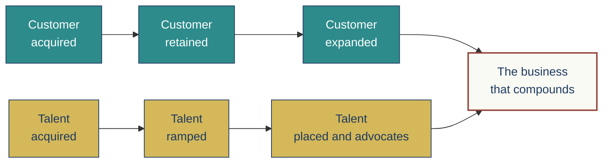
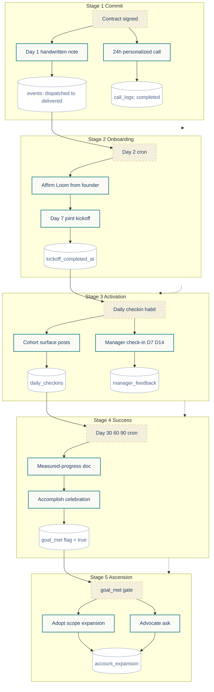

<!-- slide:cover-01 -->

Customer Journey Optimization, Overview

<h1 style="font-size: 4.2rem; color: white; letter-spacing: -0.03em;">
The 4-Pillar Journey Framework
</h1>

Five stages. Four pillars. Three motions. Built to make journeys that compound, not just convert.

JOBURN, INTERNAL TRAINING, 2026-06-17

<!--
COLD OPEN. State the framework by name. The deck teaches a system, not a pitch.
This is internal training format, not a webinar. Pace: slow opening. Hold the
title for 10 seconds. Set the frame: we are going to teach the system that
turns one-time buyers into long-term advocates.
-->

---
layout: default
---

<!-- slide:diagnosis-02 -->

The diagnosis

<h1 class="cjo-h1" style="margin-bottom: 1.2rem;">Why journeys leak</h1>

Most companies have a few moments without triggers, or actions without tracking. Each missing pillar produces a named failure mode. Find the leak, name the pillar that is missing, fix the structure.

<v-clicks>

Empathy without triggers

You know what they need to feel. The moment never fires because nothing in your system is watching for the condition that should fire it.

Triggers without actions

The system detects the moment. The send queue is empty. The Day 7 check-in never lands because no one wired the surface.

Actions without tracking

The Day 30 review fires. Nobody knows if it was received, opened, or worked. The journey cannot learn from a moment it cannot measure.

Tracking without empathy

The dashboard is full. The moments score high on completion and low on meaning. The relationship dies politely on schedule.

</v-clicks>

<!--
DIAGNOSTIC FRAME. Each leak corresponds to a missing pillar. The lesson is
structural, not motivational. Four v-clicks, one beat each, one per missing
pillar. Set up the framework reveal.
-->

---
layout: default
---

<!-- slide:double-bowtie-03 -->

The macro frame

<h2 class="cjo-h2">Every business runs two bowties in parallel</h2>

The customer bowtie buys, retains, expands. The talent bowtie hires, ramps, places, advocates. Most founders only see the first one. The leak in the second one is invisible until headcount stops scaling.

<!--
DOUBLE BOWTIE. The visual sets up the macro frame. The 4 pillars and the
5-stage spine apply to BOTH bowties. We teach the customer side in this deck;
the talent side is the cyborgtalent worked example later.
-->

---
layout: default
---

<!-- slide:five-stage-spine-04 -->

The structure

<h2 class="cjo-h2">The 5-stage spine every journey runs on</h2>

Stages run in order. You cannot Stage 5 your way out of a broken Stage 2. If retention leaks at Day 30, the fix lives in stages 2 or 3, not in adding more advocacy mechanics at the end.

<v-clicks>

STAGE 1
Commit, Payment

STAGE 2
Onboarding, Orientation

STAGE 3
Activation

STAGE 4
Customer Success

STAGE 5
Ascension, Advocacy

</v-clicks>

Coleman: Admit

Affirm + Activate

Acclimate

Accomplish

Adopt + Advocate

The locked sequencing rule
Run the stages in order. Diagnose leaks by working backward from the visible failure to the missing structure.

<!--
THE SPINE. Five v-clicks, one per stage. The Coleman row underneath shows the
8 phases collapsing into our 5 stages. The callout locks the rule.
-->

---
layout: default
---

<!-- slide:bookends-05 -->

The bookends

<h2 class="cjo-h2">Stage 0 and Stage 6, the moments most teams skip</h2>

The spine assumes the relationship starts at Stage 1 and ends at Stage 5. Real engagements start before the contract is signed and continue after it closes. Without bookends, the front and back leak.

<v-clicks>

Stage 0, Sales to CS handoff

Context survives the transition

Every promise the closer made gets captured before the handshake dries. Three-way intro call inside 72 hours. The buyer never has to re-explain themselves on Day 1.

Stage 6, Exit Journey

The relationship continues past the contract

Cancel ritual within 48 hours, no save attempt. Exit interview. 30 / 60 / 90 day win-back ladder. Alumni nurture. Re-acquisition rates from alumni run 3 to 5 times cold cohorts.

</v-clicks>

Why the bookends are load bearing
Honest exit interviews surface the real breakage in stages 2 to 4 that no satisfaction survey will catch. The bookends pay for themselves twice.

<!--
BOOKENDS. Stage 0 and Stage 6 added in v1.1. Two v-clicks, one per bookend.
Speaker note: most teams design 1-5 and silently break 0 and 6.
-->

---
layout: default
---

<!-- slide:motion-types-06 -->

v1.3 framing, new this cycle

<h2 class="cjo-h2">The journey forks by motion type</h2>

The 5-stage spine stays. The default triggers, action surfaces, and channels change based on how the deal moves through the cycle. Pick the motion before you pick the moments.

<v-clicks>

Product led

PLG

User discovers, activates, buys themselves. Stage 1 commit is in-app, not a closing call. Activation is product driven. Default for SaaS, low-ticket subscription, B2C apps.

Sales led

SLG

Sales team drives the cycle. Stage 1 commit is the close call. Heavy Coleman Affirm requirement post-close. Default for coaches, consultants, agencies, high-ticket B2B, enterprise.

Marketing led

MLG

Marketing drives the cycle with sales support. Stage 1 commit is form driven with sales triage. Lead nurture is dominant. Default for hybrid B2B mid-market, content-driven funnels.

</v-clicks>

Implication for the master flow
Same 5 stages. Three different default templates. The Master Flow table forks by motion. We show all three so the operator picks the right one for their cycle.

<!--
MOTION TYPES. New v1.3 framing. Three v-clicks. Lock the language: PLG, SLG,
MLG. The slide is the bridge between "the spine is universal" (stages don't
change) and "the execution is context dependent" (everything else does).
-->

---
layout: default
---

<!-- slide:pillar-1-07 -->

Pillar 1 of 4

<h2 class="cjo-h2">Key Moments. What do we want them to feel?</h2>

The user does not remember features. They remember moments. Empathy mapping is the design lens that prevents technically correct but emotionally cold journeys.

<v-clicks>

THINK / FEEL / SAY

The human state

What is going through their head? What is the dominant emotion? What would they say out loud to a peer right now?

DO / HEAR / SEE

The context

What action are they taking? What are they hearing from people around them? What are they looking at on screen?

PAIN / GAIN / DOPAMINE

The curve

What is the dominant friction? What would feel like a win? Where are they on the dopamine curve, peak, collapse, neutral, high?

</v-clicks>

First person line per moment
For each moment, write one sentence in the user voice. I just signed and I am wondering if I made a mistake. That sentence surfaces design gaps faster than any framework discussion.

<!--
PILLAR 1. Empathy mapping is the load-bearing skill. Three v-clicks group
the 9 empathy-map dimensions into bundles that fit the slide. Speaker note:
the dopamine state is the most important dimension; map every transition
against the curve.
-->

---
layout: default
---

<!-- slide:pillar-2-08 -->

Pillar 2 of 4

<h2 class="cjo-h2">Triggers. What fires each moment?</h2>

Every moment has exactly one trigger. Default to the lowest friction type that produces the right semantic. Event beats time beats state beats manual.

<v-clicks>

Type 1

Event based

A specific event lands in the database. Contract signed, first login, first deliverable shipped, payment posted.

Type 2

Time based

Day N relative to an anchor. Day 7 check-in. Day 30 review. Day 100 celebration. One canonical anchor per engagement.

Type 3

State based

A composite condition crosses a threshold. Health score yellow, goal-met flag flips, churn-risk above 0.6.

Type 4

Manual

A human deliberately fires the moment. Named owner, named SLA, audit row. A smell if it scales.

</v-clicks>

The cascade
Event beats time beats state beats manual. Each step down loses fidelity and gains operational cost. Manual without an owner is a journey that decays the moment the named human takes a vacation.

<!--
PILLAR 2. Four trigger types. Four v-clicks, one per type. The cascade is the
load-bearing principle: lowest friction trigger that produces the right
semantic. Speaker: walk through the failure modes briefly if time allows.
-->

---
layout: default
---

<!-- slide:pillar-3-09 -->

Pillar 3 of 4

<h2 class="cjo-h2">Actions. Where does the moment ship from?</h2>

Each action surface has its emotional weight. The right surface depends on what the moment is doing. Physical mail signals care that an email cannot. A 90 second Loom outperforms a 1500 word email for an Affirm moment.

<table class="cjo-table">
<thead>
<tr>
<th>Surface</th>
<th>What it does</th>
<th>When to use it</th>
</tr>
</thead>
<tbody>
<tr><td>Physical mail</td><td>Handwritten note, certificate, welcome artifact</td><td>Stage 1 Admit, Stage 4 Accomplish certificate. Unbypassable.</td></tr>
<tr><td>Loom video</td><td>Personalized 90 sec founder video</td><td>Stage 2 Affirm. Day 30 / 60 / 90 milestone. Recorded once per cohort, sent automatically.</td></tr>
<tr><td>Live call</td><td>24 hour welcome call, kickoff, milestone review</td><td>Stage 1 / 2 / 4 high-stakes moments. Voice and tone matter.</td></tr>
<tr><td>Email</td><td>Cadence touchpoints, milestone announcements</td><td>Stage 2 to 4 recurring digests, structured stage transitions.</td></tr>
<tr><td>SMS</td><td>Time sensitive nudges, confirmations</td><td>Stage 1 confirmations, Stage 4 reminders. Use sparingly.</td></tr>
<tr><td>Slack / community</td><td>Cohort recognition, tribal identity</td><td>Stage 3 / 4 peer recognition, identity reinforcement.</td></tr>
<tr><td>In-app prompt</td><td>Product-led activation nudges</td><td>PLG motion Stage 2 / 3. Replaces kickoff call.</td></tr>
<tr><td>Dashboard</td><td>Owned, internal-facing progress surface</td><td>Stage 4 measurement, founder visibility into outcomes.</td></tr>
</tbody>
</table>

<!--
PILLAR 3. The action surfaces. Static table, no v-clicks (already dense). The
table is the reference; speaker walks through 2-3 rows of greatest interest.
-->

---
layout: default
---

<!-- slide:pillar-4-10 -->

Pillar 4 of 4

<h2 class="cjo-h2">Tracking. How do we know it landed?</h2>

Every moment writes a tracking event. Every event feeds a dashboard. Every dashboard feeds a calibration loop. Without this loop, the journey cannot learn.

The schema

-- One canonical events table 
CREATE TABLE journey_events ( 
&nbsp;&nbsp;id uuid PRIMARY KEY, 
&nbsp;&nbsp;engagement_id uuid NOT NULL, 
&nbsp;&nbsp;stage text NOT NULL, 
&nbsp;&nbsp;moment_id text NOT NULL, 
&nbsp;&nbsp;track text NOT NULL, 
&nbsp;&nbsp;fired_at timestamptz NOT NULL, 
&nbsp;&nbsp;delivered_at timestamptz, 
&nbsp;&nbsp;acknowledged_at timestamptz, 
&nbsp;&nbsp;status text NOT NULL, 
&nbsp;&nbsp;trigger_type text NOT NULL, 
&nbsp;&nbsp;action_surface text NOT NULL, 
&nbsp;&nbsp;cost_usd numeric, 
&nbsp;&nbsp;metadata jsonb 
);

<v-clicks>

v_journey_health

Per-engagement composite. Stage completion, days since last event, acknowledged-vs-dispatched ratio, goal-met flag.

v_advocate_unlock

Boolean per engagement. True only when goal_met = true AND accomplish_celebrated_at IS NOT NULL. The Advocate-ask gate.

v_cohort_progression

Cohort-level rollup. Powers the wins-of-the-week post, the cohort-call agenda, the tribal-recognition surface.

</v-clicks>

<!--
PILLAR 4. Schema on the left, computed views on the right. Three v-clicks
reveal the three views. The advocate-unlock view is the load-bearing one,
the gate between Stage 4 and Stage 5.
-->

---
layout: default
---

<!-- slide:pillars-aligned-11 -->

The 4 pillars in alignment

<h2 class="cjo-h2">One complete moment: the Day 1 founder note</h2>

Pillar 1, Key Moment

Day 1 dopamine peak catch. Founder writes a personal note that arrives same-day, references the stated 100-day goal.

Pillar 2, Trigger

Event based. contract_signed_at IS NOT NULL AND day1_note_sent_at IS NULL. Fires within 2 hours.

Pillar 3, Action

Handwrytten API via Make scenario. Founder-personal carve-out for top 1 to 3 notes per week. Cost ~5 USD per note.

Pillar 4, Tracking

journey_events row at dispatch. Status update at vendor mail_delivered webhook. Failure alert to ops Slack if 7 days silent.

moment_id: day1_founder_handwritten_note 
stage: 1_commit 
track: founder 
trigger: 
&nbsp;&nbsp;type: event-based 
&nbsp;&nbsp;condition: "contract_signed_at NOT NULL" 
&nbsp;&nbsp;expected_latency_hours: 2 
action: 
&nbsp;&nbsp;surface: handwrytten_api 
&nbsp;&nbsp;via: make_scenario "ct-day1" 
&nbsp;&nbsp;cost_usd: 5.00 
voice_lock: 
&nbsp;&nbsp;ref: "voice_dna_v1.md" 
&nbsp;&nbsp;voice_qc_skill: voice_qc 
tracking: 
&nbsp;&nbsp;fire_event: "INSERT journey_events..." 
&nbsp;&nbsp;success_event: "webhook mail_delivered" 
&nbsp;&nbsp;failure_alert: "slack ops if 7d silent" 
fallback: "founder writes personally"

<!--
PILLARS ALIGNED. One worked moment with all 4 pillars filled in. Left side is
the human-readable explanation, right side is the YAML manifest that the
implementation team gets. This is the deliverable target: 80 percent
executable infrastructure, 20 percent strategic prose.
-->

---
layout: default
---

<!-- slide:empathy-dopamine-12 -->

The empathy overlay

<h2 class="cjo-h2">Map every transition against the dopamine curve</h2>

Coleman's whole framework rests on the dopamine asymmetry. The seller exits high. The buyer collapses inside 48 hours. The gaps between states are where the load-bearing moments live.

```mermaid
flowchart LR
    classDef high fill:#2E8B8B,color:#fff,stroke:#1E3A5F
    classDef collapse fill:#94463B,color:#fff,stroke:#1E3A5F
    classDef neutral fill:#cbd5e1,color:#1E3A5F,stroke:#51688a
    classDef peak fill:#D4B85A,color:#1E3A5F,stroke:#1E3A5F

    P1[Pre-buy<br/>curiosity]:::neutral --> P2[Commit<br/>dopamine peak]:::high
    P2 --> P3[Hour 2-48<br/>collapse window]:::collapse
    P3 --> P4[Day 7<br/>ability building]:::neutral
    P4 --> P5[Day 30<br/>first small win]:::peak
    P5 --> P6[Day 60<br/>midpoint doubt]:::collapse
    P6 --> P7[Day 100<br/>goal achieved]:::peak
    P7 --> P8[Day 100+<br/>advocacy]:::high
```

PEAK Stage 1 commit, Stage 4 win.

COLLAPSE Affirm window, Day 60 midpoint.

NEUTRAL Pre-buy, Day 7 ability build.

HIGH Day 100+ advocate willing.

<!--
DOPAMINE OVERLAY. The map is the second view of the journey. Where the chart
goes red is where the moments must catch them. Speaker: walk through the
hour-2-to-48 collapse window and the Day 60 midpoint doubt as the two most
common failure points.
-->

---
layout: default
---

<!-- slide:hero-journey-flow-13 -->

HERO VISUAL

<h2 class="cjo-h2">The full journey, all 4 pillars across all 5 stages</h2>

<!--
HERO VISUAL ONE. The full flowchart. 5 swimlanes. Moments as nodes, triggers
as dashed conditions, tracking as side notes. This is the chart we walk
clients through in the workshop. No v-clicks; the chart is the moment.
-->

---
layout: default
---

<!-- slide:master-flow-table-14 -->

The Master Flow, scaffolded onto our spine

<h2 class="cjo-h2">Stage by stage, all four pillars in one row</h2>

<table class="cjo-table">
<thead>
<tr>
<th>Stage</th>
<th>Trigger</th>
<th>Action</th>
<th>Timing</th>
<th>Channel</th>
<th>Tracking</th>
<th>Motion variant</th>
</tr>
</thead>
<tbody>
<tr><td>1 Commit</td><td>contract_signed</td><td>Handwritten note + 24h call</td><td>0-24 h</td><td>Mail + phone</td><td>events row + call_log</td><td>PLG: in-app welcome</td></tr>
<tr><td>2 Onboard</td><td>Day 2 cron</td><td>Affirm Loom + joint kickoff</td><td>2-7 d</td><td>Loom + video call</td><td>kickoff_completed_at</td><td>PLG: product tour</td></tr>
<tr><td>3 Activate</td><td>first_meaningful_action</td><td>Cohort posts + manager check-in</td><td>7-30 d</td><td>Slack + call</td><td>daily_checkins</td><td>PLG: in-app nudges</td></tr>
<tr><td>4 Success</td><td>Day 30 / 60 / 90 cron</td><td>Measured-progress review + celebration</td><td>30-100 d</td><td>Doc + Loom + call</td><td>goal_met flag</td><td>PLG: usage milestones</td></tr>
<tr><td>5 Ascend</td><td>goal_met = true</td><td>Scope expansion + advocate ask</td><td>100 d +</td><td>Call + case study</td><td>account_expansion</td><td>PLG: tier upgrade prompt</td></tr>
</tbody>
</table>

How to read this
The first 6 columns are the default Sales-led template. The Motion variant column shows the PLG fork. Same stage, different surface. Same physics, different execution.

<!--
MASTER FLOW. The reference table. Pull from the mega doc, scaffolded onto
our 5-stage spine. The motion variant column shows the PLG fork. Speaker:
walk one row, then point at the variant column for the contrast.
-->

---
layout: default
---

<!-- slide:tool-tier-15 -->

Tool-tier adaptation

<h2 class="cjo-h2">The same moment, three different stacks</h2>

Constraints set the tier. Budget, existing stack, team capacity, engagement count, latency. Mix tiers freely within one journey. The Day 1 note can be Tier 1, the Day 60 review Tier 3.

<v-clicks>

Tier 1

Bootstrap, DIY

~50 USD per engagement

Founder writes the Day 1 note. Google Sheets tracks moments. Gmail + Calendly + Loom-recorded-once. 1 to 5 engagements per month.

Tier 2

Solo founder, small agency

~200 to 700 USD per engagement

Scribeless robot-pen. Airtable or Notion CRM. Resend email. Make scenarios for cross-system. 5 to 20 engagements per month.

Tier 3

Pro agency, scaled

~700 to 1,500 USD per engagement

Handwrytten API. GHL workflows. Postgres journey_events. Make scenarios. Edge functions for goal-met flag. 20+ engagements per month.

</v-clicks>

The DIY-always-works fallback
Every prescribed surface has a DIY fallback. Even at Tier 3, the founder personally writes the Day 1 note for the top 10 accounts. Coleman's pattern, not a downgrade.

<!--
TOOL TIERS. Three v-clicks, one per tier. The fallback callout is important:
even at Tier 3, the founder-touch on top accounts is a feature, not a
fallback. Speaker: walk through which moments stay Tier 1 forever (the Day
1 founder note for high-stakes accounts).
-->

---
layout: default
---

<!-- slide:frameworks-attribution-16 -->

Frameworks layered, attribution honest

<h2 class="cjo-h2">What is theirs, what is ours</h2>

We stand on three load-bearing thinkers and we name them. We also name where our framework extends theirs. The lineage is owned, not laundered.

<v-clicks>

Joey Coleman

First 100 Days framework, 8 phases

Assess, Admit, Affirm, Activate, Acclimate, Accomplish, Adopt, Advocate. Owns the dopamine-asymmetry physics and the first-date-parents principle.

OUR EXTENSION, Accomplish-gate on goal_met flag (programmatic Advocate-ask tripwire)

BJ Fogg

Two distinct models, two distinct jobs

B=MAP (Motivation + Ability + Prompt) fires a single behavior at a single moment. Tiny Habits (anchor + tiny behavior + celebration) installs a recurring habit. Most write-ups blur them, we do not.

OUR DISCIPLINE, separate use for Stage 3 prompts vs Acclimate-window habits

Chip and Dan Heath

Power of Moments, 4 ingredients

Elevation, Insight, Pride, Connection. The Heaths define what makes a moment memorable. They do not prescribe a numeric scoring system.

OUR HEURISTIC, the 2 / 3 / 4 ingredient threshold triage is ours, built on Heath's ingredients

Russell Brunson + John

Ascension language, contextual rejection

Stage 5 Ascension borrows Brunson's direct-response language on top of Coleman's Adopt. We also contextually reject Hooked-Model variable-reward in B2B paying-buyer settings, not as universal ethics.

OUR FRAMING, layered language + named exclusion lines

</v-clicks>

<!--
FRAMEWORKS LAYERED. Four v-clicks. Each card shows WHO owns the original
framework and WHERE we extend it. This is the attribution-honesty slide. We
do not pretend Coleman invented the Accomplish-gate flag. We do not pretend
Heath invented the 2/3/4 score. We name our extensions explicitly.
-->

---
layout: default
---

<!-- slide:anti-patterns-17 -->

Anti-patterns to reject on sight

<h2 class="cjo-h2">Future feature proposals that hit any of these get killed, not considered</h2>

x Pull-to-refresh randomness, variable-reward mechanics. Contextual rejection in B2B paying-buyer settings.

x Streak punishment, loss-aversion mechanics. Engineers compulsion through fear.

x Cheap branded swag. Pens, mugs, tote bags. Serves the seller, not the recipient.

x Premature referral asks at Day 30 / 60 calendar trigger. First-date-parents damage.

x Vague satisfaction surveys at milestone points. Doesn't measure the stated goal.

x Generic welcome email with company history + product features.

x Engagement metrics dashboards optimized for time-on-platform.

x Replacing the Day 1 handwritten note with email for efficiency.

x Message overload, channel collision. 10 messages across 4 senders in one day.

<!--
ANTI PATTERNS. The 9-row catalog. No v-clicks, the density is the point.
Speaker: read 3 to 5 out loud, point at the ones the team has actually
shipped recently, agree to kill them. The slide is the audit.
-->

---
layout: default
---

<!-- slide:database-reactivation-18 -->

v1.3 framing, new this cycle

<h2 class="cjo-h2">Database Reactivation is a standalone moment class</h2>

Most teams treat reactivation as an email sequence. Wrong frame. Reactivation is the 5-stage journey applied in reverse to a cold contact who once raised their hand. Same physics, different anchor.

<v-clicks>

The reframe

A dormant lead is not a new lead. They committed once. They paused. The Affirm-window for a reactivation is the first 48 hours after they re-engage, not after they first signed.

The trigger surface

State-based on engagement_score crossing a threshold (last-touch + opens + intent signals). Not time-based. Reactivation that fires on a calendar is a campaign. Reactivation that fires on a signal is a relationship.

The anchor moment

A founder-named human note that references something specific from the original engagement. We made the change you said we needed. No pitch. The note IS the moment.

The Accomplish gate

Same rule. No advocate ask until the reactivated relationship hits a renewed goal-met state. Reactivation is not a license to skip stages.

</v-clicks>

<!--
DATABASE REACTIVATION. New v1.3 framing. Four v-clicks. The reframe is the
load-bearing beat: reactivation IS a journey, not a campaign. Speaker: tie
this to the SupportED reactivation SOP and the agency Reactivation & Launch
SOP that already exists.
-->

---
layout: default
---

<!-- slide:art-of-follow-up-19 -->

v1.3 framing, new this cycle

<h2 class="cjo-h2">The Art of the Follow Up, a 10 day cadence</h2>

For any high-intent contact who paused (booked a call and ghosted, started a trial and went silent, signed an MSA and stalled), run this 10-day cadence. Built for warmth, not pressure. Each touch has its own job.

<v-clicks>

D 0

Re-anchor

Reference the exact stated outcome. No new pitch.

D 1

Pattern-match

Show a peer with their same situation. Outcome, not feature.

D 3

Friction-find

Ask one question. What is in the way right now?

D 5

Loom check

90 sec personal video. Named. Specific.

D 7

Door-open

If now is not it, here is when. Soft.

</v-clicks>

<v-clicks>

D 8

Story drop

One short case study, same vertical.

D 9

Honest pause

If silent, name it. No guilt-trip.

D 10

Close-loop

Final note. Door stays open. Move to nurture list.

RULE

Every touch carries one job

No mega-mails. No 4-stack subject lines. Quiet, warm, ownership.

</v-clicks>

<!--
ART OF FOLLOW UP. 8 cadence touches across 10 days plus the rule card.
v-clicks reveal them in two rows. The whole sequence is one moment class,
not 8 separate moments. Speaker: read 3 touches aloud, name the job each
does, lock in the rule.
-->

---
layout: default
---

<!-- slide:industry-matrix-20 -->

HERO VISUAL TWO

<h2 class="cjo-h2">Five industries, five different defaults</h2>

Same 5-stage spine. The Day 1 ritual, the cohort surface, the Advocate ask, the tracking surface all fork by industry. Lock the industry before designing the moments.

Coach / Agency

Sales led

Day 1 founder note + 24h call. Cohort Slack. Advocate ask at goal_met. Postgres tracking.

Real Estate

Sales led

Closing-day gift + 30d check. Repeat-buyer registry. Advocate ask post-close. CRM tracking.

Local Trade

Marketing led

Same-day follow-up + 90d return-visit nudge. Neighborhood referrals. NPS at job close.

Enterprise B2B

Sales led, multi-stake

QBR cadence + champion + sponsor + IT touches. Renewal window opens at Day 60. Salesforce.

SaaS / B2C

Product led

In-app welcome + activation gates. Cohort by usage tier. Auto-referral after first-value. Mixpanel + DB.

<table class="cjo-table">
<thead>
<tr>
<th>Industry</th>
<th>Day 1 ritual</th>
<th>Cohort recognition</th>
<th>Advocate ask</th>
<th>Tracking surface</th>
</tr>
</thead>
<tbody>
<tr><td>Coach / Agency</td><td>Founder note + welcome call</td><td>Private Slack channel</td><td>Goal-met flag, case study request</td><td>Postgres journey_events</td></tr>
<tr><td>Real Estate</td><td>Closing-day artifact (housewarming)</td><td>Referral program + repeat ladder</td><td>Post-close handshake at month 1</td><td>CRM tags + repeat-buyer flag</td></tr>
<tr><td>Local Trade</td><td>Same-day SMS thank-you</td><td>Neighborhood network of homes serviced</td><td>NPS at job close + 90d return nudge</td><td>Jobber / Housecall Pro</td></tr>
<tr><td>Enterprise B2B</td><td>3-way exec intro + handoff dossier</td><td>Customer council, exec-tier roundtable</td><td>QBR-gated, sponsor-validated</td><td>Salesforce + Gainsight</td></tr>
<tr><td>SaaS / B2C</td><td>In-app welcome + founder Loom</td><td>In-app feed + referral codes</td><td>First-value-delivered in-app prompt</td><td>Mixpanel + Postgres events</td></tr>
</tbody>
</table>

<!--
INDUSTRY MATRIX. Hero visual two. Top row of 5 tiles = the strategic frame
per industry. Bottom row = the 4-column adaptation matrix. The slide is
information-dense by design. Speaker: pick the audience's industry, walk
that ONE row, contrast with one neighbor.
-->

---
layout: default
---

<!-- slide:worked-cyborgtalent-21 -->

Worked example, dual-track placement

<h2 class="cjo-h2">cyborgtalent, the canonical reference</h2>

The setup

cyborgtalent places AI-trained operators (cyborgs) into founders' companies. The founder is the buyer. The operator is the user. Both must be retained.

The economics

~1,065 USD vendor + ~800 USD labor = ~1,865 USD per placement, 100-day window. Baseline LTV 9,600. Treated LTV 24,000. LTV-delta ratio 7.7 times. The moments are pulling their weight.

Founder track

Day 1 handwritten note from John. Day 2-3 Affirm Loom. Day 7 joint kickoff. Day 30 / 60 / 90 measured-progress reviews. Day 100 Accomplish celebration. Then the Advocate ask, gated.

Operator track

24h welcome call from senior operator. Embossed Operator Charter booklet. Weekly Cyborg Cohort call. First-week pride moment in internal Slack. Identity-ladder progression to senior cyborg.

The lesson the worked example proves
Dual-track journeys are not double-cost journeys. The shared moments (joint kickoff, measured-progress review) serve both audiences. The split moments (founder Affirm Loom, operator Charter) serve each precisely. Cost stays inside the 500 to 1,200 band per side.

<!--
WORKED EXAMPLE ONE. cyborgtalent. The canonical doc is at
00_Foundations/cyborgtalent_moments_architecture_2026_06_14.md. This slide is
the compression. Speaker: walk the LTV-delta math out loud, then the
dual-track principle.
-->

---
layout: default
---

<!-- slide:worked-saas-22 -->

Worked example, product-led motion

<h2 class="cjo-h2">SaaS trial to paid, 5 USD per trial economics</h2>

The constraint

500 trials per month. No founder time per user. Activation must happen in-app within 7 days or churn risk skyrockets.

What changes

Action surfaces shift from physical to digital. In-app welcome replaces mail. Behavioral-trigger emails replace calls. Recorded-once founder Loom serves every new user. Spend per trial 5 to 50 USD vs 500 to 1,200 high-touch.

What stays the same

Day 0 measurable goal capture (in signup flow). Affirm window inside 48 hours (welcome email + in-app nudge + Loom). Accomplish-gate on Advocate ask. All 9 anti-patterns hold.

The economics

Infrastructure cost is fixed, not per-trial. Same welcome email serves 10 or 10,000 trials. Same founder Loom plays for the next 18 months. The math compounds as the cohort grows.

The lesson the SaaS example proves
The principles are universal. The surfaces adapt. Coleman's dopamine asymmetry hits a 19 USD subscription the same way it hits a 50,000 USD engagement. Magnitude differs. Shape does not.

<!--
WORKED EXAMPLE TWO. SaaS. From the v1.2 saas_b2c_adaptation_guide.md. Four
cards in 2x2. Speaker: walk the constraint, name what changes, name what
stays. The universal-physics-with-adapted-surfaces beat is the lesson.
-->

---
layout: default
---

<!-- slide:thought-experiments-23 -->

Thought experiments, stress-test any design

<h2 class="cjo-h2">12 mental moves to land on great moments</h2>

01Pre-mortem the relationship

02The phone call they don't make

03The brag they want to make

04Strip the rewards

05Find the dopamine collapse

06Peer-comparison test

07Reverse the ask

085-year-old test

09Lifeboat test

10Third-rail test

11Repeat-customer letter

12Retroactive consent test

<v-clicks>

01 PRE-MORTEM

Write the breakup message

Imagine the customer is sending a breakup message 6 months from now. What did you miss in Stage 2-4? Which moment, if engineered, would have caught it?

03 THE BRAG

Write their LinkedIn post

If they were proud at Day 100, what is in that post? Reverse-engineer the moments that make that brag true. Build toward THAT, not generic milestones.

05 DOPAMINE COLLAPSE

Find the cheap save

At each stage transition, identify where the emotional state probably drops. What touchpoint, costing 5 to 50 USD, would close THAT gap?

</v-clicks>

<!--
THOUGHT EXPERIMENTS. 12-card grid up top. Three expanded cards below (clicks
reveal one at a time). These are the mental moves to land great moments.
Speaker: pick one, run it live with the audience on their actual journey.
-->

---
layout: default
---

<!-- slide:workshop-format-24 -->

Workshop format

<h2 class="cjo-h2">90 minutes, 5 blocks, with a runnable manifest at the end</h2>

<v-clicks>

BLOCK 1

Empathy walk

15 min

BLOCK 2

4-pillar audit

20 min

BLOCK 3

Options exploration

20 min

BLOCK 4

Flow chart co-create

20 min

BLOCK 5

Output + next steps

15 min

</v-clicks>

PRE-WORKSHOP, ASYNC

15 min intake from the client

Constraint discovery (budget, stack, capacity, count, latency). Current-state audit. Engagement context (buyer, user, stated 100-day goal).

POST-WORKSHOP, 24 H

Runnable deliverable

Filled-in journey design doc + Mermaid flow chart + per-moment YAML manifest catalog + tier-adapted tool recs + 3-week implementation roadmap.

<!--
WORKSHOP FORMAT. Five v-clicks across the blocks. Then the pre and post
wrappers as static cards. Speaker: this is what we sell to clients. 90 min
of facilitated work. Output is runnable infrastructure, not a strategy doc.
-->

---
layout: default
---

<!-- slide:context-doc-prompt-25 -->

The reusable artifact

<h2 class="cjo-h2">The context-doc prompt, paste and run</h2>

Hand this prompt + the client engagement context to the customer_journey_optimizer skill and you get back a 5-stage moments map with per-moment YAML manifests. The prompt is the reusable interface.

# Context-doc prompt 
 
CLIENT: {client_slug} 
MOTION: {product_led | sales_led | marketing_led} 
INDUSTRY: {coach | real_estate | trade | enterprise_b2b | saas} 
BUYER: {persona, ICP-locked, one paragraph} 
USER: {persona, separate or same as buyer} 
STATED_DAY_100_GOAL: {one measurable sentence} 
TIER_BUDGET: {tier_1 | tier_2 | tier_3, per-engagement spend cap} 
EXISTING_STACK: {CRM, email, comm channels} 
ENGAGEMENT_COUNT_PER_MONTH: {1-5 | 5-20 | 20+} 
 
# Skill activates and produces: 
# 1. Engagement snapshot with ICP lock 
# 2. 5-stage moments map (founder + user tracks) 
# 3. Per-moment YAML manifest catalog 
# 4. Tracking architecture + goal-met flag spec 
# 5. Trigger wiring plan + anti-pattern audit 
# 6. Vendor + cost choices for the matched tier 
# 7. Open decisions surfaced for John

<!--
CONTEXT DOC PROMPT. The reusable artifact. Show the actual structure of the
input. Speaker: this is how we go from a sales call to a runnable journey
design in one workflow run. Live demo if time.
-->

---
layout: default
---

<!-- slide:cost-discipline-26 -->

Cost discipline + journey economics

<h2 class="cjo-h2">Per-engagement spend, 500 to 1,200 USD band</h2>

<table class="cjo-table">
<thead>
<tr><th>Stage</th><th>Spend band (vendor)</th><th>What it buys</th></tr>
</thead>
<tbody>
<tr><td>1 Commit</td><td>5 to 20</td><td>Day 1 note + 24h call</td></tr>
<tr><td>2 Onboard</td><td>50 to 200</td><td>Welcome artifact + kickoff</td></tr>
<tr><td>3 Activate</td><td>100 to 300</td><td>Cohort calls + check-ins</td></tr>
<tr><td>4 Success</td><td>300 to 500</td><td>Measured reviews + celebration</td></tr>
<tr><td>5 Ascend</td><td>0 to 50</td><td>Gated, low-cost ask</td></tr>
</tbody>
</table>

The LTV-delta formula

// per engagement type, one row per quarter 
 
LTV_delta =  
&nbsp;&nbsp;(LTV_treated - LTV_baseline) 
&nbsp;&nbsp;/ moment_spend_per_engagement

The thresholds
Ratio under 3 times suggests the moments are not pulling their weight. Re-run calibration. Ratio above 10 times suggests under-investment. Widen the band.

Loaded-cost honesty
The 5 USD Day 1 note vendor pass-through is real cost 25.83 USD with 5 minutes founder review at 250 USD per hour. The cost band assumes fully-loaded math. The YAML manifest cost_usd field is vendor-only.

<!--
COST DISCIPLINE. Left = the spend bands per stage. Right = the LTV-delta
formula and the thresholds. Bottom callout = the loaded-cost honesty rule.
Speaker: walk the cyborgtalent row from the previous slide (1,865 / 14,400
= 7.7x). The ratio is the test.
-->

---
layout: default
---

<!-- slide:self-application-27 -->

Self-application discipline

<h2 class="cjo-h2">We use the framework on ourselves first</h2>

Five FF and Joburn journey types run today. None are mapped explicitly. We apply this skill to each as a self-audit. The outputs become both operational improvement and the canonical worked-example library.

<v-clicks>

01

Client engagement

offer_ramp_up Phase 1-4 detailing

02

Operator placement

cyborgtalent, mapped, canonical

03

Cert candidate

cert_forge intake to issuance to alumni

04

Internal team hire

Joburn team member ramp arc

05

Audience growth

Joburn brain to audience to operator pipeline

</v-clicks>

Why we eat our own dog food
We sell the framework by showing we use it on ourselves. Each self-applied journey is a worked example. Each calibrates the framework against real-world data. The credibility is structural.

<!--
SELF APPLICATION. Five v-clicks for the five journey types. The
cyborgtalent one is already mapped (canonical worked example). The other
four are pending. Speaker: name which one we tackle next.
-->

---
layout: default
---

<!-- slide:whats-next-28 -->

What's next, v1.3 framing

<h2 class="cjo-h2">Customer Journey in a Box, the productized asset</h2>

After this deck validates the framing, the next build is the productized version. GHL-importable template bundle, industry adaptation tables, per-step tier alternatives, fed through AIOS as a workshop deliverable.

<v-clicks>

The bundle

GHL workflow JSON exports per industry x motion type. Pre-built triggers, action surfaces, tracking tags. Operator imports, swaps the variables, ships in days.

The industry adaptation tables

For each of the 5 industries, the per-stage moment defaults, the cohort surface defaults, the Advocate-ask defaults. Five rows times five stages times four pillars.

The technical trigger maps

Per-step manual / mid / pro alternative solutions. The Tier 1 fallback for every Tier 3 prescription. The operator picks the tier the client lives in.

Powered by RAG

Pulls canon language from copy-brain at build time. Feels rich without exposing the SOP layer or the internal vocabulary. Living asset, not a one-time write.

</v-clicks>

<!--
WHAT'S NEXT. The product layer. Four v-clicks. Speaker: this Slidev validates
the framing. After it ships, we build the productized version. ~6-10 hr next
session.
-->

---
layout: default
---

<!-- slide:next-steps-29 -->

How to apply this on Monday

<h2 class="cjo-h2">Three concrete next steps</h2>

<v-clicks>

STEP 01

Pick one client

Pick the client whose journey is leaking the most visible money. Run the 4-pillar audit on their last 5 engagements. Surface the missing pillar.

STEP 02

Map one journey

Load the customer_journey_optimizer skill. Feed it the context-doc prompt with their motion, industry, ICP lock, stated goal, tier. Generate the YAML manifest catalog.

STEP 03

Ship one moment

Pick the highest-stakes moment that currently does not exist. Wire all 4 pillars. Trigger, action, tracking, voice lock. Ship it inside 7 days. Calibrate.

</v-clicks>

The compounding move
The framework is not earned by understanding it. It is earned by shipping one moment, watching the tracking surface light up, calibrating, then shipping the next one. The journey that compounds is the journey that learns.

<!--
NEXT STEPS. Three v-clicks. Each one is actionable inside the week. Speaker:
end on the compounding-move callout. The framework rewards the operator who
ships, not the operator who reads.
-->

---
layout: cover
---

<!-- slide:closing-litmus-30 -->

The litmus test

Ask this on every journey design before shipping

Does this journey have all 4 pillars 
at every stage?

Key Moments. Triggers. Actions. Tracking. At Stage 0, 1, 2, 3, 4, 5, 6. If any cell in that grid is empty, the journey has a structural leak. Find it. Fill it. Ship the next moment.

JOBURN, INTERNAL TRAINING, 2026-06-17, END OF DECK

<!--
CLOSING LITMUS. The single test that closes the deck. Five-by-seven grid of
pillars by stages. Every cell filled or named missing. Speaker: hold this
slide. The litmus is what they take with them.
-->
