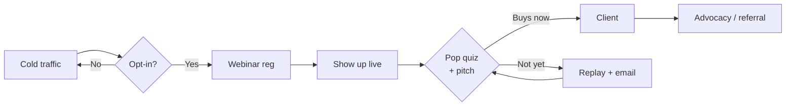

Funnel Futurist · Live Capability Demo

<h1 style="font-size: 4.5rem; color: white;">Slidev Feature Lab</h1>

Every interactive thing Slidev can do — live, on the slide. Click around. Draw. Take the quiz. Let it narrate itself.

PRESS F FOR FULLSCREEN · ARROWS TO ADVANCE

---
layout: cover
---

The AI VSL concept

<h1 style="font-size: 3.2rem; color: white;">A deck that narrates + advances itself.</h1>

Web Speech API reads the script, then auto-advances. Swap the browser voice for an ElevenLabs MP3 per slide and you have a faceless, self-running webinar or VSL.

<button class="fl-quiz-btn" style="background: var(--ff-orange); color: white; border-color: var(--ff-orange);" @click="selfRun">▶ Play self-running narration</button>

{{ status }}

<!--
Browsers block autoplay audio without a user gesture, so a play button is the honest pattern.
For a true hands-off replay, use slidev-addon-narrator with pre-rendered MP3s + a per-slide timer.
-->

---
layout: cover
---

Built-in · Mermaid diagrams

<h2 style="font-size: 2.2rem; margin-bottom: 1rem;">Flowcharts from text. Zero design tools.</h2>

Edit the text, the diagram redraws. Also supports sequence, gantt, mindmap, state, ER. Renders to SVG so it exports clean.

---
layout: cover
---

Charts + live data

<h2 style="font-size: 2.1rem; margin-bottom: 0.5rem;">Real data, rendered at open-time.</h2>

This is Chart.js inside the slide. Swap the simulated series for a <code>fetch()</code> to Supabase and the deck shows current numbers every time a client opens it.

<Line v-if="loaded" :data="data" :options="opts" />

---
layout: cover
---

Live embed · Excalidraw

<h2 style="font-size: 1.9rem;">Draw on a real Excalidraw board, live.</h2>

<iframe src="https://excalidraw.com" style="width: 100%; height: 100%; border: 0;" allow="clipboard-read; clipboard-write"></iframe>

Fully interactive — draw right now. For finished slides, the <code>slidev-addon-excalidraw</code> renders a saved <code>.excalidraw</code> file as crisp SVG.

---
layout: cover
---

Live embed · tldraw

<h2 style="font-size: 1.9rem;">Or a tldraw whiteboard.</h2>

<iframe src="https://www.tldraw.com" style="width: 100%; height: 100%; border: 0;"></iframe>

Live whiteboarding for workshops. (If this panel is blank, tldraw is blocking the embed — use the <code>slidev-addon-tldraw</code> addon instead, which renders inline.)

---
layout: cover
---

Reactive quiz · Hannah's pop-quiz hook

<h2 style="font-size: 2rem; max-width: 50rem; text-align: center; margin-bottom: 0.5rem;">
A 1560 SAT is your child's strongest BS/MD asset.
</h2>

True or false? Click one.

<button class="fl-quiz-btn" :class="{ 'fl-quiz-wrong': answered && picked==='T', 'opacity-50': answered && picked!=='T' }" @click="pick('T')">TRUE</button>
<button class="fl-quiz-btn" :class="{ 'fl-quiz-correct': answered && picked==='F', 'opacity-50': answered && picked!=='F' }" @click="pick('F')">FALSE</button>

Correct.
Not quite.
Most NJMS applicants now score above 1500 — the score is the entry fee, not the asset.

TRUE: {{ tallyT }}

FALSE: {{ tallyF }}

Self-contained reactive widget — no server. (For real audience polling, see the interaction slide.)

---
layout: cover
---

Reactions

<h2 style="font-size: 2rem; margin-bottom: 0.5rem;">Tap a reaction. Watch it float.</h2>

This is the self-contained version. The live-audience version streams taps from everyone's phones onto your screen.

🔥
❤️
👏
🤯
💰

{{ f.emoji }}

---
layout: cover
---

The question you actually asked

<h2 style="font-size: 2.2rem; color: white; margin-bottom: 1.5rem;">How does audience interaction work?</h2>

Live polls / quizzes / reactions

You run the deck on a <strong>server</strong> (not static). A slide shows a <strong>QR / short URL</strong>. The audience opens it on their phones, taps answers, and their responses <strong>stream back onto your screen live</strong>. Needs <code>slidev-polls</code> / <code>slidev-addon-slide-quiz</code> / <code>-reaction</code> running on a host.

Recorded / one-way (YouTube, webinar)

No phones needed. Two options: <strong>(a)</strong> self-contained reactive widgets <em>you</em> click (like the quiz + reactions you just used), or <strong>(b)</strong> the platform chat — slides prompt <em>"type T or F in the chat"</em> and you read it out. This is Hannah's model.

Short version: live = phones + a running server. Recorded = reactive widgets or the chat. For our webinars we use the chat; for YouTube + courses we use widgets.

---
layout: cover
---

What's live here vs what needs a server

✅ Mermaid diagrams

static, exports clean

✅ Charts (Chart.js)

static; can fetch live data

✅ Live Excalidraw / tldraw

iframe embed

✅ Reactive quiz + reactions

self-contained Vue

✅ Self-running narration

Web Speech / ElevenLabs MP3

✅ Pen / drawing

built-in (pencil icon)

⚙️ Live audience polls

needs running server

⚙️ Multi-viewer sync

needs running server

Everything with ✅ works on a plain Vercel deploy like this one. Only true live-audience features need the dev server running.

---
layout: cover
---

Feature Lab

<h1 style="font-size: 3rem; color: white;">All of it. One markdown file.</h1>

Webinars, courses, YouTube, portal walkthroughs, live client reports. Same engine, infinite range.

FUNNEL FUTURIST · SLIDEV FEATURE LAB

