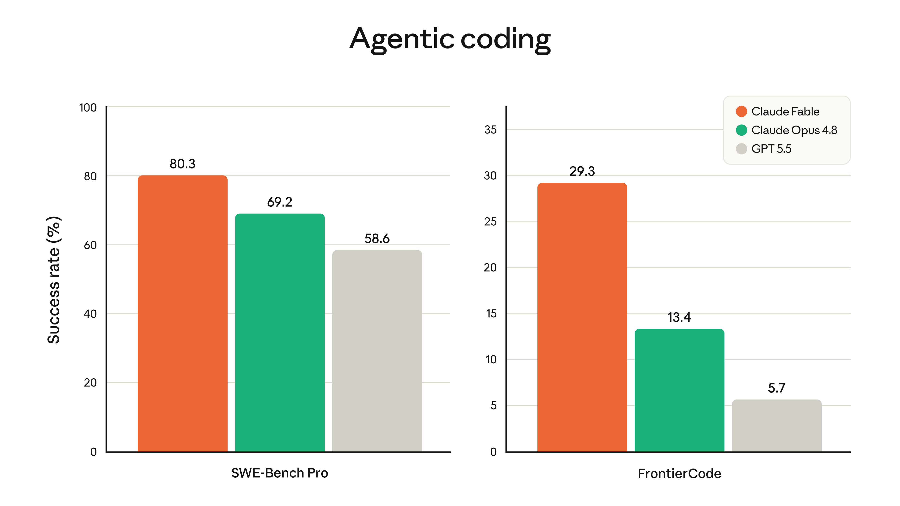

<!-- ============================================================
     SLOT 1 / 6 · COLD-OPEN HOOK · 5-10s · Scene A
     ============================================================ -->

Joburn · Build-Along · EP 02 · 2026-06-09

<h1 style="font-size: 4.8rem; color: white; line-height: 1;">
months became days. 
and your shelf became the strategy.
</h1>

<v-click>

anthropic shipped fable 5 today. stripe just compressed two months of engineering into one day. the headline isn't the model. the headline is your shelf.

</v-click>

JOBURN · JOHN COBURN

<!--
HOOK VERBATIM (Scene A · 5-10s):

stripe just compressed two months of engineering into one day. fifty million lines of ruby. one model. one day.

[CLICK · reveal sub]

if that doesn't change how you plan next quarter, you're not paying attention.

because the headline isn't the model. the headline is the shelf.

every project you killed in the last two years because the math didn't work just got re-priced. and that list, the one in your notes app, the one in the dead column of your notion. that's your roadmap now.

let me show you what i mean.

PRESENTER NOTES:
- cold open hard. no logo, no intro music
- "stripe compressed two months of engineering into one day" is the first thing the viewer hears
- one full beat after "one day."
- pivot line "the headline is the shelf" is the hinge. say it slower.
-->

---

<!-- ============================================================
     SLOT 1.5 / 6 · WHY THIS MATTERS FOR YOU · identity stake · ~25s · Scene B
     The Stakes slide. Hero's Journey beat 2 (call → stakes → guide).
     ============================================================ -->
layout: default
class: !p-0
---

FIG. 0 · THE STAKES

<h2 style="font-size: 2.5rem; margin-top: 0.75rem; line-height: 1.1;">this is not a tool drop. it is a labor-cost regime change.</h2>

<v-click>

IF YOU INTERNALIZE THIS

you operate from a labor curve 60x cheaper than your competitors. you ship 12 compounding assets in 12 weeks while they think it takes quarters. <strong class="ff-cyan">your moat compounds while theirs erodes.</strong>

</v-click>

<v-click>

IF YOU DON'T

someone else eats your category. you keep selling hours nobody buys. your shelf graveyard grows. and <strong style="color: #94463b;">the gap between operators-with-systems and operators-still-figuring-it-out doubles every quarter.</strong>

</v-click>

<v-click>

this isn't about whether you use the model. it's about whether the version of you with this in your stack beats the version of you without it. it does. by a lot. and you decide which version ships next monday.

</v-click>

<!--
SLOT 1.5 VERBATIM (Scene B · large cam · slow · ~25s):

before i show you anything else, listen to this part carefully. because this is the part that decides whether this video matters in your life or not.

this is not a tool drop. this is a labor-cost regime change.

[CLICK 1 · "if you internalize"]
if you internalize what just happened, you start operating from a labor curve sixty x cheaper than your competitors. while they're still benchmarking models, you're shipping twelve compounding assets in twelve weeks. your moat compounds. theirs erodes.

[CLICK 2 · "if you don't"]
if you don't, someone else eats your category. you keep selling hours nobody buys. your shelf graveyard grows. and the gap between operators with systems and operators still figuring it out doubles every quarter.

[CLICK 3 · navy callout]
this isn't about whether you USE the model. it's about whether the version of YOU with this thing in your stack beats the version of you without it. it does. by a lot. and you decide which version ships next monday.

PRESENTER NOTES:
- Scene B (large cam · intimate, not directorial)
- this is the IDENTITY-LEVEL beat at the open. hero's journey beat 2 (stakes).
- "this isn't about whether you USE the model" is the hinge.
- slow pace. lower voice slightly.
- ~25s
-->

---

<!-- ============================================================
     SLOT 2 / 6 · TOPIC CARD · 20-30s · Scene B (large cam)
     ============================================================ -->

EPISODE 02 · FABLE 5 DROP · 2026-06-09

<h1 style="font-size: 3.4rem; margin-top: 1rem;">the shelf is the strategy now.</h1>

WHAT YOU'LL WALK AWAY WITH

<v-clicks>

<ul style="margin-top: 1rem; font-size: 1.08rem; list-style: none; padding: 0;">
<li style="margin-bottom: 0.6rem;">01 · the math behind two months becoming one day. and what it does to every project you killed.</li>
<li style="margin-bottom: 0.6rem;">02 · the three failure modes operators are about to hit this quarter.</li>
<li style="margin-bottom: 0.6rem;">03 · a four-move playbook. audit, re-price, rank, ship one per week for twelve weeks.</li>
<li>04 · the identity question that decides whether your shelf is a roadmap or a graveyard.</li>
</ul>

</v-clicks>

THE FACTS ON THE TABLE

<v-clicks>

<ul style="margin-top: 1rem; font-size: 1.08rem; list-style: none; padding: 0;">
<li style="margin-bottom: 0.55rem;"><strong>2 models. 1 day.</strong> anthropic.</li>
<li style="margin-bottom: 0.55rem;"><strong>$10 in / $50 out</strong> per million tokens.</li>
<li style="margin-bottom: 0.55rem;"><strong>50M lines of ruby.</strong> stripe. one day.</li>
<li><strong>~60x compression</strong> of senior labor.</li>
</ul>

</v-clicks>

FIG. 1 · WHAT JUST SHIPPED

<!--
TOPIC VERBATIM (Scene B · 20-30s):

today we're talking about the one number from the fable 5 launch that actually matters. not the benchmarks. not the price. not the pokemon demo. one line buried in the announcement.

months of work. done in days.

that's not a coding story. that's a unit economics story.

because when the cost of a unit of work drops by sixty x in twelve months, every project you ever shelved with the words "too expensive" or "not worth it right now" has to be re-priced.

that list of yeses you couldn't afford is now the most valuable asset you own. more valuable than your offer. more valuable than your audience. more valuable than your team.

[CLICK each takeaway as you describe it · 4 clicks left col, 4 right col]

and most operators are gonna miss it. they're gonna spend the week asking what the model can do, instead of asking what they already decided was worth doing if it was free.

PRESENTER NOTES:
- this slot is the contract. tell viewer angle is NOT "fable 5 is cool"
- but "your shelf is the asset"
- controlled, not hype
- 20-30s
-->

---

<!-- ============================================================
     SLOT 3a / 6 · BUILD 1 · the drop · Scene A
     ============================================================ -->
layout: default
class: !p-0 !overflow-hidden
---

PHASE 01 · STEP 01 · the drop

<h2 style="font-size: 2.6rem; color: white; line-height: 1.05; margin-top: 1rem;">two models. one day.</h2>

<v-clicks>

<strong style="color: var(--ff-cyan);">Fable 5</strong> · public release. state of the art across the board.

<strong style="color: var(--ff-orange);">Mythos 5</strong> · same model. safeguards lifted on cyber. locked behind Project Glasswing.

<strong>$10 / $50</strong> per million tokens. less than half the price of Mythos Preview.

free on Pro/Max/Team through June 22. credits start June 23.

</v-clicks>

<!--
SLOT 3a VERBATIM (Scene A · ~60s):

[CLICK 1 · fable explainer reveals]
so here's what shipped today. two models. one underlying system.

fable 5 ships to everyone. claude api, pro plans, max, team, enterprise. state of the art on basically every benchmark anthropic put in the announcement.

[CLICK 2 · mythos]
mythos 5 is the SAME MODEL. safeguards lifted in cybersecurity. but it's locked behind something called project glasswing. us government cyberdefenders only. you and i don't get it.

[CLICK 3 · pricing]
and the price went down. ten bucks per million input tokens, fifty per million output. less than half what mythos preview cost a few weeks ago.

[CLICK 4 · timing]
on pro and max, it's free for thirteen days. after june twenty-two you start burning credits.

PRESENTER NOTES:
- Scene A
- this is setup. don't linger
- ~60s
-->

---

<!-- ============================================================
     SLOT 3b / 6 · BUILD 1 · the capability story · Scene A
     ============================================================ -->
layout: default
class: !p-0
---

PHASE 01

STEP 02 · the capability story

<h2 style="font-size: 2rem; margin-top: 0.25rem;">claude is now 2x GPT-5.5 on agentic coding.</h2>

FIG. 2 · SWE-BENCH PRO + FRONTIERCODE · CLAUDE FABLE VS OPUS 4.8 VS GPT-5.5

<v-clicks>

SWE-Bench Pro

<strong style="font-size: 1.4rem; color: var(--ff-cyan);">80.3%</strong> vs Opus 69.2 / GPT 58.6

11 points clear of Anthropic's own previous best.

FrontierCode

<strong style="font-size: 1.4rem; color: var(--ff-orange);">29.3%</strong> vs Opus 13.4 / GPT 5.7

<strong class="ff-cyan">2.2x Opus.</strong> <strong class="ff-cyan">5x GPT-5.5.</strong>

<strong>the moat:</strong> on the hardest agentic work, the gap doesn't just close. it widens.

</v-clicks>

<!--
SLOT 3b VERBATIM (Scene A · ~75s):

okay. now look at the numbers. and i want you to look at them with one question in mind. not "is this model smart?" but "what does this MEAN for the work i'm not doing yet?"

[CLICK 1 · SWE-Bench card]
SWE-Bench Pro. real software engineering tasks. fable hits 80.3 percent. opus 4.8 was 69. GPT-5.5 was 58. that's not a small jump. that's eleven points clear of anthropic's own previous best, in one quarter.

[CLICK 2 · FrontierCode card]
FrontierCode. harder benchmark. fable 29.3 percent. opus 13.4. GPT-5.5 five point seven. on the HARDEST agentic coding work, fable is more than 2x opus 4.8 and 5x GPT-5.5.

[CLICK 3 · the moat]
that's the moat. and the gap doesn't close at the top end. it widens. which means as the work gets harder, the leverage you get from this model gets bigger. opposite of what you'd expect.

PRESENTER NOTES:
- pace this. one stat per breath.
- read "29.3" out loud, then say "twenty-nine point three percent. on the hardest tasks."
- ~75s
-->

---

<!-- ============================================================
     SLOT 3c / 6 · BUILD 1 · the cost curve broke · Scene A
     ============================================================ -->
layout: default
class: !p-0
---

PHASE 01

STEP 03 · the cost curve broke

<h2 style="font-size: 1.9rem; margin-top: 0.25rem;">more compute, wider gap. the leverage is buyable.</h2>

FIG. 3 · FRONTIERCODE ACCURACY VS COST · LOG SCALE

<v-clicks>

<strong class="ff-cyan">orange line:</strong> Fable 5 scales 12% → 30% as you spend $5 → $20 per task.

<strong style="color: #2E8B8B;">green line:</strong> Opus 4.8 PLATEAUS at 12-14%. spend more, get nothing.

<strong>GPT-5.5:</strong> flat at 5-6%. doesn't even play.

<strong>translation:</strong> the harder your work, the more Fable 5 leaves the field behind. that's not a benchmark. that's an operating advantage you can rent for $20.

</v-clicks>

STRIPE

<strong>50 million lines of ruby. codebase-wide migration. one day. would have taken their team over two months.</strong> that's roughly 60x compression of senior labor.

<!--
SLOT 3c VERBATIM (Scene A · ~75s):

now here's the part that fucked me up the most when i read the announcement. and you can't read it from the benchmark table. you have to look at this graph.

[CLICK 1 · orange line]
orange line is fable 5. as you let it spend more, $5 per task, $10 per task, $20 per task, the score keeps climbing. 12 percent at low effort, all the way up to 30 at max.

[CLICK 2 · green line]
green line is opus 4.8. plateaus at around 13. spend twice as much. get nothing extra. you hit a ceiling.

[CLICK 3 · GPT-5.5]
GPT-5.5 doesn't even leave the floor. flat line.

[CLICK 4 · translation]
which means the harder your problem, the bigger fable's lead gets. that's not a benchmark. that's an operating advantage you can rent for the price of a dinner.

[gesture to Stripe callout · already on screen]
and that's why the stripe number matters. fifty million lines of ruby. one day. would have taken a team two months. that's roughly sixty x compression of senior labor. and stripe is one of the most disciplined engineering orgs on earth. they're not the exception. they're the floor.

PRESENTER NOTES:
- the cost-curve story is the technical case for everything that follows
- stripe callout already on screen during the click sequence
- ~75s
-->

---

<!-- ============================================================
     SLOT 3d / 6 · BUILD 1 · the three failure modes · Scene A
     ============================================================ -->
layout: default
class: !p-0
---

PHASE 01

STEP 04 · three failures most operators are about to make

<h2 style="font-size: 1.95rem; margin-top: 0.25rem;">the constraint moved. three things follow.</h2>

<v-clicks>

FAILURE 01

<h3 style="font-size: 1.15rem; margin-top: 0.5rem; color: var(--ff-navy);">pricing yesterday's labor</h3>

you cannot sell hours in a market where hours don't exist. you can sell judgment. you can sell taste. you can sell the system that decides. <strong class="ff-cyan">you cannot sell forty hours of doing.</strong>

FAILURE 02

<h3 style="font-size: 1.15rem; margin-top: 0.5rem; color: var(--ff-navy);">chasing shiny new ideas</h3>

the shelf is sitting right there. you already validated those projects. you already scoped them. they just cost too much. <strong class="ff-cyan">the new yes is the old yes the math finally allows.</strong>

FAILURE 03

<h3 style="font-size: 1.15rem; margin-top: 0.5rem; color: var(--ff-navy);">confusing cheaper with easier</h3>

the work still needs taste. the model does not know which migration is worth running. it does not know which client deserves the rebuild. <strong class="ff-cyan">you do.</strong>

</v-clicks>

<v-click>

the constraint used to be capital, then hours. now it's discernment. the question stopped being "can we afford this?" it's now <strong>"should we even do this?"</strong> and that's a way harder question.

</v-click>

<!--
SLOT 3d VERBATIM (Scene A · ~90s):

so the cost curve broke. that's the whole story. and when the cost curve breaks, three things happen.

[CLICK 1 · failure 01]
one. operators pricing yesterday's labor lose. you cannot sell hours in a market where hours don't exist anymore. you can sell judgment. you can sell taste. you can sell the system that decides. you cannot sell forty hours of doing.

[CLICK 2 · failure 02]
two. operators chasing shiny new ideas miss the easy win. the shelf is sitting right there. you already validated those projects. you already scoped them. you already wanted them. they just cost too much. the new yes is the old yes that the math finally allows.

[CLICK 3 · failure 03]
three. operators who confuse cheaper with easier lose the whole thing. the work still needs taste. the model doesn't know which migration is worth running. it doesn't know which client deserves the rebuild. you do.

[CLICK 4 · the constraint moved]
the constraint moved. it used to be capital. it used to be hours. now it's discernment. the question stopped being can we afford this. the question is now should we even do this. and that's a way harder question.

PRESENTER NOTES:
- pace yourself. one per breath. number on fingers.
- "you cannot sell forty hours of doing" is the section's punch line. let it sit.
- ~90s
-->

---

<!-- ============================================================
     SLOT 4 / 6 · WHITEBOARD · 2-4min · drauu in place · Scene A
     ============================================================ -->
layout: default
class: !p-0
---

FIG. 4 · YOUR SHELF IS THE ROADMAP

<h2 style="font-size: 2.6rem; margin-top: 1rem;">draw the curve. fill the shelf.</h2>

[ PRESS PEN ICON · DRAW LIVE ·  
TWO COLUMNS: "SHELVED 2024" (RED) | "VIABLE TODAY" (GREEN) · 
COST CURVE ACROSS THE TOP: MONTHS → DAYS · 
SIX REAL SHELVED PROJECTS WITH DOLLAR ANCHORS · 
ARROWS SWEEPING ACROSS THE CURVE · 
CIRCLE THE GREEN COLUMN · 
HAND-PRINT: "you don't need new ideas. you need the old yeses you couldn't afford." ]

PRESS PEN ICON · NARRATE WHILE DRAWING · HOLD 2 SECONDS ON FINAL LINE

<!--
WHITEBOARD VERBATIM (Scene A · drauu pen on this slide · 2-4 min):

alright. whiteboard. let me draw this out.

two columns. left side i'm writing "shelved 2024." red marker. right side i'm writing "viable today." green marker.

and across the top, i'm drawing the cost curve. starts way up here, crashes down to almost nothing. label at the top of the curve. months. label at the bottom. days. that's the whole macro picture.

now watch what happens in the columns.

left side. real things i killed. full codebase rewrite, eighty grand. internal tooling, forty grand. knowledge base audit, twenty five. per-client funnels, hundred and twenty. compliance review, sixty. back catalog re-edit, thirty five.

those are not hypothetical. those are projects i had on a list that i walked away from because the math didn't work.

now watch the arrows. each one sweeps across the curve. and the new number on the right is roughly one percent of the old number. eight hundred bucks. four hundred. three hundred. twelve hundred. six hundred. four hundred.

that's your column. that's your green column. that's your roadmap.

and i'm gonna circle it. and underneath the circle i'm writing the line that decides whether this video changes anything for you.

you don't need new ideas. you need the old yeses you couldn't afford.

that's it. that's the whole frame. read it again. the new ideas are not the play. the play is the shelf. the play is what you already decided was worth doing back when worth doing meant "i can justify the cost."

the justification just changed.

DIAGRAM STEPS (in order):
1. HEADERS: top of board, write "SHELVED 2024" left in red, "VIABLE TODAY" right in green. big.
2. COST CURVE: draw a downward sloping curve from high-left to low-right across the top third. label top "MONTHS" and bottom "DAYS."
3. LEFT COLUMN: six lines in red top-to-bottom. say each out loud. "codebase rewrite $80k", "internal tooling $40k", "kb audit $25k", "per-client funnels $120k", "compliance review $60k", "back-catalog re-edit $35k".
4. ARROWS: sweep an arrow from each left entry across the curve. "each one crosses the curve."
5. RIGHT COLUMN: in green, write across from each. "~$800", "~$400", "~$300", "~$1.2k", "~$600", "~$400".
6. CIRCLE the right column hard in green. say "that's your column. that's your roadmap."
7. FINAL LINE under the circled right column: "you don't need new ideas. you need the old yeses you couldn't afford." hold camera 2 seconds.

PRESENTER NOTES:
- drawing IS the pacing. don't speed-run.
- read each dollar value out loud.
- name one REAL agency-os shelved project from your own work (audit_scaffolder/deep_audit, per-client funnel rebuild, etc).
- closing line IS the title of the episode.
-->

---

<!-- ============================================================
     SLOT 5a / 6 · BUILD 2 · the four moves · Scene A
     ============================================================ -->
layout: default
class: !p-0
---

PHASE 02

STEP 05 · the playbook

<h2 style="font-size: 2rem; margin-top: 0.25rem;">four moves. one per week. twelve weeks.</h2>

<v-clicks>

01

<h3 style="font-size: 1.08rem; margin-top: 0.5rem; color: var(--ff-navy);">audit the shelf</h3>

one focused afternoon. list every project, migration, audit, or build you killed for being too expensive. don't filter. 30 to 50 items.

~1 AFTERNOON

02

<h3 style="font-size: 1.08rem; margin-top: 0.5rem; color: var(--ff-navy);">re-price each one</h3>

team of 3 for 2 months becomes one operator with a project folder for 3 days. ten grand becomes a hundred. kill nothing that survives.

~1 HOUR EACH

03

<h3 style="font-size: 1.08rem; margin-top: 0.5rem; color: var(--ff-navy);">rank by compounding</h3>

not exciting-ness. the boring migration that unlocks 10x throughput beats the sexy new product every time. <strong class="ff-cyan">compounding beats clever.</strong>

~1 MORNING

04

<h3 style="font-size: 1.08rem; margin-top: 0.5rem; color: var(--ff-navy);">ship one per week</h3>

one. per. week. for. twelve. weeks. no off-site. no roadmap doc. just monday after monday after monday.

~12 WEEKS

</v-clicks>

<v-click>

twelve weeks. twelve compounding assets your competitors don't have. and they will not catch up. because they're still asking what the model can do.

</v-click>

<!--
SLOT 5a VERBATIM (Scene A · ~4 min):

four moves. and then one question that decides whether any of this matters for you.

[CLICK 1 · move 01 card]
move one. audit the shelf. one afternoon. open a doc. write down every project, every migration, every audit, every build you killed in the last two years because the math didn't work. don't filter. just list. thirty to fifty items. if you have fewer than ten you didn't go back far enough.

[CLICK 2 · move 02 card]
move two. re-price each one. write the new cost next to the old. team of three for two months becomes one operator with a project folder for three days. ten grand becomes a hundred. forty grand becomes four hundred. kill nothing that survives the re-price.

[CLICK 3 · move 03 card]
move three. rank by compounding asset value. not by exciting-ness. this is where most operators screw up. the boring migration that unlocks ten x throughput beats the sexy new product every single time. compounding beats clever.

[CLICK 4 · move 04 card]
move four. ship one per week. twelve weeks. one. per. week. for. twelve. weeks. that's the entire strategy. no off-site. no roadmap doc. no sprint planning ritual. you ship one shelf item every monday for twelve mondays in a row.

[CLICK 5 · navy callout]
in twelve weeks you have twelve compounding assets your competitors don't have. and they will not catch up. because they're still asking what the model can do.

PRESENTER NOTES:
- operator tempo. controlled. dollar-anchored.
- click each card AS you read it
- "one. per. week. for. twelve. weeks." with full beat between each word
- ~4 min
-->

---

<!-- ============================================================
     SLOT 5b / 6 · BUILD 2 · the identity beat · Scene A
     ============================================================ -->
layout: default
class: !p-0
---

FIG. 5 · THE PART NOBODY'S SAYING OUT LOUD

<v-clicks>

<h2 style="font-size: 2.7rem; line-height: 1.15; color: var(--ff-navy); margin-bottom: 1.5rem;">
the shelf is not just a list of cheap projects.
</h2>

<h2 style="font-size: 2.7rem; line-height: 1.15; color: var(--ff-navy);">
the shelf is a list of the work you actually wanted to do.
</h2>

the rebuild of the offer you knew was wrong. the audit you knew the business needed. the system you knew would set you free. you didn't kill them because they were bad. <strong>you killed them because the cost curve told you no.</strong>

the curve is not telling you no anymore.

the model lowers the cost. you still pick.

</v-clicks>

<!--
SLOT 5b VERBATIM (Scene A · slow down · ~2 min):

[FULL BEAT · 1 full second of silence before clicking]

but here's the part nobody's saying out loud.

[CLICK 1 · strike-through]
the shelf is not just a list of cheap projects.

[CLICK 2 · second h2 reveals]
the shelf is a list of the work you actually wanted to do.

[CLICK 3 · expansion paragraph]
the rebuild of the offer you knew was wrong. the audit you knew the business needed. the system you knew would set you free. you didn't kill those projects because they were bad. you killed them because the cost curve told you no.

[CLICK 4 · curve line]
the curve is not telling you no anymore.

so the real question is not whether you can afford the shelf. it's whether you trust yourself to pick from it. because if you don't trust the version of you that put those projects on the shelf in the first place, no amount of cheap intelligence is gonna save you.

[CLICK 5 · navy callout]
the model lowers the cost. you still pick.

pick well.

PRESENTER NOTES:
- DROP TEMPO. controlled, intimate, not directorial.
- sit forward. lower voice. kill teaching energy.
- "the model lowers the cost. you still pick." is the 2nd-most-important line in the episode.
- "pick well." is the two-word close. let it sit.
- ~2 min
-->

---

<!-- ============================================================
     SLOT 6 / 6 · RECAP + CTA · 30-45s · Scene D (cam only)
     ============================================================ -->

RECAP · EPISODE 02

<h1 style="font-size: 3.4rem; color: white;">the shelf is the strategy.</h1>

WHAT TO REMEMBER

<v-clicks>

<ul style="margin-top: 0.85rem; color: rgba(255,255,255,0.92); font-size: 1rem; list-style: none; padding: 0;">
<li style="margin-bottom: 0.7rem;">01 · months became days. ~60x compression of senior labor. your pricing, your team, your calendar were built for a curve that no longer exists.</li>
<li style="margin-bottom: 0.7rem;">02 · every project you killed for being too expensive just got re-priced. that list of yeses you couldn't afford is your roadmap now.</li>
<li>03 · four moves. audit. re-price. rank by compounding. ship one per week for twelve weeks. <strong class="ff-cyan">the model lowers the cost. you still pick.</strong></li>
</ul>

</v-clicks>

<v-click>

NEXT EPISODE

i walk through my actual shelf. the projects i killed in the last two years that just got cheap. the order i'm shipping them in. and the one i'm starting this monday.

bring a notebook. you're gonna want to mirror the move.

subscribe so you don't miss it.

</v-click>

JOBURN.COM · BUILD-ALONG EP 02 · 2026-06-09

<!--
RECAP VERBATIM (Scene D · cam only · 30-45s):

three takeaways.

[CLICK 1 · takeaway 01]
one. months became days. the cost of a unit of work just dropped roughly sixty x. your pricing, your team structure, your weekly calendar were all built for a labor curve that no longer exists. fix that this month or someone else eats your category.

[CLICK 2 · takeaway 02]
two. every project you killed for being too expensive just got re-priced. that list of yeses you couldn't afford is your roadmap now. you don't need new ideas. you need the old yeses.

[CLICK 3 · takeaway 03]
three. four moves. audit the shelf. re-price. rank by compounding asset value. ship one a week for twelve weeks. that's the strategy. the model lowers the cost. you still pick.

[CLICK 4 · tease]
next video i'm walking through my actual shelf. the projects i killed in the last two years that just got cheap. the order i'm shipping them in. and the one i'm starting this monday. bring a notebook. you're gonna want to mirror the move.

subscribe so you don't miss it.

and stop trading hours. you don't have to anymore.

PRESENTER NOTES:
- Scene D · cam only · eye contact
- final line "stop trading hours, you don't have to anymore" is the mic drop. let it sit.
- hold 2 full seconds before stopping recording.
- 30-45s.
-->
