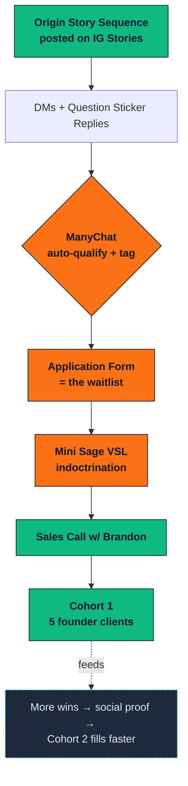

Brandon × Funnel Futurist

<h1 style="font-size: 4rem; line-height: 1.05;">
The Path to Cohort 1.
</h1>

You're 90% done. Here's the 10% that's left.

This deck is the whole map. 7 slides. Read it in 3 minutes.

2026-05-30 · cohort 1 launches monday

<!--
This is the cure for finish-line syndrome. Brandon is 90% done. The remaining
10% feels like a mountain because the surface area looks huge — actually it's
a handful of moves. We're going to lay them out so he sees the whole path on
one screen.
-->

---
layout: default
---

The funnel · one diagram

<h1 style="font-size: 2.6rem; margin-bottom: 2rem;">
This is the whole machine.
</h1>

■ built &nbsp;·&nbsp;
■ to build this week &nbsp;·&nbsp;
▢ compounding loop

7 stages · 5 already in motion

---
layout: default
---

What's already built ✓

<h1 style="font-size: 2.6rem; margin-bottom: 1.5rem;">
You're not starting from scratch. Most of the work is done.
</h1>

✓ Origin Story Sequence

8 IG-story frames in your voice. Two versions (maxxing + wellness). Day-X anchor + Question sticker CTA. Ready to post.

✓ VSL Script v1

~7 min, your @beefcakemaxxing essay voice. Ready when you are to record.

✓ 28-Email Sequence (draft)

WHISPER 1-5 ready. TEASE + SHOUT draft. We sequence sends, you reply to inbound.

✓ Waitlist Landing Page

Copy ready · build in progress. Goes live before TEASE phase opens.

✓ MSA + Contract

PandaDoc-ready V2 with Phoenix's revisions. Sign + pay = green light.

✓ Audience Verified

40K maxxing + 42K wellness = ~70K unique. Voice locked. Account roles per Phoenix call.

6 of 9 components shipped

---
layout: default
---

What's left · the actual finish line

<h1 style="font-size: 2.6rem; margin-bottom: 1.5rem;">
Three things from you. Three things from us.
</h1>

<h3 style="color: var(--ff-orange); margin-bottom: 1rem; text-transform: uppercase; letter-spacing: 0.1em; font-size: 0.85rem;">
Brandon (you)
</h3>

1. Finish offer ramp-up docs

You're close. Get them done today/tomorrow.

2. Post the Origin Story Sequence

8 IG stories. Version A on @beefcakemaxxing. Today or tomorrow.

3. Reply warm to inbound

Don't sell. Just sort. ManyChat picks up the heavy lifting.

<h3 style="color: var(--ff-cyan); margin-bottom: 1rem; text-transform: uppercase; letter-spacing: 0.1em; font-size: 0.85rem;">
Funnel Futurist (us)
</h3>

1. ManyChat flows

Auto-qualify story replies, tag by intent, route to application form. Built before stories go live.

2. Application form

10-Q form = the waitlist. Funnels every reply into one sortable list.

3. Mini Sage VSL

3-5 min, your voice. "When you join, here's what happens." John records right after your offer docs land.

6 items · ~5 working days · then we launch

---
layout: default
---

This week · the critical path

<h1 style="font-size: 2.4rem; margin-bottom: 1.5rem;">
Day by day. No mystery.
</h1>

<table>
<thead>
<tr>
<th style="width: 18%;">Day</th>
<th style="width: 41%;">Brandon</th>
<th style="width: 41%;">Funnel Futurist</th>
</tr>
</thead>
<tbody>
<tr>
<td><strong class="cream">Sat May 30</strong> today</td>
<td>Finish offer ramp-up docs · review Origin sequence</td>
<td>Build ManyChat flows · stub application form</td>
</tr>
<tr>
<td><strong class="cream">Sun May 31</strong></td>
<td>Post Origin Story Sequence · reply to early DMs</td>
<td>ManyChat live · application form live · capture early data</td>
</tr>
<tr>
<td><strong class="cream">Mon Jun 1</strong> launch day</td>
<td>WHISPER content cadence starts · DMs all day</td>
<td>WHISPER Email 1 sends · monitor + analyze engagement</td>
</tr>
<tr>
<td><strong class="cream">Tue-Wed Jun 2-3</strong></td>
<td>Reply to inbound · record Mini Sage VSL with John</td>
<td>Mini VSL produced + deployed · ManyChat routes warm leads to it</td>
</tr>
<tr>
<td><strong class="cream">Thu-Sun Jun 4-7</strong></td>
<td>Continue WHISPER posts · warm DM follow-up</td>
<td>Analyze qualitative data · refine VSL v2 prep · waitlist opens Jun 8</td>
</tr>
<tr>
<td><strong class="cream">Mon Jun 22</strong> cohort 1 day 1</td>
<td>Run Execution Launch Calls with 5 founder clients</td>
<td>Onboarding sequences fire · we monitor delivery + retention</td>
</tr>
</tbody>
</table>

9 working days to first founder client

---
layout: default
---

After cohort 1 · the compounding loop

<h1 style="font-size: 2.6rem; margin-bottom: 1.5rem;">
The hard part is launch one. 
After that, it gets easier.
</h1>

Every cohort feeds the next. The work compounds:

→ <strong class="cream">Cohort 1 wins</strong> become testimonials

→ <strong class="cream">Testimonials</strong> unlock the Social Proof sequence

→ <strong class="cream">Social Proof</strong> shortens the cohort 2 sales cycle

→ <strong class="cream">Shorter cycle</strong> means higher close rate

→ <strong class="cream">Higher close rate</strong> means cohort 3 sells out before WHISPER ends

<h3 style="color: var(--ff-cyan); margin-bottom: 1rem;">The math</h3>
<table style="font-size: 0.9rem;">
<tr><td style="padding: 0.4rem 0;">Cohort 1 (Jun-Sep)</td><td style="text-align: right;"><strong>5 × $3K = $15K</strong></td></tr>
<tr><td style="padding: 0.4rem 0;">Cohort 2 (Sep-Dec)</td><td style="text-align: right;"><strong>8 × $3.5K = $28K</strong></td></tr>
<tr><td style="padding: 0.4rem 0;">Cohort 3 (Dec-Mar)</td><td style="text-align: right;"><strong>12 × $4K = $48K</strong></td></tr>
<tr style="border-top: 1px solid var(--ff-rule);"><td style="padding: 0.6rem 0;"><strong class="cyan">9 months total</strong></td><td style="text-align: right;"><strong class="cyan">$91K</strong></td></tr>
</table>

Conservative. Each cohort can run higher pricing as social proof accumulates. Numbers above assume modest growth, no ads.

launch one · then the system runs

---
layout: cover
class: text-center
---

One question

<h1 style="font-size: 3.6rem; line-height: 1.1; margin: 2rem 0;">
What's blocking you right now?
</h1>

Not the whole launch. Just the next thing on your list.

Drop it in your launch Slack channel. We'll move it within 4 hours.

You're 90% done. Don't let the last 10% feel like 90.

Cohort 1 starts <strong class="cyan">Mon Jun 22</strong>. Three weeks from today.

brandon × funnel futurist · the simplest version of this

