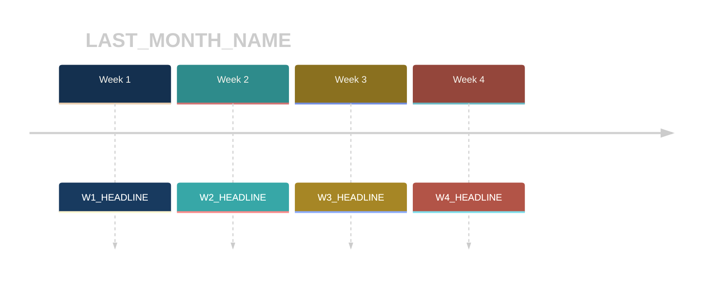
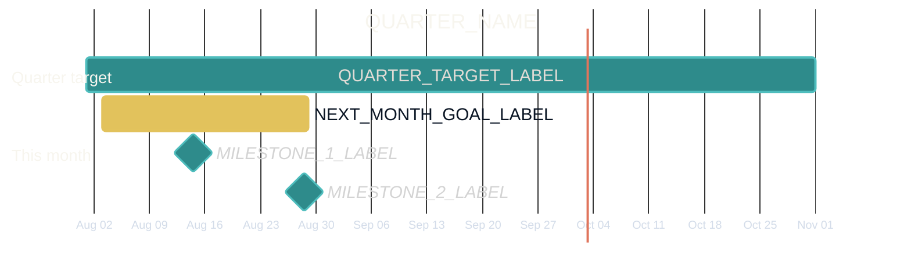

<!-- slide:cover-01 -->

  

    
    Funnel Futurist · all hands · the monthly drumbeat
  

  <h1 class="th-h1 xl mt-5">FF Town Hall</h1>
  
{{MONTH YEAR}}

  
This is how we remember what we're doing, and why.

ff town hall · standing template · the structure never changes

<!--
FRAME. Calm, warm open. Everyone lands, cameras on. One click for the why-line.
BEATS:
  - "Welcome to the town hall. Same structure as every month. That's on purpose."
  - (click) "This is how we remember what we're doing, and why."
TIMING: 30 sec
TRANSITION: straight into the recap. "So. Why do we do this."
-->

---
layout: default
---

<!-- slide:why-vision-mission-02 -->

01 · Why we do this · the two-minute recap, every single month

<h2 class="th-h2 mt-2">Where we're going. How we get there.</h2>

<v-clicks>

  
Vision · where we're going

  
{{VISION}}

  
Big enough that every person's personal vision fits inside it.

  
Mission · how we get there

  
{{MISSION}}

  
What drives when the pain of escaping the current situation subsides.

</v-clicks>

why we do this · vision + mission · never changes

<!--
FRAME. The recap opens EVERY town hall. After a certain point nobody needs new
information; they need to remember the core things. Read both cards out loud, verbatim.
BEATS:
  - (click) Vision. Where we're going.
  - (click) Mission. How we get there.
TIMING: 40 sec
TRANSITION: "And HOW we win matters."
-->

---
layout: default
---

<!-- slide:why-values-03 -->

01 · Why we do this · how we win

<h2 class="th-h2 mt-2">It's not just winning. How you win matters.</h2>

<v-clicks>

  
Internal Mastery

  
The craft compounds inside you first. Get better at getting better.

  
Sincere Candor

  
Say the true thing, kindly, and say it now. Silence is never agreement.

  
Stewardship &amp; Ownership

  
Act like you own it, because you do. Leave everything better than you found it.

</v-clicks>

{{VALUES_LOCKED_LIST}} · replace this token with the sitting-locked 3 to 5 values, then never touch this slide again

why we do this · values · never changes

<!--
FRAME. One value per click, one breath each. These are the current live three;
the sitting locks the canonical list, then this slide is frozen.
BEATS:
  - (click) Internal Mastery.
  - (click) Sincere Candor.
  - (click) Stewardship and Ownership.
TIMING: 40 sec
TRANSITION: "And the last piece of the why: how this whole system works."
-->

---
layout: center
class: text-center
---

<!-- slide:why-self-improving-04 -->

01 · Why we do this · the promise

This system self-improves as long as we stick to it.

<v-click>

We set targets. We miss some. That is the system working, not failing.

</v-click>

<v-click>

A miss just means: <b>okay, what do we have to do.</b>

</v-click>

why we do this · targets doctrine · never changes

<!--
FRAME. The targets doctrine, stated plainly so misses never become fear or theater.
BEATS:
  - The system self-improves as long as we stick to it.
  - (click) Targets get missed. That's the system working.
  - (click) A miss just means: okay, what do we have to do.
TIMING: 40 sec. That closes the 2-minute recap.
TRANSITION: "So. Last month."
-->

---
layout: center
---

<!-- slide:divider-been-05 -->

02

  
Section 02

  
Where we've been

  
{{LAST MONTH}}, honestly. Planned against actual.

where we've been

<!--
FRAME. Section turn. Slow down for half a beat.
TIMING: 10 sec
TRANSITION: "Here's the scoreboard."
-->

---
layout: default
---

<!-- slide:been-planned-actual-06 -->

02 · Where we've been · the scoreboard

<h2 class="th-h2 mt-2">What we planned. What actually happened.</h2>

<table class="th-table" v-pre>
<thead>
<tr><th>Objective</th><th>Planned</th><th>Actual</th></tr>
</thead>
<tbody>
<tr><td>{{OBJ_1_NAME}}</td><td>{{OBJ_1_PLANNED}}</td><td>{{OBJ_1_ACTUAL}}</td></tr>
<tr><td>{{OBJ_2_NAME}}</td><td>{{OBJ_2_PLANNED}}</td><td>{{OBJ_2_ACTUAL}}</td></tr>
<tr><td>{{OBJ_3_NAME}}</td><td>{{OBJ_3_PLANNED}}</td><td>{{OBJ_3_ACTUAL}}</td></tr>
<tr><td>{{OBJ_4_NAME}}</td><td>{{OBJ_4_PLANNED}}</td><td>{{OBJ_4_ACTUAL}}</td></tr>
</tbody>
</table>

One line on the month: {{LAST_MONTH_VERDICT}}

where we've been · planned vs actual

<!--
MOVE FAST. Numbers first, no editorializing row by row. The verdict line lands last.
BEATS:
  - (click) The table. Read the gaps out loud where they exist. No blame register.
  - (click) The one-line verdict on the month.
TIMING: 60 sec
TRANSITION: "Here's how the month actually moved."
-->

---
layout: default
---

<!-- slide:been-timeline-07 -->

02 · Where we've been · the shape of the month

<h2 class="th-h2 mt-2">The month in four beats.</h2>

where we've been · timeline

<!--
ZOOM. One headline per week; the visual carries it. NOTE: tokens inside the Mermaid
block are bare CAPS (no curly braces; braces break the diagram parser). Replace
LAST_MONTH_NAME + W1..W4_HEADLINE when filling in.
TIMING: 40 sec
TRANSITION: "Which brings us to today."
-->

---
layout: center
---

<!-- slide:divider-now-08 -->

03

  
Section 03

  
Where we are

  
Five departments. One slide each. Ninety seconds each. Same format every month.

  Objective + definition of done
  3 numbers · planned / actual / next target
  One win · one miss · one ask

where we are · the 90-second format

<!--
FRAME. Set the rule before the first report so the rhythm holds.
BEATS:
  - Five departments, 90 seconds each.
  - (click) The locked format: objective + DoD, three numbers, win-miss-ask. No slideware beyond this.
TIMING: 20 sec
TRANSITION: "Acquisition, you're up."
-->

---
layout: default
---

<!-- slide:dept-1-acquisition-09 -->

Where we are · dept 1 of 5 · {{ACQ_OWNER}} reporting

<h2 class="th-h2 mt-1">Acquisition / Pipeline</h2>

  
Objective{{ACQ_OBJECTIVE}}

  
Done when{{ACQ_DOD}}

  

Planned

{{ACQ_PLANNED}}

  

Actual

{{ACQ_ACTUAL}}

  

Next target

{{ACQ_NEXT_TARGET}}

  
Win{{ACQ_WIN}}

  
Miss{{ACQ_MISS}}

  
Ask{{ACQ_ASK}}

where we are · acquisition / pipeline · 90 seconds

<!--
MOVE FAST. The owner talks, the slide keeps them honest. 90 seconds hard.
BEATS:
  - Objective + done-when, one breath.
  - (click) The three numbers. Planned, actual, next.
  - (click) One win, one miss, one ask. The ask names WHO it's for.
TIMING: 90 sec
TRANSITION: "Delivery."
-->

---
layout: default
---

<!-- slide:dept-2-delivery-10 -->

Where we are · dept 2 of 5 · {{DEL_OWNER}} reporting

<h2 class="th-h2 mt-1">Delivery / Client Work</h2>

  
Objective{{DEL_OBJECTIVE}}

  
Done when{{DEL_DOD}}

  

Planned

{{DEL_PLANNED}}

  

Actual

{{DEL_ACTUAL}}

  

Next target

{{DEL_NEXT_TARGET}}

  
Win{{DEL_WIN}}

  
Miss{{DEL_MISS}}

  
Ask{{DEL_ASK}}

where we are · delivery / client work · 90 seconds

<!--
MOVE FAST. Same rhythm as the last report. 90 seconds hard.
TIMING: 90 sec
TRANSITION: "Systems."
-->

---
layout: default
---

<!-- slide:dept-3-systems-11 -->

Where we are · dept 3 of 5 · {{SYS_OWNER}} reporting

<h2 class="th-h2 mt-1">Systems / AIOS</h2>

  
Objective{{SYS_OBJECTIVE}}

  
Done when{{SYS_DOD}}

  

Planned

{{SYS_PLANNED}}

  

Actual

{{SYS_ACTUAL}}

  

Next target

{{SYS_NEXT_TARGET}}

  
Win{{SYS_WIN}}

  
Miss{{SYS_MISS}}

  
Ask{{SYS_ASK}}

where we are · systems / aios · 90 seconds

<!--
MOVE FAST. Same rhythm. 90 seconds hard.
TIMING: 90 sec
TRANSITION: "Team ops."
-->

---
layout: default
---

<!-- slide:dept-4-teamops-12 -->

Where we are · dept 4 of 5 · {{TOPS_OWNER}} reporting

<h2 class="th-h2 mt-1">Team Ops / VA</h2>

  
Objective{{TOPS_OBJECTIVE}}

  
Done when{{TOPS_DOD}}

  

Planned

{{TOPS_PLANNED}}

  

Actual

{{TOPS_ACTUAL}}

  

Next target

{{TOPS_NEXT_TARGET}}

  
Win{{TOPS_WIN}}

  
Miss{{TOPS_MISS}}

  
Ask{{TOPS_ASK}}

where we are · team ops / va · 90 seconds

<!--
MOVE FAST. Same rhythm. 90 seconds hard.
TIMING: 90 sec
TRANSITION: "Finance closes the round."
-->

---
layout: default
---

<!-- slide:dept-5-finance-13 -->

Where we are · dept 5 of 5 · {{FIN_OWNER}} reporting

<h2 class="th-h2 mt-1">Finance / Ops</h2>

  
Objective{{FIN_OBJECTIVE}}

  
Done when{{FIN_DOD}}

  

Planned

{{FIN_PLANNED}}

  

Actual

{{FIN_ACTUAL}}

  

Next target

{{FIN_NEXT_TARGET}}

  
Win{{FIN_WIN}}

  
Miss{{FIN_MISS}}

  
Ask{{FIN_ASK}}

where we are · finance / ops · 90 seconds

<!--
MOVE FAST. Only share what the whole team should see; detail lives in the finance lane.
TIMING: 90 sec
TRANSITION: "That's today. Now, forward."
-->

---
layout: center
---

<!-- slide:divider-going-14 -->

04

  
Section 04

  
Where we're going

  
One goal for {{NEXT MONTH}}, tied to the quarter.

where we're going

<!--
FRAME. Section turn. Lift the energy; this is the part people leave with.
TIMING: 10 sec
TRANSITION: "Here it is."
-->

---
layout: default
---

<!-- slide:going-goal-15 -->

04 · Where we're going · the month's job

{{NEXT_MONTH_GOAL}}

<v-click>

  
Serves{{QUARTER_TARGET}}

  
Done when{{NEXT_MONTH_DOD}}

</v-click>

where we're going · next month's goal

<!--
FRAME then LAND. The goal in one sentence, big type. Then anchor it to the quarter
so nobody mistakes a month goal for a floating wish.
BEATS:
  - The goal. Read it slowly.
  - (click) What quarter target it serves + the definition of done.
TIMING: 45 sec
TRANSITION: "On the calendar, it looks like this."
-->

---
layout: default
---

<!-- slide:going-roadmap-16 -->

04 · Where we're going · the month inside the quarter

<h2 class="th-h2 mt-2">The road, drawn.</h2>

where we're going · roadmap

<!--
ZOOM. Point at the bar, not the audience. The month is a bar inside the quarter's bar.
NOTE: tokens inside the Mermaid block are bare CAPS (no curly braces) and the DATES
must stay real calendar dates or the gantt parser errors. Edit both monthly.
TIMING: 40 sec
TRANSITION: "Before we close the loop: the good stuff."
-->

---
layout: default
---

<!-- slide:shoutouts-17 -->

05 · Shoutouts

<h2 class="th-h2 mt-2">Celebrated by name.</h2>

<v-clicks>

  
{{SHOUTOUT_1_NAME}}

  
{{SHOUTOUT_1_WHAT}} · killer work here.

  
{{SHOUTOUT_2_NAME}}

  
{{SHOUTOUT_2_WHAT}} · killer work here.

</v-clicks>

shoutouts · wins have names

<!--
LAND. Names in big gold type. Pause after each; let the room react. Applause is allowed.
BEATS:
  - (click) Name one + the specific thing they did.
  - (click) Name two + the specific thing they did.
TIMING: 60 sec
TRANSITION: "And because the team won, the team gets the reward."
-->

---
layout: center
class: text-center
---

<!-- slide:reward-18 -->

05 · The team reward

<v-click>

  
Earned this month

  
{{TEAM_REWARD}}

</v-click>

Won together. Enjoyed together.

shoutouts · team reward

<!--
LAND. Keep it fun. The reward is the team's, not a bonus scheme.
TIMING: 30 sec
TRANSITION: "Now the honest part."
-->

---
layout: default
---

<!-- slide:misses-19 -->

06 · The misses, acknowledged

<h2 class="th-h2 mt-2">What we said we'd do, and didn't.</h2>

<v-clicks>

Miss{{MISS_1}}

Miss{{MISS_2}}

</v-clicks>

<v-click>

  
The system change we're making

  
{{SYSTEM_CHANGE}}

</v-click>

No blame. No theater. A miss just means: okay, what do we have to do.

the misses · acknowledged, then answered

<!--
FRAME. Honest register, level voice. Own the misses as the company's, not a person's.
BEATS:
  - (click) Miss one, plainly.
  - (click) Miss two, plainly.
  - (click) The system change. This is the payoff: a miss produces a fix, every time.
  - (click) Restate the doctrine line.
TIMING: 90 sec
TRANSITION: "Which leaves one thing."
-->

---
layout: center
class: text-center
---

<!-- slide:close-one-thing-20 -->

07 · Close

If we do nothing else in {{NEXT MONTH}}, we do this:

<v-click>

{{ONE_THING}}

</v-click>

close · the one thing

<!--
LAND. The single takeaway. Say it, click it, let it sit for two full seconds.
TIMING: 30 sec
TRANSITION: "Same time next month."
-->

---
layout: center
class: text-center
---

<!-- slide:close-next-date-21 -->

  
  See you next month

Next town hall

{{NEXT_TOWNHALL_DATE}}

<v-click>

Same structure. New numbers. That's the point.

</v-click>

ff town hall · standing template · the structure never changes

<!--
LAND. Eye-contact close. Date on screen, one click for the closing line, done.
BEATS:
  - Next town hall date.
  - (click) "Same structure. New numbers. That's the point."
TIMING: 20 sec. Total runtime target: about 20 minutes.
-->
