```mermaid {scale: 0.85}
%%{init: {"theme":"base","themeVariables":{"background":"#ffffff","edgeLabelBackground":"#ffffff","fontSize":"15px","lineColor":"#5C7078"},"flowchart":{"curve":"linear","nodeSpacing":40,"rankSpacing":55}} }%%
flowchart LR
  ...
```

# _BUILD_SPEC — The Roadmap Thesis deck. Read this in full before writing a slide.

**This file is the coherence contract.** Several agents build different section files in
parallel. **The only thing keeping the deck from drifting is that every one of you obeys
this exactly.** Where this spec and your instinct disagree, the spec wins.

---

## 1. WHAT THIS DECK IS

| | |
|---|---|
| **Asset** | Canonical public training. YouTube-native. Also the roadmap indoctrination asset |
| **Presenter** | John Coburn, Funnel Futurist |
| **Runtime** | 24-32 min before tightening |
| **Slides** | ~54 source beats, and you will produce MORE than that (see §3) |
| **CTA** | Get your Roadmap. **Soft. One action.** |
| **Format** | **NOT a Fladlien 14-section webinar.** Follow the script's own 16 sections |
| **Arc** | show the loop → draw the green line out → reveal the viewer is already walking the line |

**Source of content:** `_SCRIPT.md`, in this folder. **Read only your assigned sections.**
Its spoken copy is John's. **Put his words in the speaker notes. Never paste a paragraph
of it onto a slide.**

---

## 2. THE HARD RULES. Any one of these breaks the deck.

1. 🔴 **Never an em-dash (U+2014).** Zero tolerance. Use `--` or restructure. This applies to slide copy AND speaker notes.
2. 🔴 **No emoji anywhere.** They render as tofu boxes in the build fonts. Use an Iconify icon (`<div class="i-carbon-arrow-right" />`) or a text label.
3. 🔴 **Never `<v-click.fade>` as a wrapper.** `<v-click>` is the wrapper; `.fade` is a directive on an existing element (`<div v-click.fade>`).
4. 🔴 **Every list of 2+ items is a `<v-clicks>` reveal.** A list that lands all at once lets the viewer read ahead of the speaker. **No dead clicks:** every click earns one new beat.
5. 🔴 **Content must fit the 16:9 frame at every click state.** Anything past the bottom edge is clipped with no scroll. Cut a block rather than shrink type.
6. 🔴 **No clickable-looking buttons.** Nobody can click a video. Use a headline CTA, a visible URL in monospace, or a "link in the description" callout.
7. 🔴 **Body text never below `text-2xl`** equivalent. The stylesheet already sets `p, li` to 1.25rem.
8. 🔴 **Never the same layout three times consecutively.**
9. 🔴 **No inline `<style>` blocks.** Slidev scopes them per-slide, so a class defined on slide 4 silently fails on slide 9. Everything is already in `style.css`.
10. 🔴 **Speaker notes on every slide.** Format in §6.

---

## 3. SLIDE SPLITTING — one idea per slide, always

**The script's `[SLIDE n]` markers are BEATS, not slides.** A beat with six spoken lines
is six slides or one slide with six v-clicks. **Decide by whether the lines are a list
(v-clicks) or a sequence of distinct ideas (separate slides).**

**Fladlien's speed lesson: a deck moves fast because each slide holds ONE idea, not
because slides are rushed.** Visible content is sparse; the reveals are dense.

**Expect to produce 1.5-2.5x the marker count.** A section with markers 24-28 should
land around 8-12 slides. **That is correct, not overbuilt.**

**Never put more than about 12 words of visible text on an opening or hook slide.**

---

## 4. THE VISUAL SYSTEM

**Ground: WHITE.** John's ruling 2026-08-03: *"the readability of the frames isn't that
good, I would just use white."* And: *"it can be our style, but it doesn't need to be
retro futuristic."* **So: clean, high-contrast, restrained. No glow, no gradient mesh,
no neon.**

**The dark ground is a PEAK, used sparingly.** Add `class: peak` to a slide's frontmatter
for a genuine emotional peak only. **Budget: at most 4 peak slides in the whole deck.**
Candidates: the cold open, The Restart reveal, the green-line reveal, the final thesis line.

**Palette, already in `style.css` as CSS vars. Use the helper classes, not raw hex:**

| Token | Hex | Meaning |
|---|---|---|
| `--void` | `#0A2230` | peak ground |
| `--teal` / `--tealb` | `#209080` / `#2BB3A0` | the forward path, the win, the system |
| `--ember` | `#C4552F` | the restart, the failure, the return |
| `--gold` | `#D9B96A` | gates, locks, the payoff |
| `--fog` / `--fogd` | `#7A9199` / `#5C7078` | secondary text, borders |

**Helper classes available:** `.rt-kicker` `.rt-h1` `.rt-h2` `.rt-sub` `.rt-card`
(+`.good` `.bad` `.gate`) `.rt-card-t` `.rt-card-s` `.rt-figure` `.rt-stat` `.rt-statl`

**Meaning is carried by colour consistently across the whole deck.** Teal always means
the path that works. Ember always means the restart. **If you use ember for emphasis on
something that is not a failure, you have broken the deck's grammar.**

---

## 5. DIAGRAMS — mermaid inline, and one rendered figure

**Use fenced ```mermaid blocks directly in the slide.** Slidev renders mermaid natively.
**This is the placeholder-and-QC layer by design** (John: use mermaid so we can QC
ourselves, then port to Miro later). **Do not embed Miro iframes. That call is on hold.**

🔴 **CORRECTED 2026-08-03. The `---`-delimited YAML header this spec originally mandated is
GONE.** Use mermaid's single-line init directive instead -- a bare `---` inside a fence is a
hazard next to Slidev's slide splitter, and the YAML form did not render:

````

````

🔴 **AND inline mermaid is currently NOT rendering in this deck** -- Slidev creates
`<div class="mermaid"></div>` and never fills it. **Preferred path: author in mermaid, render
with the mermaid CLI, embed the PNG.** See the INVISIBLE-RENDER LAW at the end of this file:
any diagram programmed directly into Slidev must be screenshot-verified before it ships.

**Node grammar, non-negotiable so all diagrams read as one family:**
- decision → `{"Right message?"}` rhombus, gold fill
- process → `["Build the argument"]` rectangle, grey
- terminal win → `["Predictable pipeline"]` teal
- restart → `{{"THE RESTART"}}` hexagon, ember
- forward edges teal, failure and return edges ember dashed, the majority return path **thick and labelled**

**Aspect warning, measured:** `flowchart LR` renders about 4:1 and `TB` about 0.7:1.
**Neither fits a centred slide graphic.** So: **use LR and treat the diagram as a
full-bleed horizontal band** with the headline above it, or split one diagram across two
slides. **Do not fight the aspect ratio; it cannot be tuned.**

**One pre-rendered figure exists:** `/flows/01_restart_loop.png` (the full restart loop,
white ground). Use it on `.rt-figure` where the whole loop must be seen at once. Because
the deck ground is already white, it will not letterbox.

---

## 6. SPEAKER NOTES — required on every slide

```
<!--
HOOK: the one line this slide exists to land
BEATS:
  - John's spoken line, verbatim from _SCRIPT.md
  - the next one
TIMING: 25 sec
TRANSITION: the micro-hook that pulls into the next slide
-->
```

**John's spoken words belong here, verbatim.** He is recording over these slides, so the
notes are the script. **A slide whose notes paraphrase him is a slide he cannot read off.**

---

## 7. CLAIMS — specific to the penny, and in the titles too

**John's ruling 2026-08-03:** *"we want to always be specific, and be specific in the
titles."*

🔴 **Do NOT invent, round, or estimate any figure.** Two figures are cleared to mention
and both must appear in the approved form:

| Claim | Approved form |
|---|---|
| the tutoring client | **"over $1.2M tracked across 2025 and 2026"** — never a bare "$1.2 million", never "$1.3M" |
| the email case study | **"about $2.4M across the engagement"** — the $1.81M-in-9-months figure is the tighter version |

**Every other number: leave a `joeReviewItem` instead of writing a figure.** Do not put
a placeholder number on a slide. **A wrong number on a recorded asset is unfixable.**

**Anything the script marks `[VERIFY]` or `[PROOF]` becomes a `joeReviewItem`, not a
slide claim.**

---

## 8. FILE FORMAT

Your file is included by `slides.md` via `src:`. **Your first slide needs its own
frontmatter block; subsequent slides are separated by `---`.**

```markdown
---
layout: center
class: text-center
---

<!-- slide:s2-gates-01 -->

<div class="rt-kicker">SECTION 2</div>
<div class="rt-h1">Three gates. The same three, forever.</div>

<!--
HOOK: ...
BEATS:
  - ...
TIMING: 20 sec
TRANSITION: ...
-->
```

**Slide IDs:** `<!-- slide:{section}-{topic}-{nn} -->`, always AFTER the frontmatter
close, never before it. A comment before the frontmatter breaks the parser.

**Do not write the deck headmatter.** `slides.md` owns it.

---

## 9. WHAT YOU RETURN

Return the structured object. **`joeReviewItems` is the important field** — it is how a
question reaches John instead of rotting as a `[VERIFY]` tag on a slide nobody re-reads.

Put an item there for: any figure you could not source, any claim needing proof, any
place the script is ambiguous about what should be on screen, and anything you think is
weaker than the rest of the deck.

**Do not leave `[VERIFY]`, `[TODO]` or `[PLACEHOLDER]` text on any slide.**

---

## 🔴 THE INVISIBLE-RENDER LAW (locked 2026-08-03, after the toolbar shipped blank FOUR times)

**Applies to every slide deck, every SAGE VSL, every webinar, every 400-slide-hack build, and
every diagram we program directly into Slidev.**

### What happened
`styles/carbon-toolbar-icons.css` set **only** `mask-image`. A mask icon is painted by masking
the element's **background**, so with no `width`, `height` or `background-color` every icon
computed to `0x0` and `transparent`. **All 50 masks were correct and all 50 were invisible.**

### Why it survived three previous fixes
**Because the documented verification was wrong.** It asserted `maskImage !== 'none'` -- the one
property that was never broken. It passed every time, on a completely blank toolbar. The
operator reported "10/10 icons resolving" on a deck John could see was blank.

> ### THE LAW
> **Verify the property that determines VISIBILITY, not the property you changed.**
>
> For anything mask-based that means **area AND a non-transparent paint source AND the mask.**
> For anything rendered at runtime it means **look at the rendered pixels.**

### Two failure modes this generalises to, both hit on the same deck
1. **Mask-based icons** -- valid asset, zero box, no paint source. Invisible.
2. **Runtime-rendered diagrams** (inline Mermaid) -- Slidev creates `<div class="mermaid"></div>`
   and the renderer never fills it. **No console error, no failed request, valid source.** The
   slide looks finished in the markdown and is empty on screen.

### 🔴 SO: ANY DIAGRAM PROGRAMMED DIRECTLY INTO SLIDEV MUST BE SCREENSHOT-VERIFIED
**John asked whether an inline chart is unverifiable because you cannot see it. It is NOT
unverifiable -- Playwright can screenshot it, and that is exactly what must happen.** The
failure was never a missing capability; it was skipping the visual check.

**Required before any deck with diagrams ships:**
```
1. Build and serve (or deploy) the deck.
2. For EVERY diagram slide, navigate to it and screenshot it.
   Slidev keeps all slides mounted, so `document.querySelector('.slidev-layout')` returns
   SLIDE 1, not the active one. Select the visible slide:
     [...document.querySelectorAll('.slidev-layout')]
       .find(e => e.offsetParent !== null && e.getBoundingClientRect().width > 100)
3. Assert the diagram actually produced geometry, not just a container:
     el.querySelectorAll('svg .node').length > 0        // Mermaid rendered nodes
   An empty `<div class="mermaid"></div>` is the tell.
4. LOOK AT THE SCREENSHOT. Overlapping nodes, clipped labels, a connector routed through a
   box and a caption sitting on a shape are all invisible to a DOM assertion.
```

**Preferred delivery for our decks: author in Mermaid, render with the Mermaid CLI, embed the
PNG.** Not because inline cannot be verified, but because pre-rendering means every diagram is
looked at by construction, the aspect ratio is ours to choose, and the deck cannot lose its
diagrams to a version bump. Inline stays legal **only with the screenshot pass above.**

### The toolbar check that actually works
```js
// Slidev's toolbar is opacity-0 until hover. Force it visible or you screenshot nothing.
const bar = [...document.querySelectorAll('div')].find(d =>
  /absolute bottom-0 left-0/.test(d.className.toString()) &&
  d.querySelectorAll('[class*="i-carbon"]').length >= 4);
bar.style.opacity = '1';

const icons = [...document.querySelectorAll('[class*="i-carbon"]')]
  .filter(e => e.offsetParent !== null);        // skip icons inside closed modals
const broken = icons.filter(e => {
  const s = getComputedStyle(e), r = e.getBoundingClientRect();
  const mask = s.maskImage !== 'none' ? s.maskImage : s.webkitMaskImage;
  const painted = !/rgba\(0,\s*0,\s*0,\s*0\)|transparent/.test(s.backgroundColor);
  return !(r.width > 0 && r.height > 0 && painted && mask && mask !== 'none');
});
// broken.length must be 0. Expect 8 visible on a normal slide.
```
