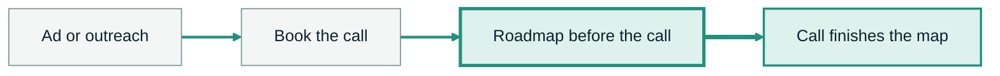
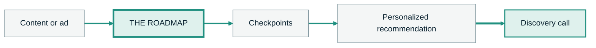
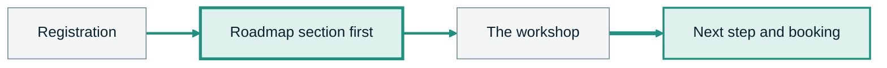

<!-- slide:s7-move-01 -->

SECTION 7 &middot; CONSUMPTION IS PART OF THE PRODUCT

An opt-in is not movement.

<v-clicks>

Most funnels measure whether somebody opted in

A number that goes up while nothing changes for the person behind it

The Roadmap System measures whether they actually moved

Which is the only measurement a transformation business can act on

</v-clicks>

<!--
HOOK: two metrics that look adjacent and are not. One counts contacts. One counts change.
BEATS:
  - Most funnels measure whether somebody opted in. The Roadmap System measures whether they actually moved.
TIMING: 25 sec
TRANSITION: and the reason that distinction matters is about when value actually gets created.
-->

---
layout: default
class: flex flex-col justify-center
---

<!-- slide:s7-move-02 -->

WHEN VALUE GETS CREATED

A good resource does not create value when it is delivered.

<v-clicks>

Consumed

Understood

Acted on

</v-clicks>

<!--
HOOK: delivery is a shipping event. Value is a behavior event. Almost every funnel is built to optimize the first one.
BEATS:
  - A good resource does not create value when it is delivered. It creates value when it is consumed, understood, and acted on.
TIMING: 25 sec
TRANSITION: which means consumption cannot sit at the end of the build.
-->

---
layout: center
class: text-center
---

<!-- slide:s7-move-03 -->

Consumption cannot be an afterthought.

It has to be designed into the product.

<!--
HOOK: the section thesis in one sentence. Consumption is a design decision, not a follow-up sequence.
BEATS:
  - So consumption cannot be an afterthought. It has to be designed into the product.
TIMING: 18 sec
TRANSITION: so here is what designing it in actually looks like.
PACE: stop after the first line. The click is the argument.
-->

---
layout: default
---

<!-- slide:s7-engine-01 -->

THE CONSUMPTION ENGINE

Five parts, built in from the start.

<v-clicks>

Checkpoints

Visible progress

Meaningful stakes

Personalization

Useful unlocks

</v-clicks>

<!--
HOOK: five mechanics people mistake for polish. They are the load-bearing structure of whether anybody finishes.
BEATS:
  - That is where the checkpoints, visible progress, meaningful stakes, personalization, and useful unlocks come in.
TIMING: 30 sec
TRANSITION: and I want to be precise about what those five things are not.
-->

---
layout: default
---

<!-- slide:s7-engine-02 -->

THE PART PEOPLE GET WRONG

Three things this is not.

<v-clicks>

Not childish gamification

Not fake scarcity

Not an arbitrary timer attached to a worthless PDF

</v-clicks>

<!--
HOOK: say the ugly versions out loud, because the audience has been sold all three and will assume you mean them.
BEATS:
  - Not childish gamification. Not fake scarcity. Not an arbitrary timer attached to a worthless PDF.
TIMING: 22 sec
TRANSITION: what it actually is comes down to three words.
PACE: flat delivery on all three. No sneering. Several of them have shipped one of these.
-->

---
layout: center
class: text-center
---

<!-- slide:s7-engine-03 -->

Real progress.

Real relevance.

A real reason to continue.

<!--
HOOK: the standard every consumption mechanic has to pass. If a mechanic fails one of these it is decoration.
BEATS:
  - Real progress. Real relevance. A real reason to continue.
TIMING: 18 sec
TRANSITION: and at the end of it there is one asset that decides whether any of this was worth their time.
-->

---
layout: center
class: text-center
---

<!-- slide:s7-cat-01 -->

THE CATALYST

So useful that the provider is slightly nervous giving it away.

Something you could reasonably charge for.

<!--
HOOK: the nervousness is the spec. If you feel fine handing it over, it is not the Catalyst.
BEATS:
  - At the end of the Roadmap, there should be a Catalyst asset so useful that the provider is slightly nervous giving it away.
  - Something you could reasonably charge for.
TIMING: 25 sec
TRANSITION: it can take a few different shapes.
-->

---
layout: default
---

<!-- slide:s7-cat-02 -->

WHAT A CATALYST CAN BE

Different shapes. Same standard.

<v-clicks>

A done-for-you asset

A personalized diagnostic

A high-value template

A teardown

A plan

</v-clicks>

Earned by completing the meaningful checkpoints

<!--
HOOK: five shapes, one gate. Nobody is handed the Catalyst. They walk to it.
BEATS:
  - A done-for-you asset. A personalized diagnostic. A high-value template. A teardown. A plan.
  - The person earns it by completing the meaningful checkpoints.
TIMING: 30 sec
TRANSITION: let me tell you exactly what ours is, so this is not theoretical.
-->

---
layout: default
---

<!-- slide:s7-cat-03 -->

OUR CATALYST

A high-converting book-a-call ad.

<!--

```mermaid {scale: 0.85}
---
config:
  theme: base
  themeVariables: {background: "#ffffff", edgeLabelBackground: "#ffffff", fontSize: "15px", lineColor: "#5C7078"}
  flowchart: {curve: linear, nodeSpacing: 40, rankSpacing: 55}
---
flowchart LR
  A["We write the structure"]:::proc
  B["You record it"]:::proc
  C["You send it back"]:::proc
  D["We edit the whole thing"]:::win
  A -- "with our instructions" --> B
  B --> C
  C --> D
  classDef proc fill:#F4F6F6,stroke:#7A9199,stroke-width:1px,color:#0A2230
  classDef win fill:#DFF1ED,stroke:#209080,stroke-width:2px,color:#0A2230
  linkStyle 0,1 stroke:#209080,stroke-width:2.5px
  linkStyle 2 stroke:#209080,stroke-width:4px
```

HOOK: name the actual asset. A Catalyst you cannot describe in one line is not an asset, it is an intention.
BEATS:
  - Ours is a high-converting book-a-call ad. We write the structure. We give you the instructions to record it. You send it back. We edit the whole thing.
TIMING: 30 sec
TRANSITION: and then there is the part almost nobody offering a done-for-you asset will say.
SOURCE: the Catalyst was settled 2026-08-01 and is not spoken in _SCRIPT.md yet. These BEATS are written to John's own wording of it and need his read before record.
DRAW: tap each of the four steps as you name it.
-->

---
layout: center
class: text-center
---

<!-- slide:s7-cat-04 -->

And we tell you if it does not have teeth.

That is a promise to give you an inconvenient answer.

<!--
HOOK: the strongest clause in the whole offer. Everybody promises a deliverable. Almost nobody promises a verdict on it.
BEATS:
  - And we tell you if it does not have teeth.
  - That is a promise to give you an inconvenient answer, which is not something most people offering you a done-for-you asset are willing to make.
TIMING: 25 sec
TRANSITION: and to earn it there is a window.
PACE: this is the slide you slow down on. Say the line, stop, let it sit, then click.
SOURCE: same 2026-08-01 ruling as the previous slide. Needs John's read.
-->

---
layout: center
class: text-center
---

<!-- slide:s7-72-01 -->

THE WINDOW

72

HOURS

Our current working window.

<!--
HOOK: one number on a white frame. The specificity is the credibility.
BEATS:
  - Our current working window is seventy-two hours.
TIMING: 15 sec
TRANSITION: and the reason it is three days and not one, or seven, is worth understanding.
-->

---
layout: default
---

<!-- slide:s7-72-02 -->

WHY THREE DAYS

Not a day. Not a week.

<v-clicks>

Twenty-four hours

Can be too unforgiving

A week

Creates too much room to forget

Three days

Long enough to be reasonable. Short enough to preserve momentum

</v-clicks>

<!--
HOOK: a three-way comparison, so the window reads as a considered decision rather than a marketing timer.
BEATS:
  - Twenty-four hours can be too unforgiving. A week creates too much room to forget. Three days is long enough to be reasonable and short enough to preserve momentum.
TIMING: 30 sec
TRANSITION: but do not let the number become the point.
-->

---
layout: center
class: text-center
---

<!-- slide:s7-72-03 -->

The point is not the number by itself.

It is to capture intent while it is still alive.

<!--
HOOK: the principle behind the window, so anybody can set their own and still be right.
BEATS:
  - The point is not the number by itself. The point is to capture intent while it is still alive.
TIMING: 18 sec
TRANSITION: and when the window closes on somebody who stopped halfway, here is what happens.
NOTE: do not quote a drop-off percentage here. The script flags that figure as unverified and it is on the review list.
-->

---
layout: default
---

<!-- slide:s7-re-01 -->

THE ROADMAP RE-ENTRY SEQUENCE

When somebody stops, they do not get a generic nurture sequence.

<v-clicks>

Welcome emails

Indoctrination emails

Roadmap abandonment emails

</v-clicks>

Back to the exact point they left unfinished

<!--
HOOK: the follow-up is made of the same argument, chunked. Nothing new is written for it.
BEATS:
  - And when somebody stops, the system does not dump them into a generic nurture sequence.
  - The Roadmap, the SAGE training, and the same core argument can be chunked into welcome emails, indoctrination emails, and Roadmap abandonment emails that bring them back to the exact point they left unfinished.
  - We call this the Roadmap Re-Entry Sequence.
TIMING: 40 sec
TRANSITION: which changes what an email is actually for.
-->

---
layout: center
class: text-center
---

<!-- slide:s7-re-02 -->

The email does not invent a new argument.

It continues the argument they already started.

<!--
HOOK: this is why the sequence does not feel like marketing. It is the same conversation, resumed.
BEATS:
  - The email does not invent a new argument. It continues the argument they already started.
TIMING: 18 sec
TRANSITION: and it can go further than resuming, because of what the Roadmap already knows.
-->

---
layout: center
class: text-center
---

<!-- slide:s7-rehook-01 -->

The Roadmap collects their answers.

So the follow-up can be more personal than "just checking in."

<!--
HOOK: the bridge into personalization. The data was collected as a by-product of the transformation, not as a form.
BEATS:
  - And because the Roadmap collects their answers, that follow-up can become much more personal than "just checking in."
TIMING: 18 sec
TRANSITION: so look at what it actually collects.
-->

---
layout: default
---

<!-- slide:s8-data-01 -->

SECTION 8 &middot; WHAT IT COLLECTS

Then the follow-up can reflect their reality.

<v-clicks>

Their goal

Their target

Their timeline

Their current constraint

The solution that failed

Their awareness level

The actions they will take

</v-clicks>

<!--
HOOK: seven fields, and not one of them is a lead-gen field. Every one of them is something a good consultant would ask.
BEATS:
  - The Roadmap can collect the person's goal, target, timeline, current constraint, failed solution, awareness level, and the actions they say they are willing to take. That means the follow-up can reflect their reality.
TIMING: 35 sec
TRANSITION: I have done a simple version of this for years, so let me show you the version that worked.
-->

---
layout: two-cols
---

<!-- slide:s8-story-01 -->

A LONG TIME AGO

I took a long-term goal and broke it into the daily input.

Not the goal. The input the goal requires, every day.

::right::

"How is that X per day going?"

One question. Their number, not ours

<!--
HOOK: the whole personalization mechanic, invented by hand, years before there was a system to run it.
BEATS:
  - A long time ago, I took somebody's long-term goal, broke it down into the daily input required, and followed up with a simple question: "How is that X per day going?"
TIMING: 30 sec
TRANSITION: and the reply rate on that was good for three specific reasons.
-->

---
layout: default
---

<!-- slide:s8-story-02 -->

WHY THE REPLY RATE WAS GOOD

Three reasons, and none of them are clever.

<v-clicks>

It was specific

It was based on their goal

It did not feel like a manufactured sales touch

</v-clicks>

<!--
HOOK: this is the anti-copywriting slide. Nothing here is persuasion. It is relevance.
BEATS:
  - The reply rate was good because it was specific. It was based on their goal. It did not feel like a manufactured sales touch.
TIMING: 25 sec
TRANSITION: here is what that looks like when somebody hands you their own number.
-->

---
layout: two-cols-header
---

<!-- slide:s8-ex-01 -->

EXAMPLE

They give you the number. You use their number.

::left::

They said

"I need thirty qualified conversations this month"

::right::

You ask

"How are those two conversations a day going?"

::bottom::

Not arbitrary urgency. Relevant accountability.

<!--
HOOK: the follow-up is arithmetic on their own stated target. There is nothing in it to argue with.
BEATS:
  - If somebody says they need thirty qualified conversations this month, the follow-up can ask: "How are those two conversations a day going?"
  - That is not arbitrary urgency. It is relevant accountability attached to what they said they wanted.
TIMING: 30 sec
TRANSITION: and while all of that is happening, the system is learning something bigger.
-->

---
layout: default
---

<!-- slide:s8-agree-01 -->

AGREEMENT TRACKING

You can see what they agree with.

<v-clicks>

The problem

The mechanism

The solution

The implementation path

</v-clicks>

<!--
HOOK: four layers of agreement, tracked separately. Most businesses only ever measure the last one, and only when it fails.
BEATS:
  - And as people move through the system, you can see whether they agree with the problem, the mechanism, the solution, and the product or implementation path.
TIMING: 30 sec
TRANSITION: which means you also see the four things nobody normally gets to see.
-->

---
layout: default
class: flex flex-col justify-center
---

<!-- slide:s8-agree-02 -->

WHAT THE SYSTEM SEES

Four things you could never see before.

<v-clicks>

- Where they stop
- Where they disagree
- What they misunderstand
- What questions keep appearing

</v-clicks>

<!--
HOOK: these four are the whole research function of the business, produced for free by people who never bought anything.
BEATS:
  - You can see where they stop. Where they disagree. What they misunderstand. What questions keep appearing.
TIMING: 25 sec
TRANSITION: and that is the moment the thing changes category.
-->

---
layout: center
class: text-center
---

<!-- slide:s8-agree-03 -->

That is where the Roadmap starts becoming self-proving.

<!--
HOOK: plant the phrase. It gets paid off in full later in the training, so say it and move.
BEATS:
  - That is where the Roadmap starts becoming self-proving.
TIMING: 12 sec
TRANSITION: now let me show you how this fits whatever funnel you are already running.
PACE: do not explain self-proving here. Section 12 owns it. Naming it early is the setup.
-->

---
layout: default
---

<!-- slide:s9-models-01 -->

SECTION 9 &middot; THE FUNNEL MODELS

Same Roadmap. Four ways to run it.

<v-clicks>

01 &middot; Direct book-a-call

02 &middot; Roadmap-first

03 &middot; Low ticket

04 &middot; Webinar or workshop

</v-clicks>

<!--
HOOK: nobody has to tear down what they built. Four models, and one of these is already theirs.
BEATS:
  - This fits whichever model you are already running. There are four, and you are almost certainly in one of them.
TIMING: 22 sec
TRANSITION: start with the one most of you are running now.
SOURCE: this is a structural slide, not a scripted beat. The four names come straight from the script's own section 9 markers.
-->

---
layout: default
---

<!-- slide:s9-direct-01 -->

MODEL 01 &middot; DIRECT BOOK-A-CALL

The call still comes first. It just starts further along.

<!--
HOOK: the model everybody already runs, with one asset inserted before the conversation instead of after it.
BEATS:
  - The direct flow can still begin with a call. Ad or outreach. Book the call. Complete the Roadmap before the call. Use the call to finish the map instead of starting discovery from zero.
TIMING: 30 sec
TRANSITION: and the way you ask for that is not a hoop. It is a favour.
DRAW: circle the Roadmap node, then tap the final node as you say finish the map.
-->

---
layout: center
class: text-center
---

<!-- slide:s9-direct-02 -->

HOW YOU ASK FOR IT

"Go through this before we meet."

"It will answer many of the questions you probably already have."

"And it gives us the context to make the conversation far more useful."

<!--
HOOK: the framing that makes pre-call work feel like a gift instead of a qualifier.
BEATS:
  - The framing is simple: "Go through this before we meet. It will answer many of the questions you probably already have and give us the context to make the conversation far more useful."
TIMING: 28 sec
TRANSITION: now the version for a market that needs more before it will book anything.
-->

---
layout: default
---

<!-- slide:s9-first-01 -->

MODEL 02 &middot; ROADMAP-FIRST

The Roadmap comes first.

For a market that needs education or trust before it will book.

<!--
HOOK: same destination, different order. The call is the last step instead of the first.
BEATS:
  - When the market needs more education or trust, the Roadmap can come first. Content or ad. Roadmap. Checkpoints. Personalized recommendation. Discovery call.
TIMING: 28 sec
TRANSITION: third model, and this is the one people get wrong most often.
-->

---
layout: two-cols-header
---

<!-- slide:s9-lt-01 -->

MODEL 03 &middot; LOW TICKET

Two valid positions. Same job.

::left::

The primary product

What they paid for is the Roadmap itself

::right::

The most important bonus

Attached to whatever they actually bought

::bottom::

Either way, the job is to drive consumption.

<!--
HOOK: the position in the offer is negotiable. The job is not.
BEATS:
  - In a low-ticket funnel, the Roadmap can be the primary product or the most important bonus. Either way, the job is to drive consumption
TIMING: 26 sec
TRANSITION: because in a low-ticket funnel the Roadmap is doing a second job as well.
NOTE: the spoken sentence is deliberately left open. It finishes on the next slide, so do not close it here.
-->

---
layout: default
---

<!-- slide:s9-lt-02 -->

MODEL 03 &middot; THE ASCENSION LAYER

Where implementation actually happens.

<!--

```mermaid {scale: 0.75}
---
config:
  theme: base
  themeVariables: {background: "#ffffff", edgeLabelBackground: "#ffffff", fontSize: "15px", lineColor: "#5C7078"}
  flowchart: {curve: linear, nodeSpacing: 40, rankSpacing: 55}
---
flowchart LR
  A["Ad or content"]:::proc
  B["Low-ticket purchase"]:::proc
  R["THE ROADMAP"]:::hub
  C["Checkpoints"]:::proc
  W["Ascension layer"]:::win
  A --> B
  B --> R
  R --> C
  C --> W
  classDef proc fill:#F4F6F6,stroke:#7A9199,stroke-width:1px,color:#0A2230
  classDef hub fill:#DFF1ED,stroke:#209080,stroke-width:3px,color:#0A2230
  classDef win fill:#DFF1ED,stroke:#209080,stroke-width:2px,color:#0A2230
  linkStyle 0,1,2 stroke:#209080,stroke-width:2.5px
  linkStyle 3 stroke:#209080,stroke-width:4px
```

HOOK: a low-ticket buyer who never implements never ascends. The Roadmap is the layer that fixes that.
BEATS:
  - and use the Roadmap as the ascension and implementation layer.
TIMING: 20 sec
TRANSITION: fourth model, and it is the one that changes the most.
NOTE: this finishes the sentence you started on the previous slide. Do not restate it.
DRAW: tap the ascension node last, and hold there.
-->

---
layout: default
---

<!-- slide:s9-web-01 -->

MODEL 04 &middot; WEBINAR OR WORKSHOP

A webinar becomes a Roadmap Workshop.

They arrive able to apply the training to their own situation.

<!--
HOOK: the registrant stops being an audience member. They show up mid-transformation.
BEATS:
  - A traditional webinar can become a Roadmap Workshop. The person registers, begins the Roadmap, consumes the relevant section before the event, and arrives able to apply the training to their own situation.
  - After the workshop, the Roadmap gives them the next step and can contain the booking path.
TIMING: 35 sec
TRANSITION: and none of those four need a paid ad to start.
-->

---
layout: two-cols-header
---

<!-- slide:s9-dm-01 -->

THE FRONT DOOR

"DM ROADMAP."

::left::

A post, story, reel, YouTube description, comment keyword, or DM.

::right::

<v-clicks>

PATH

PATHWAY

PLAN

</v-clicks>

::bottom::

The front-end language changes. The system underneath stays the same.

<!--
HOOK: the keyword is the cheapest front door there is, and the word itself is a market decision, not a branding one.
BEATS:
  - A post, story, reel, YouTube description, comment keyword, or DM can say: "DM ROADMAP."
  - For another market, "PATH," "PATHWAY," or "PLAN" may be more congruent. The front-end language changes. The system underneath stays the same.
TIMING: 30 sec
TRANSITION: and the automation behind it is doing more than sending a link.
-->

---
layout: default
class: flex flex-col justify-center
---

<!-- slide:s9-dm-02 -->

ManyChat does not only deliver the link.

It drives them back to the section they have not completed.

<!--
HOOK: the automation is a consumption tool, not a delivery tool. That is the whole reframe of DM marketing.
BEATS:
  - ManyChat does not only deliver the link. It can drive the person back to the section they have not completed.
TIMING: 18 sec
TRANSITION: so notice what every one of those versions has in common.
-->

---
layout: center
class: text-center
---

<!-- slide:s9-hook-01 -->

Every version has the same destination.

Because the Roadmap is doing more than lead generation.

It is assembling the client.

<!--
HOOK: section close, and the handoff into the assembly line. The last three words are the whole next section.
BEATS:
  - Every version has the same destination because the Roadmap is doing more than lead generation. It is assembling the client.
TIMING: 20 sec
TRANSITION: hand straight into the assembly line. The phrase is the bridge, so do not pause after it.
PACE: land hard on assembling. That verb is the next section's title.
-->
