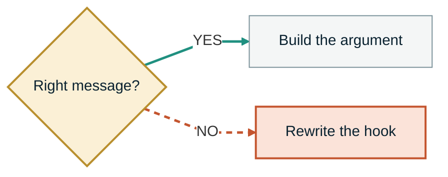
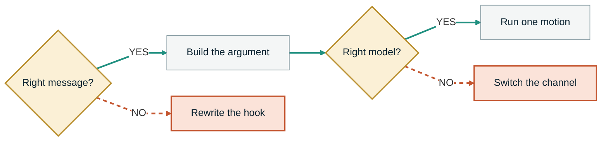
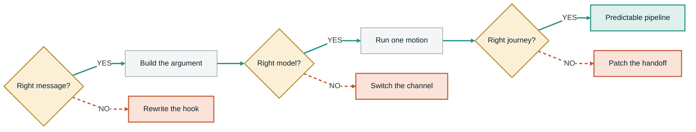
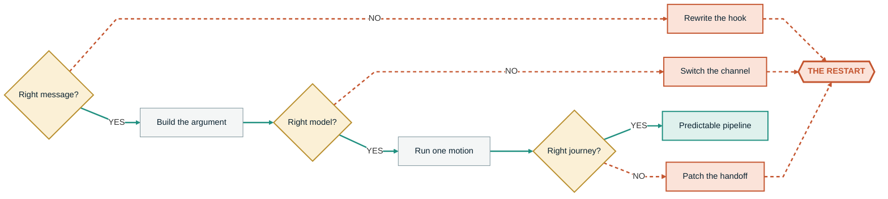
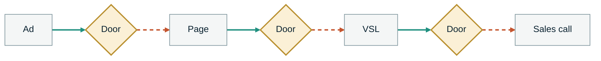
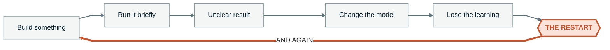

<!-- slide:s2-gates-01 -->

SECTION 2 &middot; THE THREE GATES

Three gates. The same three, forever.

<!--
HOOK: the three gates are structural, not stage-specific. Nobody outgrows them.
BEATS:
  - Regardless of whether you are trying to get from zero to ten thousand a month, thirty thousand a month, or break through one hundred thousand for the first time, the same three gates keep appearing.
TIMING: 18 sec
TRANSITION: here they are, and you have already met all three.
-->

---

<!-- slide:s2-gates-02 -->

EVERY STAGE &middot; THE SAME THREE

The same three gates keep appearing.

<v-clicks>

1. Right message?

Do they recognize themselves

2. Right model?

Does it fit what you actually have

3. Right journey?

Does it hold all the way to the transformation

</v-clicks>

The symptoms change. The loop does not.

<!--
HOOK: name all three before opening any one of them, so the viewer has the frame.
BEATS:
  - The symptoms change as the company grows. The loop does not.
TIMING: 25 sec
TRANSITION: start with the first one, because everything downstream inherits it.
-->

---

<!-- slide:s2-gate1-01 -->

GATE ONE

Right message?

<v-clicks>

- Does the market recognize itself in what you are saying?
- Do they care about the problem you are naming?
- Do they understand the outcome?
- Does the argument meet them at the level of awareness they are actually in?

</v-clicks>

<!--
HOOK: gate one is not about clever copy, it is about recognition.
BEATS:
  - Does the market recognize itself in what you are saying? Do they care about the problem you are naming? Do they understand the outcome? Does the argument meet them at the level of awareness they are actually in?
TIMING: 30 sec
TRANSITION: and when the answer is no, watch what a founder actually does.
-->

---

<!-- slide:s2-gate1-02 -->

GATE ONE &middot; THE NO PATH

A no here means a rewrite.

<v-clicks>

New hook

New positioning

Another angle

New offer

More content

</v-clicks>

<!--
HOOK: the no path is the whole problem, and it looks like productivity.
BEATS:
  - If the answer is no, the founder rewrites the hook, changes the positioning, adds another angle, changes the offer, or creates more content.
  - Then they start again.
TIMING: 30 sec
TRANSITION: gate two, and this is the one people fight religious wars over.
DRAW: trace the red NO edge with drauu as you say "then they start again". One stroke.
-->

---

<!-- slide:s2-gate2-01 -->

GATE TWO

Right model?

Does the way you acquire and convert fit your current resources and economics?

<v-clicks>

More money than time

Paid distribution may make sense

More time than money

Organic content, DMs, partnerships and manual follow-up become the proving ground

</v-clicks>

<!--
HOOK: the model question is a resource question before it is a marketing question.
BEATS:
  - Does the way you are acquiring and converting customers fit your current resources and economics?
  - If you have more money than time, paid distribution may make sense. If you have more time than money, organic content, DMs, partnerships, and manual follow-up can become the proving ground.
TIMING: 30 sec
TRANSITION: which means none of these are the thing people treat them as.
-->

---

<!-- slide:s2-gate2-02 -->

GATE TWO &middot; THE MENU

<v-clicks>

High ticket

Low ticket

Webinars

Workshops

Direct booking

Outbound

Organic

</v-clicks>

Not religions. Models.

<!--
HOOK: strip the identity out of the model choice and it becomes a decision again.
BEATS:
  - High ticket, low ticket, webinars, workshops, direct booking, outbound, and organic are not religions. They are models.
TIMING: 25 sec
TRANSITION: so what actually decides which one is right for you.
-->

---

<!-- slide:s2-gate2-03 -->

GATE TWO &middot; WHAT DECIDES IT

The right model depends on five things.

<v-clicks>

- The market
- The margins
- The sales cycle
- The trust required
- What you can actually sustain

</v-clicks>

<!--
HOOK: five variables, none of which are in the guru's case study.
BEATS:
  - And the right model depends on the market, the margins, the sales cycle, the trust required, and what you can actually sustain.
TIMING: 25 sec
TRANSITION: and when the model answer comes back no, the response is bigger and more expensive.
-->

---

<!-- slide:s2-gate2-04 -->

GATE TWO &middot; THE NO PATH

A no here means a new channel.

<v-clicks>

New channel

Another funnel

Another agency

High to low ticket

</v-clicks>

<!--
HOOK: gate two failures cost money, not just an afternoon.
BEATS:
  - If the answer is no, the founder changes channels, builds another funnel, hires another agency, or swaps high ticket for low ticket.
  - Then they start again.
TIMING: 30 sec
TRANSITION: gate three is the one almost nobody audits, and it is where the money leaks.
DRAW: trace the second red NO edge. Same stroke, same place, so it reads as a pattern.
-->

---

<!-- slide:s2-gate3-01 -->

GATE THREE

Right journey?

Once somebody enters, does the whole journey hold their attention and move them toward the transformation?

<v-clicks>

- Does the ad continue into the page?
- Does the page continue into the email?
- Does the email continue into the training?
- Does the sales conversation continue the same argument?
- Does fulfillment continue the same transformation after they buy?

</v-clicks>

Or does every asset begin a different sale?

<!--
HOOK: continuity is a property of the whole chain, so any single break costs the whole chain.
BEATS:
  - Once somebody enters, does the complete journey hold their attention and move them toward the transformation?
  - Does the ad continue into the page? Does the page continue into the email? Does the email continue into the training? Does the sales conversation continue the same argument? Does fulfillment continue the same transformation after they buy?
  - Or does every asset begin a different sale?
TIMING: 40 sec
TRANSITION: and here is what a no at gate three makes people do.
-->

---

<!-- slide:s2-gate3-02 -->

GATE THREE &middot; THE NO PATH

A no here means a patch.

<v-clicks>

More emails

New VSL

New script

More pressure

Lower price

Better closer

</v-clicks>

<!--
HOOK: six fixes, none of which touch the actual break, which is the handoff itself.
BEATS:
  - If the answer is no, the founder adds more emails, rewrites the VSL, changes the sales script, adds pressure, lowers the price, or hires a better closer.
  - Then they start again.
TIMING: 30 sec
TRANSITION: now put all three no paths on the same screen.
DRAW: trace the third red NO edge, then hold. The pattern should be obvious before you say it.
-->

---

<!-- slide:s2-loop-01 -->

THE CONVERGENCE

Every no goes to the same place.

Three different failures. One destination.

<!--
HOOK: three different failures, one destination. That is what makes it a loop instead of a list.
BEATS:
  - By the time they solve the third problem, the first one has changed.
  - By the time they fix acquisition, the new channel brings in a different level of awareness.
TIMING: 30 sec
TRANSITION: and this is the whole thing, drawn out properly.
DRAW: circle the restart node while you say "the first one has changed".
-->

---

<!-- slide:s2-loop-02 -->

THE CHART FROM THE FIRST MINUTE

You have seen this already. Now you can read it.

Back to the beginning, with the learning gone.

<!--
HOOK: deliberate callback. This is the same chart from the cold open, and the whole point is that it was unreadable then and is obvious now.
BEATS:
  - By the time they rewrite the VSL, sales is still using the old argument.
  - By the time they improve closing, fulfillment is promising something else.
TIMING: 35 sec
TRANSITION: so what did all that motion actually buy them.
DRAW: trace the thick MOST FOUNDERS return arrow along the bottom, left to right. This is the only stroke on this slide.
NOTE TO EDITOR: this figure appears three times in the deck (twice in the cold open, once here). That is intentional and it is the payoff of the callback. Do not swap it for a different graphic.
-->

---
layout: center
class: text-center
---

<!-- slide:s2-loop-03 -->

They make local progress.

The whole system never compounds.

<!--
HOOK: local progress is why the loop survives. It feels like winning.
BEATS:
  - They make local progress. The whole system never compounds.
TIMING: 20 sec
TRANSITION: that repeated return to zero has a name.
-->

---
layout: center
class: text-center
---

<!-- slide:s3-door-01 -->

SECTION 3 &middot; THE ROOT CAUSE

The Invisible Door

The point where the prospect leaves one touchpoint and enters the next.

<!--
HOOK: name the gap and it stops being invisible. That is the entire job of this beat.
BEATS:
  - We call the hidden gap between those assets The Invisible Door. It is the point where the prospect leaves one touchpoint and enters the next.
TIMING: 25 sec
TRANSITION: and the reason it stays hidden is how we are all taught to build.
-->

---

<!-- slide:s3-door-02 -->

HOW WE ARE TAUGHT TO BUILD

Most businesses treat each asset as a separate object.

<v-clicks>

An ad

A landing page

A VSL

A webinar

An application

A sales call

</v-clicks>

The prospect experiences one continuous decision.

<!--
HOOK: six objects to you, one decision to them. The mismatch is the whole problem.
BEATS:
  - Most businesses treat each asset as a separate object. An ad. A landing page. A VSL. A webinar. An application. A sales call.
  - But the prospect experiences one continuous decision.
TIMING: 35 sec
TRANSITION: so look at what sits in between them.
DRAW: draw a single continuous line under all six cards while you say "one continuous decision".
-->

---

<!-- slide:s3-door-03 -->

THE DOOR IS BETWEEN EVERY PAIR

Every handoff asks them to reorient.

<v-clicks>

The problem

The promise

The mechanism

The language

The action

</v-clicks>

<!--
HOOK: five things can change at a door, and any one of them makes them start over.
BEATS:
  - And every time the next touchpoint changes the problem, the promise, the mechanism, the language, or the action, the prospect has to reorient.
TIMING: 35 sec
TRANSITION: and that reorientation has a name too, and it is the one that matters.
DRAW: tap each gold door as you name the five things that can change.
-->

---
layout: center
class: peak text-center
---

<!-- slide:s3-restart-01 -->

THE ROOT CAUSE, NAMED

That is The Restart.

<!--
HOOK: the single highest-recall moment in the training. Say it, then stop talking.
BEATS:
  - That is The Restart.
TIMING: 12 sec
TRANSITION: here is exactly what it does to you.
PACE: full stop after the line. Let the dark frame sit for two beats before you move.
-->

---

<!-- slide:s3-restart-02 -->

WHAT AN INCONGRUENT TOUCHPOINT DOES

Three things, every time.

<v-clicks>

Breaks the argument

The one established before it

Resets understanding

They work out where they are again, from scratch

Forces self-competition

The funnel now has to beat itself

</v-clicks>

<!--
HOOK: define it precisely, because a vague root cause cannot be fixed.
BEATS:
  - The Restart is what happens when an incongruent touchpoint breaks the argument established before it, resets the prospect's understanding, and forces the funnel to compete against itself.
TIMING: 35 sec
TRANSITION: and self-competition is not a metaphor. Watch it happen.
-->

---

<!-- slide:s3-restart-03 -->

SELF-COMPETITION

Your funnel starts fighting itself.

<v-clicks>

The ad earns attention

The page spends it

The training builds belief

The sales call starts discovery from zero

The sale creates one expectation

Onboarding introduces another

</v-clicks>

<!--
HOOK: every pair is a win handing off to a loss. That is the shape of the whole business.
BEATS:
  - Your funnel starts fighting itself. The ad earns attention, but the page spends it. The training builds belief, but the sales call starts discovery from zero. The sale creates one expectation, and onboarding introduces another.
TIMING: 40 sec
TRANSITION: so who ends up holding all of that together.
-->

---
layout: center
class: text-center
---

<!-- slide:s3-restart-04 -->

So the founder reconnects it.

Every time.

<!--
HOOK: the founder becomes the missing piece of infrastructure, personally, forever.
BEATS:
  - The founder then has to personally reconnect all the pieces every time.
TIMING: 18 sec
TRANSITION: and once you are the connective tissue, the loop has a fixed shape.
-->

---

<!-- slide:s3-cycle-01 -->

THE RESTART CYCLE

So the loop becomes this.

And again. And again.

<!--
HOOK: six steps, and step six is step one. Years disappear in here.
BEATS:
  - So the loop becomes: build something. Run it briefly. Get an unclear result. Change the model. Lose the previous learning. Start again. And again. And again.
TIMING: 30 sec
TRANSITION: so the fix is not what everybody assumes it is.
DRAW: trace the thick return edge on "and again", then again on the second "and again".
-->

---
layout: center
class: text-center
---

<!-- slide:s3-out-01 -->

The way out is not becoming perfect at three disconnected systems.

It is one system that connects all three.

<!--
HOOK: reframe the goal before naming the solution, or the solution sounds like another tactic.
BEATS:
  - The way out is not to become perfect at three disconnected systems. The way out is to install one central system that connects all three.
TIMING: 22 sec
TRANSITION: and this is that system, so let me draw the line out.
-->
