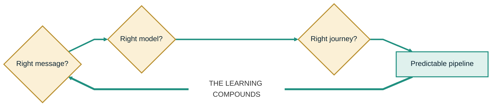
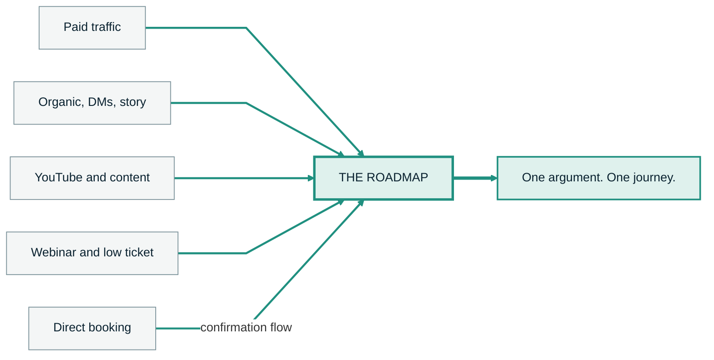
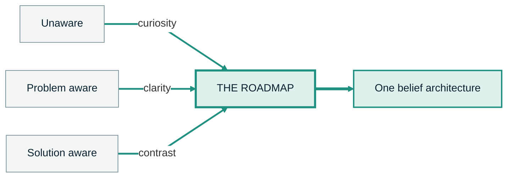

<!-- slide:s4-line-01 -->

SECTION 4 &middot; DRAW THE LINE OUT

<svg viewBox="0 0 340 10" class="w-96 mx-auto my-10" xmlns="http://www.w3.org/2000/svg"><line x1="5" y1="5" x2="335" y2="5" style="stroke: var(--tealb)" stroke-width="8" stroke-linecap="round" /></svg>

This green line is the SAGE Roadmap System.

<!--
HOOK: the energy pivot of the whole training. Diagnosis stops. Possibility starts.
BEATS:
  - This green line is the SAGE Roadmap System.
TIMING: 15 sec
TRANSITION: so let me show you what it actually connects.
PACE: hold the bare line on the dark frame for two beats before you name it. Your voice changes here or the pivot does not exist. Everything before this was the doctor. From here you are the general.
DRAW: trace along the teal line, left to right, once, as you say the sentence.
-->

---

<!-- slide:s4-line-02 -->

ALL THREE GATES &middot; ANSWERED TOGETHER

One line through all three.

Nothing you already learned gets thrown away.

<!--
HOOK: same three gates, same gold rhombi, one continuous line. The return edge is now teal, and that is the entire difference between this diagram and the last five.
BEATS:
  - It connects the right message to the right model and the right journey without throwing away everything you already learned.
TIMING: 30 sec
TRANSITION: and it does one more thing, which is give the market a single place to stand.
DRAW: trace the teal return edge on "without throwing away". Same stroke you used for the red one, so the contrast is physical.
-->

---

<!-- slide:s4-ask-01 -->

ONE PLACE TO UNDERSTAND

Six questions, answered in one place.

<v-clicks>

Where am I now?

What is actually stopping me?

What have I tried?

What are my real options?

What happens next?

What does the transformation require from me?

</v-clicks>

<!--
HOOK: nobody is confused because they lack information. They are confused because the answers live in six different places.
BEATS:
  - It gives the market one place to understand: Where am I now? What is actually stopping me? What have I tried? What are my real options? What happens next? And what does the transformation require from me?
TIMING: 40 sec
TRANSITION: which is why calling this a lead magnet undersells what it is.
-->

---
layout: center
class: text-center
---

<!-- slide:s4-transform-01 -->

Not a lead magnet that describes the transformation.

The Roadmap is the transformation beginning.

<!--
HOOK: the category reframe. A lead magnet is a document about a change. This is the first increment of the change.
BEATS:
  - The Roadmap is not just a lead magnet describing the transformation. The Roadmap is the transformation beginning.
TIMING: 22 sec
TRANSITION: and I mean that literally, so here is what actually happens inside it.
-->

---

<!-- slide:s4-transform-02 -->

WHAT HAPPENS INSIDE IT

Five things, before they ever speak to you.

<v-clicks>

- They recognize the problem
- They see how it applies to them
- They understand the new paradigm
- They take a meaningful step
- They reveal where they agree, where they hesitate, and where they stop

</v-clicks>

<!--
HOOK: four of these are movement and the fifth is diagnostics. You get both from the same artifact.
BEATS:
  - The person recognizes the problem. They see how it applies to them. They understand the new paradigm. They take a meaningful step. They reveal where they agree, where they hesitate, and where they stop.
TIMING: 35 sec
TRANSITION: and the last one is true whether they buy or not.
-->

---
layout: center
class: text-center
---

<!-- slide:s4-transform-03 -->

They become more informed

whether or not they ever buy.

<!--
HOOK: this is the line that makes the whole asset ethical, and the reason it converts. Nobody is trapped in it.
BEATS:
  - They become more informed whether or not they ever buy.
TIMING: 18 sec
TRANSITION: and here is the part I find especially powerful about that.
-->

---

<!-- slide:s4-demo-01 -->

PRODUCT DEMONSTRATION

You are going through it right now.

We do not have to ask you to imagine what this feels like for your leads. You are inside it before you ever talk to us.

<!--
HOOK: the asset is the demo. There is no gap between the claim and the evidence, because they are standing in the evidence.
BEATS:
  - And this is the part I think is especially powerful. We do not have to ask you to imagine what this feels like for your leads. You are going through it before you ever talk to us.
TIMING: 25 sec
TRANSITION: so use yourself as the test. Ask yourself six things.
-->

---

<!-- slide:s4-demo-02 -->

ASK YOURSELF

You are the test case.

<v-clicks>

Did this help me understand the problem?

Did the sequence feel clear?

Did I feel pushed, or more informed?

Would my leads benefit from this?

Where did I lose interest?

What would I change?

</v-clicks>

<!--
HOOK: six questions that only work if we are willing to hear the bad answers. That willingness is the proof.
BEATS:
  - You can ask yourself: Did this help me understand the problem? Did the sequence feel clear? Did I feel pushed, or did I feel more informed? Would my leads benefit from going through something like this? Where did I lose interest? What would I change?
TIMING: 40 sec
TRANSITION: because of one thing, and it is the whole thesis of this section.
-->

---
layout: center
class: text-center
---

<!-- slide:s4-thesis-01 -->

THE ROADMAP IS NOT A PROMISE OF THE PRODUCT.

IT IS THE FIRST EXPERIENCE OF THE PRODUCT.

<!--
HOOK: the single most quotable line in the training. Nothing else belongs on this frame.
BEATS:
  - The Roadmap is not a promise of the product. It is the first experience of the product.
TIMING: 20 sec
TRANSITION: which means your honest reaction to it is not feedback on a document. It is data on the system.
PACE: this is the one slide in the deck you read out loud. Say the first half, stop, click, say the second half, stop again.
SOURCE: this is the script's on-screen line at SLIDE 21, promoted to its own frame.
-->

---

<!-- slide:s4-demo-03 -->

TELL US IF IT DOES NOT WORK

If it does not feel useful, tell us.

That feedback is part of the system.

It is supposed to improve every time somebody moves through it.

<!--
HOOK: invite the criticism on camera. A system that gets better from every pass has to be able to hear that it did not work.
BEATS:
  - If it does not feel useful, tell us. That feedback is part of the system. Because the system is supposed to improve every time somebody moves through it.
TIMING: 25 sec
TRANSITION: and once you understand that, the distribution strategy gets almost embarrassingly simple.
-->

---
layout: center
class: text-center
---

<!-- slide:s5-roads-01 -->

SECTION 5 &middot; DISTRIBUTION

All roads lead to the Roadmap.

<!--
HOOK: say it once, flat, and let it sound too simple. It is supposed to.
BEATS:
  - All roads lead to the Roadmap.
TIMING: 12 sec
TRANSITION: and I mean all of them, so let me actually list them.
-->

---

<!-- slide:s5-roads-02 -->

EVERY ENTRANCE

Ten front doors. One room.

<v-clicks>

Paid traffic

Organic content

YouTube

Story sequences

Link in bio

Boosted reel

Webinar

Low-ticket purchase

DM automation

Outbound follow-up

</v-clicks>

<!--
HOOK: ten channels people treat as ten strategies. They are ten entrances to the same argument.
BEATS:
  - Paid traffic leads to the Roadmap. Organic content leads to the Roadmap. YouTube leads to the Roadmap. Story sequences lead to the Roadmap. A link in the bio leads to the Roadmap. A boosted reel leads to the Roadmap. A webinar leads to the Roadmap. A low-ticket purchase leads to the Roadmap. A DM automation leads to the Roadmap. Outbound follow-up leads to the Roadmap.
TIMING: 45 sec
TRANSITION: and even the one case where somebody skips the whole thing.
PACE: rhythm beat. Same cadence every time, no variation. The repetition is the argument.
-->

---

<!-- slide:s5-roads-03 -->

THE CONVERGENCE

Even a booked call goes back through it.

<!--
HOOK: the hardest case for the argument is the person who books straight off an ad, and even they route through it.
BEATS:
  - And even when somebody books a call directly, the confirmation flow can lead them back through the Roadmap before the conversation.
TIMING: 30 sec
TRANSITION: so look at what that actually means for your team.
DRAW: circle the hub, then tap each incoming edge in turn.
-->

---
layout: center
class: text-center
---

<!-- slide:s5-one-01 -->

One thing.

One central asset.

One argument.

One place the business keeps improving.

<!--
HOOK: four sentences, one noun. This is the operational payoff of the whole training.
BEATS:
  - One thing. One central asset. One argument. One place the business keeps improving.
TIMING: 22 sec
TRANSITION: compare that to what you are probably asking your team to do now.
-->

---

<!-- slide:s5-one-02 -->

WHAT THE TEAM MAINTAINS

Same headcount. Different job.

<v-clicks>

Maintain five disconnected funnels

Five arguments, five sets of learnings, none of them transferable

Keep making the Roadmap better

One argument, improved on a schedule, and every channel inherits it

</v-clicks>

<!--
HOOK: this is a resourcing argument, not a marketing one. Same people, one surface instead of five.
BEATS:
  - Instead of asking the team to maintain five disconnected funnels, you keep making the Roadmap better.
TIMING: 20 sec
TRANSITION: and the way you distribute it depends on exactly one thing about you.
-->

---

<!-- slide:s5-tvm-01 -->

TIME OR MONEY

The same system, two ways in.

More time than money

<v-clicks>

- Post
- Send DMs
- Use story sequences
- Create YouTube trainings
- Listen to the language people use

</v-clicks>

More money than time

<v-clicks>

- Paid traffic
- Boosted reels
- Retargeting
- Direct-response campaigns

</v-clicks>

<!--
HOOK: organic is not the poor cousin of paid. It is the cheaper testing ground for the same argument.
BEATS:
  - If you have more time than money, use organic distribution as the testing ground. Post. Send DMs. Use story sequences. Create YouTube trainings. Listen to the language people use when they respond.
  - If you have more money than time, distribute the same coherent system through paid traffic, boosted reels, retargeting, and direct-response campaigns.
TIMING: 45 sec
TRANSITION: notice what did not change between those two columns.
-->

---
layout: center
class: text-center
---

<!-- slide:s5-tvm-02 -->

The entry can change.

The central journey does not.

<!--
HOOK: the line that makes channel choice a low-stakes decision for the first time in their career.
BEATS:
  - The entry can change. The central journey does not.
TIMING: 15 sec
TRANSITION: which is not the same as saying one message works on everybody.
-->

---

<!-- slide:s5-entrances-01 -->

ONE ARGUMENT, MANY ENTRANCES

This is not one generic ad for everybody.

<v-clicks>

Different awareness states need different entrances.

The entrances converge on the same belief architecture.

</v-clicks>

<!--
HOOK: pre-empt the obvious objection before it forms. Nobody believes one message speaks to everyone, and we are not claiming it.
BEATS:
  - This is not saying one generic ad should speak to everybody. Different awareness states need different entrances.
  - But those entrances can converge on the same underlying belief architecture.
TIMING: 30 sec
TRANSITION: and that is the whole access argument.
-->

---
layout: center
class: text-center
---

<!-- slide:s5-rehook-01 -->

More access to the market.

Without a different business for every segment.

<!--
HOOK: section close. Access without fragmentation is the thing every one of them has tried to buy and never got.
BEATS:
  - That is how the Roadmap gives you more access to the market without forcing you to build a different business for every segment.
TIMING: 20 sec
TRANSITION: so let me show you the three states people arrive in.
-->

---

<!-- slide:s6-unaware-01 -->

SECTION 6 &middot; UNAWARE

They do not know the symptoms share a cause.

Lead with curiosity. Help them recognize the pattern.

UNAWARE

PROBLEM AWARE

SOLUTION AWARE

<!--
HOOK: an unaware prospect cannot be sold a solution, because they do not yet believe there is one problem.
BEATS:
  - Some people are unaware. They do not even know the symptoms share a common cause. You lead with curiosity and help them recognize the pattern.
TIMING: 22 sec
TRANSITION: the second group is one step further in.
-->

---

<!-- slide:s6-problem-01 -->

SECTION 6 &middot; PROBLEM AWARE

They know the problem. They do not know why the obvious fixes failed.

Become useful by articulating the problem more clearly than they can.

UNAWARE

PROBLEM AWARE

SOLUTION AWARE

<!--
HOOK: you earn the right to sell by naming their situation better than they can name it themselves.
BEATS:
  - Some people know they have a problem, but they do not understand why the obvious fixes have not solved it. You become useful by articulating the problem more clearly than they can.
TIMING: 25 sec
TRANSITION: and then there is the group that thinks it already has the answer.
-->

---

<!-- slide:s6-solution-01 -->

SECTION 6 &middot; SOLUTION AWARE

They already know the solutions.

<v-clicks>

VSLs

Webinars

Low ticket

High ticket

Agencies

Setters

Content

AI

</v-clicks>

UNAWARE

PROBLEM AWARE

SOLUTION AWARE

<!--
HOOK: this is the most sophisticated and most exhausted group. They have heard every one of these pitched as the answer.
BEATS:
  - Some people think they already know the solution. They know about VSLs, webinars, low ticket, high ticket, agencies, setters, content, and AI.
TIMING: 30 sec
TRANSITION: and here is the mistake almost everybody makes with this group.
-->

---
layout: center
class: text-center
---

<!-- slide:s6-solution-02 -->

Your job is not to pretend those never work.

It is to show why disconnected solutions send them back into The Restart.

<!--
HOOK: never attack the tactic. Attack the disconnection. The tactic is often the one thing they got right.
BEATS:
  - Your job is not to pretend those solutions never work. Your job is to show why disconnected solutions keep sending them back into The Restart.
TIMING: 25 sec
TRANSITION: so understand what those three groups actually are.
-->

---
layout: center
class: text-center
---

<!-- slide:s6-converge-01 -->

Not separate companies.

Not even separate funnels.

Three entrances into one belief architecture.

<!--
HOOK: this is the line that stops them building a second business every time they find a new segment.
BEATS:
  - These are not separate companies. They are not even necessarily separate funnels. They are different entrances into one belief architecture.
TIMING: 25 sec
TRANSITION: here is what that looks like drawn out.
-->

---

<!-- slide:s6-converge-02 -->

THREE ENTRANCES, ONE ARCHITECTURE

It meets people where they are.

Then moves them toward the same new understanding.

<!--
HOOK: three different first sentences, one destination. The mirror image of the restart diagram, where three different failures went to one destination too.
BEATS:
  - The Roadmap meets people where they are, then moves them toward the same new understanding.
TIMING: 30 sec
TRANSITION: but getting somebody in is only half the job.
DRAW: tap each of the three entrance labels, then circle the hub.
-->

---
layout: center
class: text-center
---

<!-- slide:s6-hook-01 -->

Getting somebody into the Roadmap is half the job.

A resource nobody consumes transforms nobody.

<!--
HOOK: kill the assumption that distribution was the finish line. It was the start line.
BEATS:
  - But getting somebody into the Roadmap is only half the job. A resource that nobody consumes does not transform anybody.
TIMING: 18 sec
TRANSITION: hand straight into consumption as part of the product. Do not pause between sections here.
-->
