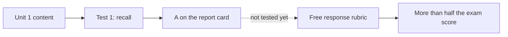

I have everything. Here is the spec.

---

# DECK SPEC — SupportED Back-to-School Webinar (rebuild)
**Target:** `/root/slidev-webinars/supported/back_to_school_2026_08_10/`
**Format:** Fladlien Webinar, 14-section spine (sections 9-14 collapsed to a booking ask)
**Register:** POLISHED-DIRECT for the argument · BEHIND-THE-SCENES for proof + mechanism
**Date:** 2026-08-10 · **Built and QC'd against this document**

---

## 0. MEASUREMENT CORRECTION BEFORE ANYTHING ELSE

The brief says the deck is 348 slides. It is not. **348 is the count of `---` separator lines**, and every slide with frontmatter consumes two of them. The built artifact proves the real number:

```
ls dist/assets/md-*.js | wc -l   ->  173
```

**The deck is 173 physical slides, ~175 by parse.** That matters because the style guide's own pacing gate is "Total slide count in 250-400 range" (§5 Pacing). So the deck fails slide count too, and the rebuild target must be stated in real slides, not separators.

| Metric | Measured now | Source |
|---|---|---|
| Physical slides | **173** | `dist/assets/md-*.js` |
| Separator lines | 348 | `grep -c '^---$'` |
| Lines in file | 3,095 | `wc -l` |
| On-slide visible words | ~3,266 | tag-stripped parse |
| **Speaker-note words** | **269 across 13 blocks** | `<!-- -->` parse |
| Source script words | **10,980** | `Full_Script_Jan_26_.md` |
| Image references | **0** | `grep -c '!\[' / ' No such file |

**The second gap nobody has named yet:** John's requirement is "the ENTIRE script is in there." The deck carries 269 words of speaker notes against a 10,980-word script. **That is 2.4% of the script.** The argument was paraphrased onto slide faces and the read-aloud track was never written. A presenter cannot run this deck. Fixing images alone does not fix this.

---

## 1. PALETTE — exact hex, locked

From `ref_visual_style_guide.md` §2.2 / §2.3, already correctly declared in the current deck's `<style>` block. Keep these values, keep the class names (§2.3 rule: "Class names stay the same across all decks").

| Slot | Hex | CSS variable | Use |
|---|---|---|---|
| Primary / Navy | **`#1B365D`** | `--slidev-theme-primary` | Headlines, mechanism reveals, CTA slides, chat prompts, commitment questions, high-authority moments |
| Secondary / Gold | **`#C5A55A`** | `--slidev-theme-secondary` | Section openers, celebration, key reveals, accent words, big numbers |
| Accent / Cream | **`#E8E0D0`** | `--slidev-theme-accent` | Backgrounds, subtle highlights, borders |
| Dark | **`#111111`** | hardcoded | Pain sections, dramatic transitions, the dark moment before relief |
| Red | **`#C0392B`** | `.red` | The wrong answer, the 3, the miss |
| Green | **`#27AE60`** | `.green` | The right answer, the 5, the earned point |
| White | `#FFFFFF` | — | All text on navy, near-black, and gold grounds |

### Readability law (§2.2, non-negotiable)
- Navy `#1B365D` ground -> **`text-white` only**
- Near-black `#111111` ground -> **`text-white` only**
- Gold `#C5A55A` ground -> **`text-white` only**
- White / default ground -> primary `#1B365D` for headlines, dark gray for body
- **No gold text on dark backgrounds. Too low contrast. Contrast ratio below 4.5:1 fails.**

### Utility classes (ship verbatim in `style.css`, not inline `<style>`)
```css
.gold { color: #C5A55A; }
.navy { color: #1B365D; }
.red  { color: #C0392B; }
.green{ color: #27AE60; }
.big-number { font-size: 5rem; font-weight: 900; color: #C5A55A; }
.strike { text-decoration: line-through; opacity: 0.5; }
.highlight {
  background: #C5A55A22;
  padding: 0.5rem 1rem;
  border-radius: 0.5rem;
  border-left: 4px solid #C5A55A;
}
```
**Build rule violated today:** the deck puts all of this in an inline `<style>` block in `slides.md`. The cheat-sheet build rules are explicit: *"style.css co-located + UNSCOPED + client-prefixed. Inline `<style>` is scoped per-slide; `:root` vars die."* Move to `style.css`, prefix client classes `.sup-*`.

---

## 2. TYPOGRAPHY — exact sizes

| Element | Minimum | Use |
|---|---|---|
| Hero text | **`text-8xl`** | Single big numbers (3, 5, 89%, 2 of 7) |
| Section headers | **`text-5xl` to `text-6xl`** | Section title slides |
| Headlines | **`text-4xl`** | Slide headlines, key statements |
| Body text | **`text-3xl`** | Primary spoken copy, the workhorse |
| Supporting text | **`text-2xl`** | Secondary info, sub-points |
| Absolute floor | **`text-xl`** | Legal and source citations only |

**Never below `text-2xl` for audience-facing content. If it will not fit at `text-2xl`, split the slide.**

Weights: `font-black` (900) for hero numbers, section titles, single-word impacts. `font-bold` (700) for key phrases and CTAs. Normal (400) for body. **Never light or thin weights** — they disappear on screen share.

---

## 3. THE GATE TABLE — what this rebuild is QC'd against

Numbers quoted exactly from `ref_visual_style_guide.md` §1.5 and `deck_production` SKILL §3. The measurement basis is the Fladlien swipe (`swipe_slides_fladlien_mattos_mobile_84p.pdf`, 84 pages, **355 image objects**, `pdfimages -list`).

| # | Gate | Target | Fail | Current deck | Verdict |
|---|---|---|---|---|---|
| G1 | Slides with zero visual | **<= 5%** | above 10% reads as a wall of type | **100%** | **FAIL by 20x** |
| G2 | Visual elements per slide | **2 to 4** (hero + supporting marks) | 1 hero alone on a flat ground is thin | **0.0** | **FAIL** |
| G3 | Distinct hero visuals | **~1 per slide** | reusing one hero across 3+ slides | 0 | **FAIL** |
| G4 | Same layout consecutively | **never 3+ in a row** | — | **18 runs, 120 slides inside them; longest run = 14** | **FAIL** |
| G5 | Slides with no animation | **zero** | — | **75 of 175 = 42.9%** | **FAIL** |
| G6 | Visible words, opening 20% | **5-15** | — | mean 18.8, 16 slides over 15 | **FAIL** |
| G7 | Visible words, content 60% | **15-30** | — | mean 16.1, 13 slides over 30 | marginal |
| G8 | Visible words, close 20% | **40-60 max** | — | mean 15.4, 1 slide over 60 | PASS |
| G9 | Body text size | **never below `text-2xl`** | — | 0 violations | **PASS** |
| G10 | Total physical slides | **250-400** | — | **173** | **FAIL** |
| G11 | All image paths start `/images/` | 100% | relative or traversal paths break on deploy | n/a (0 images) | — |
| G12 | Every image has alt text | 100% | — | n/a | — |
| G13 | No image over 500KB | 100% | — | n/a | — |
| G14 | Logo present at `/public/images/` | required | — | **CSS references `/images/supported-logo.png`, `public/` does not exist** | **FAIL, 404 on all 173 slides** |
| G15 | Dark grounds use `text-white` exclusively | 100% | — | 1 slide with `.gold` text on a dark ground, 1 dark slide with no `text-white` | **FAIL** |
| G16 | Contrast ratio | **>= 4.5:1** | — | **CTA slide is gold text on a gold background** | **FAIL, invisible** |
| G17 | Speaker notes carry the script | entire script | — | **269 of 10,980 words = 2.4%** | **FAIL** |
| G18 | Banned claims | zero | — | **"600+ students", "$2.8 million", "95% earn college credit", "150+ perfect 5s"** | **FAIL, compliance** |
| G19 | Cleared aggregate claim present | once, with "results vary" | — | **"89% score 4s or 5s vs about 22% nationally" appears zero times** | **FAIL** |
| G20 | Verified student names only | Nabila, Laura, Avery | — | **none of the three appear anywhere** | **FAIL, no named proof** |

### What counts as a visual (§3.1, verbatim)
photograph · screenshot (proof / product / dashboard / chat) · diagram or flow chart · chart · generated illustration · **recurring character cut-out** · a hand-drawn arrow or circle landing on a specific word · a big number set as type.

**Does NOT count:** a centered sentence · a coloured background · a bullet list.

### The dead ratio
**"30-50 images per 275-slide deck" (0.15 images/slide) is DEAD.** Never quote it. It was never measured against a real Fladlien deck and is wrong by ~28x. The corrected law: **every slide carries a visual; a bare text card is the exception, not the default.**

### Deck-level arithmetic for the rebuild
At the target **300 slides**: **>= 285 slides carrying a visual** (G1) and **600-1,200 visual elements** (G2). At the current 173 slides, that floor is still **>= 165 slides with a visual**. Either way the instruction is not "add some images." It is a per-slide visual map, which is what section 8 below provides the format for.

---

## 4. WHAT ALREADY EXISTS ON DISK — reuse before you generate

This is the gather-before-you-build pass. The repo holds far more usable imagery than a blank `public/` suggests.

### 4a. SupportED brand and client assets (`/root/ai-os/06_Clients/supported/`)
| Path | What it is | Use |
|---|---|---|
| `brand/supported_logo_with_name.png` (221KB) | **The logo.** | **Copy to `public/images/logo.png` immediately.** Fixes G14 across all slides |
| `brand/dr_joe_2026.jpg` (234KB) | Dr. Joe headshot | Section 3 Positioning, hero |
| `assets/summer_gap_learning_pit_flowchart.svg` | Learning-pit flowchart | Section 4 Mechanisms, the front-load/back-load diagram base |
| `assets/student_photos/drew.jpg` | One student photo | **Not on the cleared-name list. Do not caption as a testimonial.** Ambient use only, or skip |
| `strategy/university_asset_extraction_2026_07_27/frame_001..057.png` | **57 extracted frames** from SupportED university material | Behind-the-scenes proof beats, platform/teaching visuals. Audit each for PII before use |
| `strategy/supported_seasonal_numbers_2026_06_15.png` | Seasonal numbers chart | Back-to-school timing argument |
| `strategy/supported_numbers_2026_06_15.png` | Numbers chart | Data beat |
| `strategy/supported_gtm_map_2026_06_16.png` | GTM map | Internal only, do not ship to parents |
| `strategy/seo_counterfactual_2026_06_15.png` | Chart | Internal only |
| `strategy/webinar_optin_page_PROD_preview.png`, `webinar_thankyou_page_PROD_preview.png`, `webinar_optin_mockup_2026_06_18.png`, `webinar_thankyou_mockup_2026_06_18.png` | Funnel page previews | Internal only |

### 4b. SupportED imagery already inside `slidev-webinars`
`supported/operating_alignment_2026_08_04/public/images/` — 7 real screenshots, all SupportED-owned:
```
01_ap_application_funnel.png   02_lt_gameplan_47.png      03_booking_strategy_call.png
04_webinar_reg.png             05_ap_strat_tool.png       06_acingapexams_home.png
07_supported_home.png
```
**`03_booking_strategy_call.png` is directly reusable on the close** — it is a real screenshot of the actual booking flow the parent is being asked to enter, which is exactly the BEHIND-THE-SCENES register doing its job. `05_ap_strat_tool.png` and `06_acingapexams_home.png` are product-tangibility visuals for the mechanism beats.

### 4c. The worked example to borrow the METHOD from
**`bradley_pounds/evergreen_60programs_2026_07/`** is the highest-density deck we own and it ships with its own spec kit. Read these before building:

| File | Why |
|---|---|
| **`_VISUAL_MAP.md`** (185 lines) | **The per-slide visual map format this spec's §8 copies.** One row per slide: id, headline <= 7 words, tempo, emotion, VISUAL slug, treatment, animation, compliance footer |
| **`_BUILD_SPEC_V2_imagery.md`** (56 lines) | The density-and-imagery doctrine. Emotion -> metaphor -> image table |
| `_SECTION_BUILD_CONTRACT.md` (155) | How section files are contracted out and assembled |
| `_BRAND_KIT.md` (60) | Palette-lock pattern |
| `_ASSET_REFERENCE_SHEET.md` (63) | Real-asset catalog pattern |

Its measured density, per section file:
```
opening.md        40 slides / 18 image refs
teaching.md       72 slides / 26 image refs
teaching_tour.md  54 slides / 20 image refs
offer.md          32 slides / 10 image refs
close.md           6 slides /  4 image refs
recap_momentum.md 16 slides /  0 image refs   <- deliberate, see below
```
Plus **81 asset files**: **53 generated concept images** (`c01_horizon_home` ... `c53_no_pressure`) + **24 real client cut-outs** in `public/images/brad/` (the recurring-character pattern, including `img-019_cut.png` transparent cut-out) + a QR card.

**Its treatment vocabulary, adopt verbatim:** HERO-BLEED · IMG-SIDE (alternate L/R so no 3 in a row on the same side) · STAT-HERO · ORANGE-STATEMENT (for us: GOLD-STATEMENT / NAVY-STATEMENT) · NAVY-CARD · REVEAL-CARDS · ZOOM · DIVIDER.

**Its tempo vocabulary, adopt verbatim:** FRAME (slow, breathe) -> MOVE-FAST (rapid image cuts) -> STOP (one strong image, no clicks) -> ZOOM (annotated hero) -> LAND (identity payoff + CTA).

**The one rule it encodes that the style guide also states and we must keep:** the Yes-Momentum section runs **zero images on purpose** (`recap_momentum.md`, 16 slides, 0 image refs). Style guide §1.5: *"7. Yes Momentum | None | Clean slides, text only | Audience internal dialogue — no distractions."* Those slides are the sanctioned exception that keeps us inside the <= 5% bare-slide gate.

### 4d. Reusable diagram assets from other decks
`internal/roadmap_vsl_2026_08_05/public/flows/*.svg` (13 SVG flow diagrams) and `internal/sage_vsl_training_2026_08_01/public/*.svg` (7) are structurally reusable as **diagram style references**, not content. `_demo/unit_economics_bowtie_2026_05_27/public/bowtie.excalidraw` is the live proof that the Excalidraw addon path works end to end.

### 4e. What does NOT exist and must be produced
- Every AP-specific concept image (the trap, the report card, the rubric, the calendar)
- **The recurring character** (see §6)
- The rubric-scorecard visual for the Essay A vs B demonstration
- The QR code for the booking link (`{{BOOKING_LINK}}` is still an unresolved placeholder at line 3036)

---

## 5. THE ACE SWIPE — what it gives us and what it must not

`swipe_client_webinar_ace_system.md` (1,138 lines) is SupportED's own product webinar. It is the closest worked example we own for **structure and rhythm**. It is also a minefield of claims we cannot repeat.

### Structure it proves (adopt)
1. **5 True/False pop-quiz questions, chat-answered, all answers "False."** Pattern interrupt, dissolves assumptions, harvests engagement. This is the cold open and it works.
2. **The Essay A vs B demonstration is the spine of the whole webinar.** It runs roughly lines 346-525 and it is the single strongest asset in the swipe. Its rhythm:
   - Set up: "two actual student essay openings, same prompt, both students got A's in class, one scored a 6, one scored a 3"
   - **Chat gate:** "Can you tell which one is better just by reading them? Type A or B or CAN'T TELL"
   - The reveal that most people type CAN'T TELL, and **"that's exactly the problem. Your teen can't tell either."**
   - Show Essay A. Show Essay B.
   - Show the **actual rubric line**: "Contextualization - 1 point. Describes a broader historical context relevant to the prompt."
   - **Score them together, one criterion at a time, with a chat vote before each answer.** Contextualization: A = 0, B = 1. Thesis: A = 0, B = 1.
   - **Running scoreboard on screen after every criterion.** "Current Score: Essay A: 0 · Essay B: 1"
   - Fast-forward the remaining criteria: Evidence 1 vs 3, Analysis 1 vs 2, Complexity 0 vs 1
   - **Final: Essay A 3 of 7, Essay B 6 of 7**
   - The line that lands it: **"Both got A's in class. One understood the GAME. One didn't. That's the invisible scoring gap."**
   - Emotional harvest: **"Type MIND BLOWN in the chat right now."**
3. **Three mechanisms, each with the same five-beat internal structure:** why it matters / why traditional prep misses it / the three components / how it is implemented / what changes once they have it. The three are **AP Insider Intelligence · Subject-Specific Response Mastery · Pre-Grade Confidence System.**
4. **Yes-Momentum is a ladder of agreement questions with `[PAUSE]` between each.** "Can you feel how much clearer AP prep becomes..." / "Hasn't it been eye-opening..." / "Are you starting to realize your teen has been studying for the WRONG test?" Text only, no images.
5. **Recap is a single long callback paragraph** that re-lists every insight in "You discovered / You learned / I showed you / You saw" form.

### The demonstration is where the visual budget goes
Style guide §1.5 pacing table: **Section 5 Demonstration = HIGH (8-12) images, "Actual content on screen (essays, rubrics, scores). This IS the visual — no stock here."** The current deck spends 102 separators (~51 slides, its largest section) on the demonstration and puts **zero** essay text as an image, zero rubric screenshot, zero scoreboard graphic. This is the single highest-leverage fix in the deck.

### What the swipe carries that is BANNED here
Every one of these appears in the swipe and **must not survive into the rebuild**:
- "600 students" / "over 600 students" · **"$2.8 million"** · "450+ families" · "95% earn college credit" · "150+ perfect 5s" · "250+ have scored 4s"
- **"College Board Certified"** -> say **"certified AP teacher"**
- "guarantee 4s and 5s" / "guarantees improvement" / "score guarantee" -> **no guaranteed scores, credit, or dollars, ever**
- "$40,000+ in college savings", "$64,000", "$30,000-$50,000", "saved $2.8 million"
- "$50,000 of value", "$11,774", "$800 refund", "you literally can't lose"
- **National AP Scholar** (discontinued, Joe killed it himself)
- Named schools as outcomes (Columbia, Michigan, UCLA, UT Austin)
- "300% more competitive", "89% of parents make this mistake" as an unsourced stat
- The entire back half: **Components 1-4, Bonuses 1-4, VALUE STACK, PRICE REVEAL, OUR SCORE GUARANTEE, SCARCITY & URGENCY, THE TWO PATHS FROM HERE, THE REAL MATH, WHAT HAPPENS AFTER YOU ENROLL, FAQ SECTION, FINAL CTA, OPTIONAL DOWNSELL ($97/MONTH)** — script lines 202-495. **John ruled: "we're not gonna try to close it on the webinar."** None of it comes back.

### The only cleared aggregate claim
> **"89% of our students score 4s or 5s versus about 22% nationally."**
> Must carry **"results vary."** Used **at most once** in the entire deck.

Verified student names, the only three permitted: **Nabila · Laura · Avery.**

---

## 6. THE RECURRING CHARACTER

Per `deck_production` §4.1. One cut-out character, same person, same styling, transparent PNG, appearing at emotional beats across the deck. The character IS the avatar, so the viewer reads their own state on screen.

**For this deck the avatar is the PARENT of a high-school AP student. Not the student.**

| Rule | Applied here |
|---|---|
| One character per deck | Name the file set `char-parent-*.png`. Same person throughout |
| Matches the avatar | Parent of a high-schooler. Kitchen table, laptop, report card in hand, school pickup line |
| Emotional states, not poses | **relieved** at the first report card -> **uneasy** as the rubric lands -> **stuck / gripping head** at the trap -> **realising** at the scoreboard -> **deciding** at the recap -> **celebrating, fists up** at the breakout |
| Transparent PNG | Drops onto navy, gold, cream, or a photo ground |
| Comic exaggeration | **Allowed and usually lands better than earnest** |
| Never implies a real person | Not a testimonial, not a client, not a named human. Never captioned with a student's name |

Minimum six states. Reuse across the deck at emotional beats only. `img-019_cut.png` in the Brad deck is the reference for cut-out quality.

---

## 7. COMPONENT LIST WITH EXACT SYNTAX

Verified against `package.json` in `/root/slidev-webinars`. **Installed today:** `@slidev/cli ^52.15.2` · `@vueuse/motion ^3.0.3` · `slidev-addon-excalidraw ^1.1.1` · `@iconify-json/mdi ^1.2.3` · `chart.js ^4.4.0` · `vue-chartjs ^5.3.0`.
**NOT installed:** `slidev-addon-fancy-arrow`. One command, see below.

### 7.1 Animation — every slide gets one (G5)
```md
<!-- sequential list reveal, the default for any 2+ list -->
<v-clicks>

- Point one
- Point two

</v-clicks>

<!-- depth + stride -->
<v-clicks depth="2" every="2">

<!-- single reveal -->
<v-click>The big reveal.</v-click>

<!-- precise sequencing -->
<div v-click="1">First</div>
<div v-click="2">Second</div>
<div v-click="+2">Two clicks after the last</div>
<div v-after>Same click as the previous</div>
<div v-click.hide="[2,4]">Visible, then hidden at click 2, back at 4</div>

<!-- directional reveal transitions (directive form only) -->
<div v-click.fade.right>Slides in from the right</div>
<!-- also .up .down .left .scale .none -->

<!-- reactive click counter -->
{{ $clicks }}
```

### 7.2 `v-mark` — hand-drawn circle on the punch word
```md
<span v-mark.circle.red="1">CAN'T TELL</span>
<span v-mark.underline="2">extent</span>
<span v-mark.box="3">0 points</span>
<span v-mark.strike="4">work harder</span>

<!-- object form, REQUIRED for brand hex -->
<span v-mark="{ at: 2, color: '#C5A55A', type: 'circle' }">invisible</span>
<span v-mark="{ at: 3, color: '#C0392B', type: 'underline' }">a 3</span>
```
**This counts as a visual under §3.1** ("a hand-drawn arrow or circle landing on a specific word"). It is the cheapest way to lift a bare argument slide over the G1 line, and the deck uses it **zero times** today.

### 7.3 `v-motion` — kinetic entry (`@vueuse/motion`, already a dependency)
```md
<div
  v-motion
  :initial="{ x: -120, opacity: 0 }"
  :enter="{ x: 0, opacity: 1, transition: { delay: 100 } }"
  :click-1="{ scale: 1.1 }">
  The report card
</div>


```

### 7.4 `<VSwitch>` — before/after on ONE slide
```md
<VSwitch>
  <template #1></template>
  <template #2></template>
</VSwitch>
```
**Use this for the Essay A vs B swap and for classroom-grade vs exam-score.** Zero uses today.

### 7.5 `<AutoFitText>` — a headline that can never overflow
```md
<AutoFitText :max="120" :min="40" modelValue="Why Straight-A Students Score 2s and 3s on AP Exams" />
```
Directly serves the CONTENT-FITS-FRAME build rule. Zero uses today.

### 7.6 `<Arrow>` — clean animated pointer (POLISHED-DIRECT beats)
```md
<Arrow x1="120" y1="220" x2="420" y2="330" color="#C5A55A" width="3" />
<Arrow x1="120" y1="220" x2="420" y2="330" two-way />
```
Coordinates are viewport px on the fixed 16:9 frame. **Requires `layout: cover` on any slide using `absolute inset-0` positioning**, otherwise absolute children collapse to 0x0 (Invisible-Render Law).

### 7.7 `slidev-addon-fancy-arrow` — Rough.js hand-drawn (BEHIND-THE-SCENES beats)
```bash
pnpm add slidev-addon-fancy-arrow
```
```yaml
# headmatter
addons:
  - slidev-addon-fancy-arrow
```
```md
<FancyArrow x1="200" y1="300" x2="480" y2="380" color="#C0392B" :arrowSize="1.2" />
<FancyUnderline x1="180" y1="260" x2="520" y2="260" color="#C5A55A" />
```
This is the register signal for the proof and mechanism beats. **Never mix it onto a polished-direct slide.**

### 7.8 Mermaid — native, zero install
````md

````
Owns the front-load / back-load argument, the term timeline, and the 7-point rubric breakdown. **Zero uses today.** Survives PDF export.

### 7.9 Magic Move — morph text between states
````md
```md magic-move
```text
The American Revolution was a major turning point.
```
```text
Throughout the mid-18th century, Britain's mercantilist policies
positioned the American colonies as economic subordinates.
```
```
````
Purpose-built for showing Essay A morphing into Essay B. Zero uses today.

### 7.10 Excalidraw — installed, hand-drawn diagram assets
```yaml
addons:
  - slidev-addon-excalidraw
```
```md
<Excalidraw drawFilePath="./assets/rubric_scorecard.excalidraw" class="w-[720px]" :darkMode="false" :background="false" />
```
Prop name is `drawFilePath`, verified in `node_modules/slidev-addon-excalidraw/components/Excalidraw.vue`.

### 7.11 Images — path law
```md


```
**Every reference starts with `/images/`. Period.** These break on deploy: `./images/x.png` · `../public/images/x.png` · `images/x.png`.

### 7.12 Iconify — 100k icons, `@iconify-json/mdi` installed
```md
<div class="i-mdi-clipboard-text text-6xl text-[#C5A55A]" />
<div class="i-mdi-calendar-clock text-5xl" />
```
**Icons are the cheap path to G2 (2-4 visual elements per slide) on list and card slides.** Note the build rule: **no emoji in deck body fonts** — they render as tofu boxes in the headless build. Use Iconify or text labels.

### 7.13 Layouts — rotate, never 3 identical in a row (G4)
```yaml
layout: center        # big statements, reveals, emotional punches
layout: default       # bullet content, multi-point
layout: two-cols      # Essay A vs B, classroom grade vs exam score, choice 1 vs 2
layout: quote         # verbatim parent quotes
layout: image-right   # proof elements, screenshots
layout: image-left    # alternate so no 3 in a row on the same side
layout: cover         # opening slide only, AND any slide using absolute inset-0
layout: end           # closing slide only
```

### 7.14 Speaker notes — the script lives here
```md
<!--
SAY: Both of these students got an A in the class. Both knew the content.
One scored a 6. The other scored a 3.

[click] Type in chat right now: can you tell which one is better just by reading them?
[click] Most of you typed CAN'T TELL. That is exactly the problem. Your teen can't tell either.
-->
```
`[click]` markers split notes per click in presenter mode. **This is where the 10,980-word script goes.**

### 7.15 QR code for the close
Per the cheat-sheet: generate with `qrcode` npm, **verify the decode with jsQR + pngjs**, host on a white card. **No clickable-looking CTA buttons on webinar slides** — nobody can click a Zoom share. Use **QR + chat-drop + a visible monospace URL**.

---

## 8. SECTION PLAN — density, register, and image budget

Density column from `ref_visual_style_guide.md` §1.5 pacing table. Current column measured from the file.

| # | Section | Register | Image density (guide) | Image type | Current slides | Current images | Target slides |
|---|---|---|---|---|---|---|---|
| 0 | Pre-webinar | POLISHED | 1-2 | Countdown, logo, chat prompt | ~6 | 0 | 8 |
| 1 | Pop Quiz | POLISHED | **Low (1-2)** | Icon/symbol per question | ~23 | 0 | 30 |
| 2 | Pain | POLISHED | **Medium (3-5)** | Dark atmospheric, real parent scenarios | ~26 | 0 | 40 |
| 3 | Positioning | **BTS** | **Medium (2-3)** | Headshot, results screenshots, credentials | ~10 | 0 | 18 |
| 4 | Mechanisms | **BTS** | **Medium (3-4)** | Process diagrams, before/after metaphors | ~39 | 0 | 55 |
| 5 | **Demonstration** | **BTS** | **HIGH (8-12)** | **Actual content on screen (essays, rubrics, scores). This IS the visual, no stock here** | ~51 | 0 | 70 |
| 6 | Recap | POLISHED | **Low (0-1)** | None or one powerful callback | ~4 | 0 | 12 |
| 7 | Yes Momentum | POLISHED | **None** | **Clean slides, text only. Audience internal dialogue, no distractions** | ~8 | 0 | 20 |
| 8 | Back-to-school transition | POLISHED | Medium (2-3) | Calendar, term timeline, character | (inside close) | 0 | 25 |
| C | **Booking ask** (replaces 9-14) | POLISHED | Medium (3-4) | QR, booking screenshot, character celebrating | ~6 | 0 | 22 |
| | **TOTAL** | | | | **173** | **0** | **~300** |

**Sections 6 and 7 together are 12 of 173 slides today (6.9%).** In the Fladlien spine, Recap plus Yes-Momentum is where belief converts to readiness. The Brad deck gives Yes-Momentum its own 16-slide file. Ours gets 20, text-only, and those 20 are the sanctioned bare slides that keep us inside the <= 5% gate: **20 of 300 = 6.7%**, so **trim to <= 15 bare slides deck-wide, or 5.0%.** Every other slide in the deck carries a visual.

### 8.1 Per-slide visual map is a required deliverable before any slide is written
Build it in the `_VISUAL_MAP.md` format from the Brad deck. One row per slide:

| id | headline (<= 7 visible words) | tempo | emotion | VISUAL | treatment | anim | claim-flag |
|---|---|---|---|---|---|---|---|

Where VISUAL is one of: `real:{path}` (asset already on disk, §4) · `gen:{cNN_slug}` (to generate) · `char:{state}` (recurring character) · `html:` (CSS-built card, reliable text) · `mermaid:` · `none` (Yes-Momentum only).

**This map is the shopping list for the image batch AND the build contract for the slides. It is the step that was skipped, and skipping it is why the deck has zero images.**

---

## 9. WHAT THE CURRENT DECK VIOLATES — the blunt list

1. **Zero images. `public/` does not exist.** 100% of 173 slides are bare text against a <= 5% gate. Fails G1 by twentyfold. This is the whole complaint, measured.
2. **The logo 404s on every single slide.** `style.css` line 36 sets `background: url('/images/supported-logo.png')`, and there is no `public/` directory. The persistent-chrome mark John expects on every slide is a broken image, 173 times. `supported_logo_with_name.png` has been sitting in `06_Clients/supported/brand/` since June 20.
3. **`layout: center` used 137 times out of 175 slides (78%).** Eighteen separate runs of 3+ identical consecutive layouts, covering 120 slides. **The longest unbroken run is 14 slides of `layout: center` (slides 160-173, the entire close).** Runs of 11, 11, 10, 9, 8, 7, 7 follow. The rule is never 3 in a row.
4. **`two-cols` used 5 times in a 173-slide deck.** The style guide requires it for **all** comparison moments. This deck's central asset is Essay A vs Essay B scored side by side. It is rendered as a stack of centered sentences.
5. **75 slides, 42.9%, have no animation of any kind.** The rule is zero. No `v-motion` anywhere (0 uses), no `v-mark` anywhere (0 uses), no Magic Move, no `<VSwitch>`, no `<Arrow>`, no `<AutoFitText>`.
6. **Zero Mermaid diagrams.** The core argument, "AP classes front-load content and back-load the rubric," is a timeline. It is currently three centered sentences.
7. **The CTA slide is gold text on a gold background.** `background: '#C5A55A'` with `# <span class="gold">Book Your Free AP Game Plan Call</span>`. `.gold` is `#C5A55A`. **The single most important line in the webinar is rendered invisible.** Contrast ratio 1:1 against a 4.5:1 floor. Style guide §2.2: gold ground uses `text-white` **exclusively**.
8. **Banned claims are live in the deck.** Line 1005: **"$2.8 million saved in tuition."** Line 1117: **"600+ students."** Line 1001: **"95% earn college credit."** Plus "150+ perfect 5s." All four are explicitly not cleared. This is a compliance failure, not a design one.
9. **The one claim we ARE cleared to make is absent.** "89% of our students score 4s or 5s versus about 22% nationally" appears zero times. The deck uses uncleared numbers instead of the cleared one.
10. **Zero named proof.** Nabila, Laura and Avery are the only three verified students. None appears anywhere in 173 slides. Section 3 Positioning is 10 slides of assertion with no photograph, no screenshot, and no named result.
11. **173 slides against a 250-400 target.** The deck was reported as 348 because separators were counted instead of slides.
12. **Speaker notes carry 269 of 10,980 script words. 2.4%.** Thirteen note blocks in the entire file. **John's stated requirement — "we need to make sure the ENTIRE script is in there" — is not close to met.** The argument was paraphrased onto slide faces; the read-aloud track does not exist. A presenter cannot run this deck.
13. **Sixteen slides in the opening 20% exceed the 5-15 word budget** (mean 18.8). Opening pacing is "if you blink you miss it."
14. **Thirteen slides in the content zone exceed 30 words.** Five slides deck-wide exceed 60 words, the absolute ceiling that only the close is allowed to approach.
15. **All CSS lives in an inline `<style>` block in `slides.md`.** Build rule: inline `<style>` is scoped per-slide and `:root` vars die. It must be a co-located, unscoped, client-prefixed `style.css`.
16. **Live placeholders.** `{{BOOKING_LINK}}` (line 3036) unresolved. `[ QR CODE ]` (line 3034) is literal text where a QR image belongs. `[SAY THE MONTH]` (line 3049) is an unresolved stage direction on a rendered slide face.
17. **The Demonstration section, 51 slides and the deck's largest, contains no essay text as an image, no rubric screenshot, and no scoreboard graphic.** The guide's own instruction for this section is "Actual content on screen. This IS the visual — no stock here." It is the highest-density image section in the entire spine and it has zero.
18. **Register is undeclared and therefore drifting.** No README declares POLISHED-DIRECT vs BEHIND-THE-SCENES per section. `deck_production` §2.1: mixing is allowed and usually right, drifting by accident is not.
19. **`colorSchema` is not pinned in the headmatter.** Build rule: pin `light` or `dark`, never follow the viewer's OS theme.
20. **31 uses of `opacity-5x/6x/7x` on body text.** Style guide §2.2 forbids low-contrast text anywhere. Faded white on navy is exactly the failure mode named ("no light gray on dark blue").

---

## 10. BUILD ORDER

1. **Copy the logo.** `06_Clients/supported/brand/supported_logo_with_name.png` -> `public/images/logo.png`. Fixes 173 broken renders in one command.
2. **Write the per-slide visual map** in `_VISUAL_MAP.md` format, all ~300 rows, before writing a single slide. Column `VISUAL` may not be blank on more than 15 rows.
3. **Strip the four banned claims**, insert the one cleared aggregate claim once with "results vary," insert Nabila / Laura / Avery as the only named proof.
4. **Batch the concept imagery** off the map. Grade every generated image to `#1B365D` / `#C5A55A` / `#E8E0D0` so the deck reads as one visual system. Curate from candidates, kill the generic. Six-plus states of the recurring parent character.
5. **Port the 10,980-word script into speaker notes**, `[click]`-marked, section by section.
6. **Build the section files** at the §8 targets, wiring every visual, every animation, rotating layouts so no 3 repeat.
7. **Run the gate table as a script**, then **screenshot and LOOK at every slide at 1280x720, advancing every v-click.** The Invisible-Render Law: an assertion that passes is not a picture that works. The gold-on-gold CTA would have passed any automated check.

**Pre-push checklist, verbatim from §5 of the style guide:** all `[VISUAL]` directions resolved · all paths start `/images/` · all images exist in `/public/images/` · no hotlinked URLs · all images have alt text · no image over 500KB · logo present · navy/dark/gold grounds `text-white` only · no contrast below 4.5:1 · no text below `text-2xl` · no layout 3+ consecutive · `two-cols` on every comparison · `quote` on every verbatim · every slide has a `v-click` or motion · word budgets by zone · image pacing per the §1.5 table · slide count 250-400.