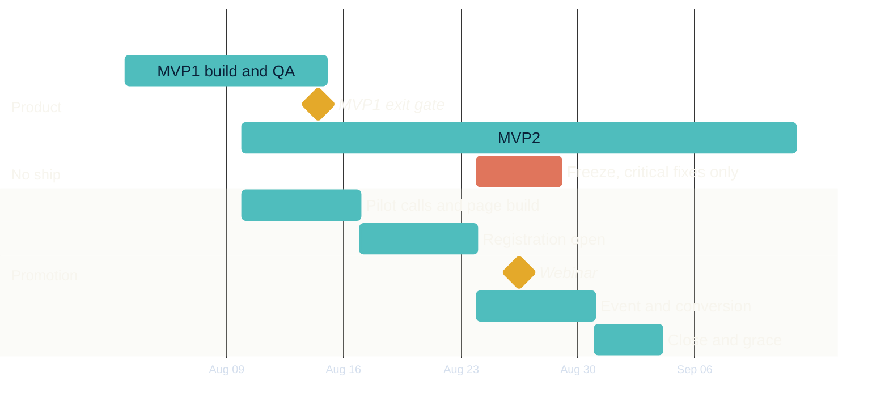

<!-- slide:aug-divider-01 -->

04

  
Section 04 · august, week by week

  
August, week by week

<v-clicks>

Five weeks, one shape. Every date below is calendar verified, and every date exists because of something in the audit.

two ctas for the whole month. no third one gets added in august.

</v-clicks>

august · the month, week by week

<!--
HOOK: This is the part you asked for. The month, on one page, with dates that hold.
BEATS:
  - "So that is the audit. Now August."
  - (click) "Five weeks, one shape. Every date I am about to show you is calendar verified, and every date is where it is because of something in that audit. Nothing here is a preference."
  - (click) "And two CTAs for the whole month. Book an AP Game Plan Call, or buy the forty seven dollar diagnostic. We do not add a third one in August."
TIMING: 15 sec
TRANSITION: "Here is the whole month on one screen, then I will walk each week."
-->

---
layout: default
---

<!-- slide:aug-spine-02 -->

04 · August · the spine, one screen

<h2 class="oa-h2 mt-2">Five weeks. One shape.</h2>

<v-clicks>

  
WK32

  
Setup + deliverability ramp

  
Aug 3 to 9. No promo sends. Fix the four blockers.

  
WK33

  
Build + pilot

  
Aug 10 to 16. John takes 3 to 4 calls. Reg page ships.

  
WK34

  
Open registration

  
Aug 17 to 23. Promo live. First segmented SMS.

  
WK35

  
Event + conversion

  
Aug 24 to 30. Webinar Wed Aug 26. Product freeze.

  
WK36

  
Close + last chance

  
Aug 31 to Sep 3. Hard close Mon 31. Grace to Thu Sep 3.

</v-clicks>

  

    
Coda · Sep 8 to 18 · the first-week reality check

    
School has started. They have now seen the syllabus and the first assignments.

    
Highest conviction window of the quarter. They are already on the list.

  

august · the five week spine

<!--
HOOK: The whole month before any detail, so nobody loses the thread later.
BEATS:
  - (click) "Week 32, this week. Setup and the deliverability ramp. No promotional sends at all."
  - (click) "Week 33. Build and pilot. I take three or four calls myself and the registration page gets built."
  - (click) "Week 34. Registration opens and the promo goes live."
  - (click) "Week 35 is the peak. The webinar is Wednesday the twenty sixth, and the product freezes around it."
  - (click) "Week 36. Hard close Monday the thirty first, grace through Thursday the third, then done."
  - (click) "And then the part I do not want us to forget. September eighth to the eighteenth. School has started, the family has seen the syllabus and the first assignments, and now the problem is real to them. That is the highest conviction window of the whole quarter and it costs nothing to reach. They are already on the list."
TIMING: 60 sec. This is the map. Slow down here, it pays for the next five slides.
TRANSITION: "So. This week. Week 32, which is already running."
-->

---
layout: default
---

<!-- slide:aug-wk32-03 -->

WK32 · Aug 3 to 9 · setup and deliverability ramp

<h2 class="oa-h2 mt-2">No promotional sends. This week makes next week land.</h2>

<v-clicks>

TUE 4Tonight. Lock targets, promise, close date, spend. John and Joe.

WED 5Suppression audit. 2,363 bounced parked, all 4,975 unsubscribed excluded. John.

THU 6UTM field ships. First re-engagement send, engaged slice only. John.

FRI 7Read the deliverability. Go or no-go on widening. John.

SAT 8Second wave to the next warmest tier, only if Friday was clean.

GATEBounce under 2 percent on Aug 6, or the list gets fixed first.

</v-clicks>

august · wk32 · setup and the ramp

<!--
HOOK: The only week in August with no selling in it, and it is the one that decides the rest.
BEATS:
  - "Week 32 has no promotional sends in it at all. Its whole job is to make next week's sends land."
  - (click) "Tuesday is tonight. Targets, the webinar promise, the close date, the spend."
  - (click) "Wednesday, the suppression audit. The two thousand three hundred and sixty three hard bounces get parked, and I confirm the four thousand nine hundred and seventy five unsubscribed are actually excluded from every send list, not just flagged."
  - (click) "Thursday, two things ship together. The hidden UTM field on the booking form, and the first re-engagement send. That send goes to the engaged slice only, the six hundred and seventy one carrying a tag plus recent openers. Not the file."
  - (click) "Friday I read it. Bounce rate, complaints, opens. That read decides whether we widen."
  - (click) "Saturday, a second wave to the next warmest tier, only if Friday came back clean."
  - (click) "And here is the gate for the week. Bounce under two percent on Thursday's send. If it is not under two, the list gets fixed before anything else ships. I will not spend your domain reputation to hit a date."
TIMING: 50 sec
TRANSITION: "Week 33 is where the two things we do not have get built."
-->

---
layout: center
---

<!-- slide:aug-wk33-04 -->

WK33 · Aug 10 to 16 · build and pilot

<h2 class="oa-h2 mt-2">Build the page. Run the call.</h2>

<v-clicks>

MON 10MVP1 final QA begins. Wenbo and Joe own the exit list.

MON-FRIWebinar registration page gets built. It does not exist today. John.

TUE-THUJohn takes 3 to 4 AP Game Plan Calls himself, off the WK32 sends.

THU 13Review the calls. Build the script, rubric and dispositions. John and Joe.

FRI 14MVP1 exit gate assessed, Joe's call. Webinar assets final, John's.

SAT 15Verify the $47 page from a home connection. John.

</v-clicks>

  
The script cannot be written <b>before the call has been run.</b>

august · wk33 · build and pilot

<!--
HOOK: Two things get built this week, and one of them is a page that does not exist.
BEATS:
  - (click) "Monday, MVP1 final QA begins. Wenbo and you own that exit list, not me."
  - (click) "Monday through Friday, the registration page gets built. That is the asset the audit says is missing, and I am building it."
  - (click) "Tuesday to Thursday I take three or four AP Game Plan Calls myself, off the bookings from this week's send."
  - (click) "Thursday you and I sit with the recordings and build the actual script, what makes a family qualified, and the call dispositions."
  - (click) "Friday is the MVP1 exit gate. That is your call, not mine. Same day the webinar assets go final, title, promise, page, reminder sequence, and that one is mine."
  - (click) "Saturday I check the forty seven dollar page from a home connection, because from here it answers a security challenge."
  - (click) "And the reason I take the first calls instead of handing out a script. The script cannot be written before the call has been run. Three real calls produce a rubric someone can hold. A rubric written in advance produces a script nobody can."
TIMING: 55 sec
TRANSITION: "Week 34, registration opens. And the runway is short, on purpose."
-->

---
layout: default
---

<!-- slide:aug-wk34-05 -->

WK34 · Aug 17 to 23 · open registration

<h2 class="oa-h2 mt-2">Registration opens Monday Aug 17.</h2>

<v-clicks>

MON 17Registration opens. Announce send to the mailable and warmed list.

TUE 18Tease 1. The problem, not the event.

WED 19Customer journey QA end to end. Release go or no-go.

THU 20Tease 2, plus the first segmented SMS.

FRI 21Confirm sales calendar capacity for Aug 26 to 31, in writing.

SAT 22Reminder send. One partner test: Timothy Freitas or Beth Hall.

RUNWAY9 days, Aug 17 to 26. Short because the page did not exist. Hold it.

</v-clicks>

august · wk34 · open registration

<!--
HOOK: The promo goes live. Everything before this was preparation.
BEATS:
  - (click) "Monday the seventeenth, registration opens. Announce send to the full mailable and warmed list."
  - (click) "Tuesday, Tease 1. The problem, not the event."
  - (click) "Wednesday, I walk the customer journey end to end. Link, page, form, CRM, booking, notification, calendar hold. That QA is also the release go or no-go for the week."
  - (click) "Thursday, Tease 2 and the first segmented SMS."
  - (click) "Friday, we confirm sales calendar capacity for the twenty sixth through the thirty first. In writing, not verbally, because that is the week the calls actually land."
  - (click) "Weekend, a reminder send and one light partner test. Timothy Freitas or Beth Hall. One, not both, because two tests in the same week means neither one tells us anything."
  - (click) "And the flag. That is nine days of registration runway, seventeenth to the twenty sixth. It is tight. It is nine days because the page did not exist, and I would rather have nine honest days than pretend we had three weeks. Do not let anything compress it further."
TIMING: 55 sec
TRANSITION: "Week 35 is the peak. Freeze on, event, then conversion."
-->

---
layout: center
---

<!-- slide:aug-wk35-06 -->

WK35 · Aug 24 to 30 · event and conversion

<h2 class="oa-h2 mt-2">The peak week. Everything serves Wednesday.</h2>

<v-clicks>

MON 24Product release freeze begins. Critical fixes only, through Aug 28.

MON 24Final reminder. What you will walk away with.

TUE 2524 hour reminder. Pre-call push to anyone already booked.

WED 26The webinar. Day-of reminders at 9am, 3pm and 15 minutes.

THU 27Replay send. Attendees route into intake and booking.

FRI 28Proof and objection handling. Freeze lifts end of day.

SAT-SUNReplay viewers and incomplete intakes, worked separately.

</v-clicks>

august · wk35 · event and conversion

<!--
HOOK: One week, one job. Get families in the room and then convert what the room produces.
BEATS:
  - (click) "Monday the twenty fourth, the product freeze starts. Critical fixes only, through Friday. I will come back to why in a minute."
  - (click) "Monday also carries the final reminder. What you will walk away with."
  - (click) "Tuesday, the twenty four hour reminder, plus a pre-call push to anyone who already booked."
  - (click) "Wednesday is the event. Day-of reminders at nine, at three, and fifteen minutes out. Those three sends do most of the work on attendance."
  - (click) "Thursday, replay goes out and attendees route into intake and booking."
  - (click) "Friday, proof and objection handling, and the freeze lifts end of day."
  - (click) "Weekend, two follow-ups worked separately. People who watched the replay, and people who started intake and did not finish. Different message, because they are in different places."
TIMING: 55 sec
TRANSITION: "That Wednesday deserves its own slide, because everything else in August exists to fill it."
-->

---
layout: center
class: text-center
---

<!-- slide:aug-webinar-07 -->

  
  The one date everything else serves

The webinar is Wednesday August 26.

  

Verified Wednesday

AUG 26

  

Eastern

7:00 PM

  

Pacific

4:00 PM

  

    
day-of sends: 9am · 3pm · 15 minutes

    
Three sends, one job. Attendance.

  

four weeks of work exist to put families in that room

august · the webinar · wed aug 26, 7:00 pm et

<!--
HOOK: Say the date and the time out loud, slowly, once. Then stop talking.
BEATS:
  - "Wednesday, August twenty sixth."
  - (click) "Seven PM Eastern, four PM Pacific. And it is a Wednesday, I checked the calendar rather than trusting the draft."
  - (click) "Three sends on the day itself. Nine in the morning, three in the afternoon, fifteen minutes out. Those three have one job and it is not persuasion, it is attendance."
  - (click) "Everything in the four weeks before this exists to put families in that room. That is the whole point of the calendar."
TIMING: 35 sec. Hold two full seconds after the date before you click.
TRANSITION: "Then week 36 closes it. And this is where I changed one of your dates."
-->

---
layout: default
---

<!-- slide:aug-wk36-08 -->

WK36 · Aug 31 to Sep 3 · close and last chance

<h2 class="oa-h2 mt-2">Four days. Then it is over.</h2>

<v-clicks>

MON 31Hard close. Deadline sends AM and PM. The deadline is real.

TUE-THUGrace period. Engaged contacts only. Nobody who never opened.

THU 3Closed. No extension. Performance and operational review the same day.

</v-clicks>

  
A deadline that moves once <b>is never believed again.</b>

the Sep 3 review scores booked and showed separately. booked is a promise, showed is the number.

august · wk36 · close and last chance

<!--
HOOK: Short week, hard edge. The close is the cheapest revenue in the month if we hold it.
BEATS:
  - (click) "Monday the thirty first is the hard close. Two deadline sends, morning and evening."
  - (click) "Tuesday to Thursday is grace. Engaged contacts only. Nobody who never opened gets a last chance email, because that is how you undo the deliverability work from week 32."
  - (click) "Thursday the third it is closed. No extension. And we run the performance and operational review the same day, while it is still fresh."
  - (click) "One line on why I am rigid about this. A deadline that moves once is never believed again. Every future close in this business gets weaker the first time we blink."
  - (click) "And the review on the third scores booked and showed separately. Booked is a promise. Showed is the number."
TIMING: 40 sec
TRANSITION: "Which brings me to the one date in your draft I actually changed."
-->

---
layout: center
---

<!-- slide:aug-datechange-09 -->

The one date I changed · and exactly why

<h2 class="oa-h2 mt-2">Aug 29 to 31 is Saturday, Sunday, Monday.</h2>

  

Sat Aug 29

Weekend

  

Sun Aug 30

Weekend

  

Mon Aug 31

Sales day

Two of the three heaviest deadline days would land when nobody can take a call. Bookings slide into the following week, and the deadline reads soft.

  

    
the change

    
The weekend becomes the final push. The hard close is Monday Aug 31. Same energy, and it lands on a day sales can work.

  

august · the one date that changed

<!--
HOOK: Not a preference. A calendar fact with a revenue consequence.
BEATS:
  - "Your draft had the official close running the twenty ninth to the thirty first. I put that against a calendar."
  - (click) "Twenty ninth is a Saturday. Thirtieth is a Sunday. Thirty first is a Monday."
  - (click) "So two of the three heaviest deadline days would land when nobody can take a call. Which means the bookings pile into the following week anyway, and worse, the deadline reads soft to the reader because nothing happens when it passes."
  - (click) "So the weekend becomes the final push, and the hard close is Monday the thirty first. Same energy, same pressure, and it lands on a day sales can actually work. That is the only date I moved on you."
TIMING: 45 sec
TRANSITION: "Now the part that only works if both sides of the business are on the same calendar. Product."
-->

---
layout: default
---

<!-- slide:aug-interlock-10 -->

04 · August · product and promotion, one calendar

<h2 class="oa-h2 mt-2">A release and a peak must never touch.</h2>

the MVP1 gate sits three days before registration opens · MVP2 runs straight through the event · both are fine, if they are planned

august · the product interlock

<!--
HOOK: The reason to put product and promotion on one calendar is so a collision is visible instead of argued about.
BEATS:
  - (click) "Top band is product. MVP1 builds and QAs into the fourteenth, and the gold diamond is your gate on the fourteenth. MVP2 starts on the tenth and runs to September eleventh."
  - "Middle band is the freeze. The twenty fourth to the twenty eighth, critical fixes only."
  - "Bottom band is the promotion. Pilot and build, registration open, then the event week with the webinar diamond on the twenty sixth, then the close."
  - (click) "Two collisions, and I want them visible rather than discovered. The MVP1 gate sits three days before registration opens. And MVP2 runs straight through the event week. Both of those are fine. They are only a problem if nobody planned for them."
TIMING: 50 sec. Walk the three bands with your cursor, left to right, do not read the labels aloud.
TRANSITION: "So here are the release rules that fall out of that picture."
-->

---
layout: center
---

<!-- slide:aug-freeze-11 -->

04 · August · release discipline

<h2 class="oa-h2 mt-2">Nothing ships into the peak.</h2>

<v-clicks>

01No major release within 48 hours of the webinar.

02None during the Aug 31 deadline sends.

03None on an SMS day.

04None during a customer migration.

</v-clicks>

  
Skool stays. It goes when the platform does the whole job, <b>never because the pages exist.</b>

the whole job: hosts video reliably · organises content · grants correct access · supports parent and student accounts and credits · onboards · communicates · captures activity

august · freeze rules and the skool ruling

<!--
HOOK: Four rules, and one ruling about Skool that I want said out loud tonight.
BEATS:
  - (click) "No major release within forty eight hours of the webinar."
  - (click) "None during the Monday the thirty first deadline sends."
  - (click) "None on an SMS day, because an SMS drives a spike of traffic to a page in the same hour."
  - (click) "And none during a customer migration."
  - (click) "Then Skool. Skool stays. It gets replaced when the platform does the whole job, never because the pages exist."
  - (click) "And the whole job is specific. Hosts video reliably. Organises content. Grants correct access. Supports parent and student accounts and the credits. Onboards. Communicates. Captures activity. That is seven things, and the pages being built is none of them. The day all seven are true, we move, and not a week before."
TIMING: 45 sec
TRANSITION: "Last piece of August. The sends themselves."
-->

---
layout: default
---

<!-- slide:aug-sends-12 -->

04 · August · the send structure · no copy written yet, on purpose

<h2 class="oa-h2 mt-2">Sixteen slots. One job each.</h2>

<table class="oa-table">
<thead>
<tr><th>Slot</th><th>Date</th><th>The job of this send</th><th>Awareness</th></tr>
</thead>
<tbody>
<tr><td>01 Re-engage</td><td>Aug 6</td><td>Are you still in this? Get a reply.</td><td></td></tr>
<tr><td>02 Re-engage</td><td>Aug 8</td><td>Second tier, only if Friday was clean.</td><td></td></tr>
<tr><td>03 Announce</td><td>Aug 17</td><td>Name the event and the date. Doors open.</td><td>Problem</td></tr>
<tr><td>04 Tease 1</td><td>Aug 18</td><td>What happens to AP grades in weeks 3 to 6.</td><td>Problem</td></tr>
<tr><td>05 Tease 2</td><td>Aug 20</td><td>Why a tutor after the bad grade is too late.</td><td>Solution</td></tr>
<tr><td>06 SMS 1</td><td>Aug 20</td><td>Registration link, one line.</td><td></td></tr>
<tr><td>07 Reminder</td><td>Aug 22</td><td>A family who did this in a prior year.</td><td>Product</td></tr>
<tr><td>08 Reminder</td><td>Aug 24</td><td>What you will walk away with.</td><td>Product</td></tr>
</tbody>
</table>

august · the send structure · slots 1 to 8

<!--
HOOK: This is the frame the copy gets written into, not the copy.
BEATS:
  - "Sixteen send slots across the month, SMS included. Each slot has exactly one job, and the job is written before a word of copy is."
  - (click) "First two are the re-engagement sends from week 32. Their job is a reply and a clean domain, not a sale."
  - "Then the announce on the seventeenth. Name the event, name the date."
  - "Then the two teases, and watch the awareness column move. Problem, then solution. That is deliberate."
  - "SMS one carries the link, one line, nothing else."
  - "Then two reminders that move to product awareness. Proof, then what they walk away with."
  - "And no copy is written yet. That is on purpose. Copy gets drafted after you sign off on this spine, so we do not write the argument twice."
TIMING: 45 sec. Do not read the table row by row. Read the shape of the awareness column.
TRANSITION: "Back half of the month is where the money actually shows up."
-->

---
layout: default
---

<!-- slide:aug-sends-13 -->

04 · August · the back half, event to close

<h2 class="oa-h2 mt-2">The back half is where it converts.</h2>

<table class="oa-table">
<thead>
<tr><th>Slot</th><th>Date</th><th>The job of this send</th><th>Awareness</th></tr>
</thead>
<tbody>
<tr><td>09 Reminder</td><td>Aug 25</td><td>24 hours. Remove every reason not to attend.</td><td>Most aware</td></tr>
<tr><td>10 Day-of</td><td>Aug 26</td><td>Three sends: 9am, 3pm, 15 minutes. Attendance.</td><td></td></tr>
<tr><td>11 SMS 2</td><td>Aug 26</td><td>The 15 minute warning.</td><td></td></tr>
<tr><td>12 Replay</td><td>Aug 27</td><td>The replay and the single strongest moment.</td><td>Product</td></tr>
<tr><td>13 Objection</td><td>Aug 28</td><td>The two objections the pilot calls surfaced.</td><td>Most aware</td></tr>
<tr><td>14 Follow-up</td><td>Aug 29</td><td>Replay viewers and incomplete intakes.</td><td>Most aware</td></tr>
<tr><td>15 Close</td><td>Aug 31</td><td>AM and PM. The deadline is real.</td><td>Most aware</td></tr>
<tr><td>16 Last chance</td><td>Sep 1 to 3</td><td>Engaged contacts only. Then closed.</td><td>Most aware</td></tr>
</tbody>
</table>

august · the send structure · slots 9 to 16

<!--
HOOK: Nine sends in seven days, and every one of them has a different job.
BEATS:
  - (click) "Twenty fifth, the twenty four hour reminder. Its job is to remove every remaining reason not to show up."
  - "Twenty sixth, the three day-of sends plus the fifteen minute SMS. Attendance, nothing else."
  - "Twenty seventh, the replay plus the single strongest moment from the night."
  - "Twenty eighth, objections. And note where those come from. The two objections we handle are the ones the pilot calls on the eleventh to thirteenth actually surfaced, not the ones we guess at."
  - "Twenty ninth, follow-up split two ways. Replay viewers, and people who started intake and stopped."
  - "Thirty first, the close, morning and evening."
  - "First to the third, last chance to engaged contacts only. Then it is shut."
TIMING: 40 sec
TRANSITION: "Two rulings sit under all sixteen of those, and then I am done with August."
-->

---
layout: center
---

<!-- slide:aug-sendrules-14 -->

04 · August · what governs the copy

<h2 class="oa-h2 mt-2">Two of the sixteen carry the argument.</h2>

  
Teases 1 and 2 are the load-bearing sends. <b>That is where the cause for argument gets built.</b>

The external shift is that AP courses now punish the families who wait for a bad grade. The internal pressure gets named and never claimed. Registration mechanics ride along. They are not the message.

  
Segments, minimum viable

  

    AP parents
    college and Common App
    existing customers
    unengaged: out of the promo, worked separately
  

do not build more segments than you will actually write differently for

august · the two rulings on the copy

<!--
HOOK: If only two of the sixteen sends were written well, it should be these two.
BEATS:
  - (click) "Teases one and two are the load-bearing sends. They are where the cause for argument gets built, and everything after them is just mechanics."
  - (click) "The external shift is that AP courses now punish the families who wait for a bad grade. We name the internal pressure the parent is already feeling, and we never claim it for them. The registration link rides along inside those emails. It is not the message."
  - (click) "Four segments and no more. AP parents. College and Common App. Existing customers. And unengaged, who come out of the promo entirely and get worked separately."
  - (click) "The rule on segments is simple. Do not build more of them than you will actually write differently for. A segment you do not write differently for is a reporting line, not a segment."
TIMING: 45 sec
TRANSITION: "That is August, end to end. Which leaves how we run it week to week, and the calls that are yours tonight."
-->
