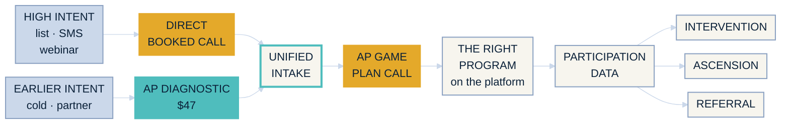

<!-- slide:eco-divider-01 -->

02

  
Section 02

  
One ecosystem

  
Two roads in. One machine. One number that says whether it is running.

one ecosystem · the map before the detail

<!--
HOOK: Before I show you what the audit found, I want to show you the picture it found it in.
BEATS:
  - "Here is why I am putting the map before the findings. Half of what looks like four separate problems is one problem, and you can only see that against the whole system."
  - (click) "Two roads in. One machine. And one number that tells us whether the machine is running."
TIMING: 12 sec
TRANSITION: "So here it is. All of it, one screen."
-->

---
layout: default
---

<!-- slide:eco-map-02 -->

02 · One ecosystem · the whole system, one screen

<h2 class="oa-h2 mt-2">Every road ends in the same place.</h2>

two entry roads · one intake · one call that matters · one data spine that feeds three exits

one ecosystem · the map

<!--
HOOK: This is the whole thing. Nothing we do between now and December sits outside this diagram.
BEATS:
  - (click) "Left side, two roads in. High intent is our own list, our SMS and the webinar audience. Earlier intent is cold traffic and partners."
  - "High intent goes straight to a booked call. They already know you. Selling them something small on the way in is a downgrade."
  - "Earlier intent buys the forty seven dollar AP Diagnostic. Small step, real money, and it hands us information."
  - "Now watch the middle. Both roads land in the same intake. Not two intakes. One."
  - "Intake feeds the AP Game Plan Call. The call routes the family to the right program. The program runs on the platform, and the platform produces participation data."
  - "Participation data is what makes the last three possible. Intervention when a student slips. Ascension when they are ready for more. Referral when it worked."
  - (click) "That is the machine. Everything else tonight is a piece of this."
TIMING: 75 sec. This is the STOP beat. Slow right down, walk the arrows with your cursor.
TRANSITION: "First question this always raises. Does the cheap road eat the expensive one. No, and here is why."
-->

---
layout: default
---

<!-- slide:eco-readiness-03 -->

02 · One ecosystem · why the two lanes do not compete

<h2 class="oa-h2 mt-2">Not two offers. Two levels of readiness.</h2>

<v-clicks>

  
Road 1 · direct booked call

  
For the family that already knows something is wrong.

  
Nothing has to be proved to them first. A small purchase on the way in only adds a step.

  
Road 2 · the $47 AP Diagnostic

  
For the family that needs a smaller first step.

  
A call is too big an ask tonight. Something real for forty seven dollars is not.

</v-clicks>

No family chooses between them. Their readiness puts them on one road or the other.

one ecosystem · readiness, not price

<!--
HOOK: These two are not fighting over the same family.
BEATS:
  - (click) "Road one is the family who already knows something is wrong. They trust you, they want help, and they will get on a call. Charging that family forty seven dollars first is a downgrade of a warm buyer."
  - (click) "Road two is the family who is not there yet. A call is too big tonight. Forty seven dollars for something real is not."
  - (click) "So nobody picks. Their readiness picks for them. Our job is to have a door open for both."
TIMING: 35 sec
TRANSITION: "And you can tell which family you are looking at in about five seconds. Here are the signals."
-->

---
layout: center
---

<!-- slide:eco-fit-04 -->

02 · One ecosystem · who takes which road

<h2 class="oa-h2 mt-2">They tell you which road they are on.</h2>

  Book an AP Game Plan Call
  

  <v-clicks>

  
Already recognises the problem

  
Already trusts SupportED

  
Wants help now, not information

  
Will speak to a human about it

  </v-clicks>
  

  Buy the $47 AP Diagnostic
  

  <v-clicks>

  
Needs a smaller first step

  
Not ready to book anything

  
Needs evidence the problem is real

  
Wants to know what their student needs

  
Wants to experience us before a bigger decision

  </v-clicks>
  

one ecosystem · the readiness test

<!--
HOOK: Four signals on the left, five on the right, and a family sorts itself in about five seconds.
BEATS:
  - (click) "Recognises the problem." (click) "Trusts you." (click) "Wants help now, not more information." (click) "And will speak to a human. That family gets asked for a call. Nothing else."
  - (click) "Needs a smaller step." (click) "Not ready to book." (click) "Needs evidence the problem is real." (click) "Wants to know what their own kid actually needs." (click) "And wants to feel what we are like before spending real money."
  - "Every cold click and every partner lead lands in the right column. That is the reason the forty seven dollar product exists at all."
TIMING: 50 sec
TRANSITION: "Which brings me to the honest part about what that product does for us in the near term."
-->

---
layout: center
---

<!-- slide:eco-lt-expectation-05 -->

02 · One ecosystem · the honest expectation

  
What the $47 lane is for right now

  
The near-term job is not a flood of high-ticket deals.

The job is to build one channel and validate it. That is the whole brief.

If direct booking ever hits a ceiling, this is <b>already a road in</b>, not a project we start from zero under pressure.

one ecosystem · the honest expectation

<!--
HOOK: I want to set the expectation on the low ticket before we build anything on top of it.
BEATS:
  - "If the forty seven dollar lane prints high ticket sales in week one, great. That is not what I am underwriting, and I do not want us judging it on that."
  - (click) "The job is to build one channel and validate it. A channel that behaves the same way twice is worth more than a lucky month."
  - (click) "And here is the strategic reason to build it while direct booking is still working. The day direct booking hits a ceiling, this is already a road in. Not something we start from zero with the pressure on."
TIMING: 40 sec
TRANSITION: "So what does validated actually mean. Six outputs, and I want us honest about which one counts."
-->

---
layout: default
---

<!-- slide:eco-lt-outputs-06 -->

02 · One ecosystem · what the channel has to produce

<h2 class="oa-h2 mt-2">Validated means all six of these.</h2>

<v-clicks>

  
01 · Buyers

  
Paid, not curious.

  
02 · Diagnostic data

  
The real gap, in writing.

  
03 · Engagement

  
Contact before the ask.

  
04 · Qualified families

  
Sorted, not guessed at.

  
05 · Booked calls

  
From a cold start.

  
06 · Predictability

  
Same in, same out.

</v-clicks>

Five of those show up fast. The sixth is the only one that lets us spend more.

one ecosystem · six outputs

<!--
HOOK: Six outputs. All six and the channel is real. Four of six and it was a promotion.
BEATS:
  - (click) "Buyers. Someone who paid us money is a different human being from someone who downloaded something."
  - (click) "Diagnostic data. We learn what the student actually needs before anyone gets on a call."
  - (click) "Engagement. We are in contact with them before we ask for anything big."
  - (click) "Qualified families. Sorted by what they told us, not guessed at by us."
  - (click) "Booked calls. Same destination as road one, reached from a cold start."
  - (click) "And predictability. Same money in, same result out."
  - (click) "The first five we will see almost immediately. The sixth takes weeks, and it is the only one that earns a bigger budget."
TIMING: 50 sec
TRANSITION: "All six of those depend on one piece being right, and it is the least glamorous box on the map."
-->

---
layout: default
---

<!-- slide:eco-intake-07 -->

02 · One ecosystem · the load-bearing piece

<h2 class="oa-h2 mt-2">One intake. Whichever road they came in on.</h2>

<v-clicks>

  
One form

  
Both roads fill in the same one.

  
Nobody builds or maintains a second version of it.

  
One data shape

  
Same fields, same names.

  
A call booker and a $47 buyer become directly comparable.

  
One attribution record

  
Written at the booking event.

  
Not inherited from whenever the contact first appeared.

</v-clicks>

This is the piece that makes it <b>one ecosystem</b> instead of two lanes that never meet.

one ecosystem · the unified intake

<!--
HOOK: If one box on that map has to be right, it is this one, and it is the boring one.
BEATS:
  - (click) "One form. Both roads fill in the same intake, so we are never maintaining two of anything."
  - (click) "One data shape. Same fields, same names, so a family who booked off an email and a family who bought the diagnostic can be compared side by side."
  - (click) "One attribution record, written at the moment they book. Not inherited from whenever that contact first landed in the system."
  - (click) "Get this right and the two lanes are one ecosystem. Get it wrong and we have two disconnected funnels and no way to tell which one is working."
TIMING: 45 sec
TRANSITION: "Which is what lets the whole month collapse down to two asks. Two."
-->

---
layout: center
---

<!-- slide:eco-two-ctas-08 -->

02 · One ecosystem · the asks

<h2 class="oa-h2 mt-2">Two CTAs for the whole month. No third.</h2>

<v-clicks>

  

    
Main list + webinar audience

    
Warm. They already know us.

  

  Book an AP Game Plan Call

  

    
Cold traffic + partner traffic

    
Earlier. No relationship yet.

  

  Buy the $47 AP Diagnostic

</v-clicks>

  Ruling
  Partners, the college segment and existing customers are not a third CTA. Each one routes into one of these two.

one ecosystem · two CTAs, no third

<!--
HOOK: The whole month has two asks in it. Anything that wants to be a third ask is exactly what broke July.
BEATS:
  - (click) "Main list and the webinar audience get one ask. Book an AP Game Plan Call."
  - (click) "Cold and partner traffic get one ask. Buy the forty seven dollar AP Diagnostic."
  - (click) "And this is the ruling I want us to hold all month. Partners are not a third CTA. The college segment is not a third CTA. Existing customers are not a third CTA. Every one of them routes into one of those two."
  - "The moment a good idea gets its own ask, we are straight back to four initiatives fighting over the same audience and the same calendar."
TIMING: 45 sec
TRANSITION: "Two asks, one intake. So there is one number. Just one."
-->

---
layout: center
class: text-center
---

<!-- slide:eco-metric-09 -->

  
  02 · One ecosystem · the one metric

AP Game Plan Calls showed.

Not booked. Showed.

Booked is a promise. <b>Showed is the business.</b>

one ecosystem · the one metric

<!--
HOOK: One number for this whole plan. Everything else is diagnostic.
BEATS:
  - "AP Game Plan Calls showed."
  - (click) "Not booked. Showed."
  - (click) "Booked is a promise. Showed is the business. A full calendar with half the seats empty is not a pipeline, it is a story we tell ourselves on a Friday."
  - "Every asset, every send and every dollar of spend gets judged against that one number, and it is the number I want on the scorecard."
TIMING: 35 sec. Say the last line, then stop talking for two full seconds.
TRANSITION: "That is the machine on paper. Now here is the machine as it actually exists tonight."
-->

---
layout: default
---

<!-- slide:eco-surfaces-10 -->

02 · One ecosystem · the estate as it exists tonight

<h2 class="oa-h2 mt-2">The real surfaces. Captured Aug 3.</h2>

<v-clicks>

  

  
acingapexams.com · the cold and ad surface

  

  
supportedtutoring.com · the main site

  

  
the live booking page · this is the COLLEGE session, not AP

  

  
apstrattool.supportedtutoring.com · the AP strategy tool

</v-clicks>

Four live surfaces, four different jobs, and no single map that says which road each one serves.

one ecosystem · the live estate

<!--
HOOK: That was the map. This is the estate. Real screens, pulled yesterday, nothing mocked up.
BEATS:
  - (click) "Acing AP Exams. That is the cold surface, the one ads would point at."
  - (click) "Supported Tutoring. The main site, and the surface your list already knows."
  - (click) "The live booking page. Read the title on it. That is the College Strategy Session, not the AP Game Plan Call. Right now warm AP traffic books itself into a college call."
  - (click) "And the AP strategy tool, which is a genuinely good asset sitting off to the side of the funnel with no road pointing at it."
  - (click) "Four surfaces, four jobs, all live tonight. None of them wrong on its own. There has just never been one map that says which road each one serves."
TIMING: 50 sec. Let each screenshot land; this is the format change, do not narrate over it.
TRANSITION: "And once they are all on one map, four things stop looking cosmetic. That is the audit."
-->
