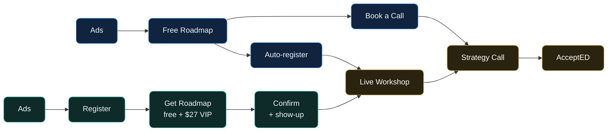

<!-- slide:cover-01 -->

SupportED / AcceptED · internal team memo

<h1 style="font-size: 3.5rem;">The Roadmap + Workshop Funnel</h1>

How leads flow from ad to enrollment, the framing per entry, and the assets you already have to run it.

Two entry paths. One destination. The live workshop.

Webinar Funnel Builder · v1 · June 2026

---
layout: center
---

<!-- slide:big-idea-02 -->

the big idea

<h2 style="font-size: 2.3rem; margin-bottom: 2.2rem;">Three steps. Each one earns the next.</h2>

<h3>1 · The Roadmap</h3>

The value hook. A free, personalized diagnostic that pulls them in and tells us who is serious.

<h3>2 · The Workshop</h3>

The indoctrination engine. We pop misconceptions, aha-stack, and build trust live.

<h3>3 · The Call</h3>

The close. Diagnose live, then present AcceptED, the Complete Pathway.

Every ad sells the next step, never the program.

---
layout: center
class: text-center
---

<!-- slide:flowchart-03 -->

how it works · the full flow

Path A  roadmap-first

Path B  workshop-first

Both converge  at the workshop

---
layout: center
---

<!-- slide:path-a-04 -->

Path A · Roadmap-first

<h2 style="font-size: 2rem; margin-bottom: 1.8rem;">They come for the roadmap. We auto-register them for the workshop.</h2>

1
<b>Ad</b> sells the free roadmap. The roadmap is the hook.

2
<b>Free Roadmap</b> opt-in. Personalized diagnostic delivered. "normally $47, free now"

3
They <b>book a strategy call</b> AND get <b class="wfb-teal">auto-registered for the workshop</b> to indoctrinate further.

4
<b>Attend the workshop</b> → strategy call → AcceptED.

---
layout: center
---

<!-- slide:path-b-05 -->

Path B · Workshop-first &nbsp;(the assumptive one)

<h2 style="font-size: 2rem; margin-bottom: 1.8rem;">They register for the workshop. The roadmap is the second commitment on the way in.</h2>

1
<b>Ad</b> sells the Roadmap Workshop.

2
<b>Register</b> for the workshop (the opt-in).

3
Next page: <b>get your custom roadmap</b> — free, with an optional <b class="wfb-gold">$27 VIP bump</b>. A second commitment.

4
<b>Confirmation</b> (confetti + show-up incentive) → workshop → call → AcceptED.

---
layout: center
---

<!-- slide:framing-06 -->

the framing · meet them where they entered

<h2 style="font-size: 2rem; margin-bottom: 1.8rem;">Same destination, different angle of approach.</h2>

<h3>Roadmap-first</h3>

They already raised their hand for value. Framing: "you got the roadmap, now come see exactly how to use it live." Warm, value-continuation.

<h3>Workshop-first</h3>

They committed to a live event. Framing: "before the workshop, lock in your custom roadmap so you get the most out of it." Assumptive, prep-driven.

One indoctrination + reminder sequence (email + SMS) runs across both, adapting the opening line to where they came from.

---
layout: center
---

<!-- slide:positioning-07 -->

why people say yes · the positioning

<h2 style="font-size: 2rem; margin-bottom: 1.8rem;">Three pillars. This is what makes us different.</h2>

<h3>Academic company first</h3>

We do AP / SAT / ACT tutoring <b>in house</b>. Most advisors only touch essays and activities, then send you elsewhere.

<h3>The Complete Pathway + Ivy</h3>

Coaching + AP + tutoring <b>under one roof</b>. Empowerly, Crimson, Zenith charge ~$30k to advise only. We do the whole thing.

<h3>Transparent pricing</h3>

<b>$3,800&ndash;$9,997 shown upfront.</b> "I hate that nobody gives you a range." Leads stop bouncing on a hidden number.

---
layout: center
---

<!-- slide:assets-08 -->

assets available · what you already have

<h2 style="font-size: 2rem; margin-bottom: 1.6rem;">Most of this is built. Here is the inventory.</h2>

<h3>Creative + copy</h3>
<ul style="margin:0; padding:0;">
<li class="wfb-li">Roadmap ads <b>recording runbook</b> (in Drive, ready for Joe)</li>
<li class="wfb-li">New college ads + new AP ads (recorded, clean audio)</li>
<li class="wfb-li">Copy-brain RAG: winning hooks, openers, bodies</li>
</ul>

<h3>Funnel + automation</h3>
<ul style="margin:0; padding:0;">
<li class="wfb-li">Live roadmap quiz + college application funnels</li>
<li class="wfb-li">Roadmap auto-generation (GHL automation)</li>
<li class="wfb-li">Auto-register + indoctrination nurture (proven template)</li>
</ul>

---
layout: center
---

<!-- slide:assets-09 -->

assets available · tracking + the workshop

<h3>Tracking</h3>
<ul style="margin:0; padding:0;">
<li class="wfb-li">Meta pixel + CAPI live (optimize for <b>Lead</b>)</li>
<li class="wfb-li">AP lead notifications fixed and firing</li>
<li class="wfb-li">Per-funnel spend, leads, and CPL visible</li>
</ul>

<h3>The workshop</h3>
<ul style="margin:0; padding:0;">
<li class="wfb-li">"College Acceptance Roadmap Workshop" (working name)</li>
<li class="wfb-li">Short VSL for indoctrination (modeled on the proven one)</li>
<li class="wfb-li">Slidev deck, Fladlien-standardized, built from the script</li>
</ul>

Gaps we are closing: the GHL email load, the registration → CAPI event, and the final workshop script.

---
layout: center
---

<!-- slide:roles-10 -->

who owns what

<h2 style="font-size: 2rem; margin-bottom: 1.8rem;">Clear lanes, no overlap.</h2>

<h3>Marketing + Ops</h3>

Ads live and tracked. Pages built simple. GHL automation, auto-register, nurture, CAPI.

<h3>Joe</h3>

Record ads clean (QC before sending). Run the live workshop and crush it.

<h3>Sales</h3>

Work registrants + roadmap leads. Run the strategy calls. Close AcceptED.

<h3>Everyone</h3>

Keep the funnel congruent. One message, ad to call. The roadmap is always the hook.

---
layout: center
class: text-center
---

<!-- slide:close-11 -->

the standard

<h2 style="font-size: 2.4rem; max-width: 50rem; margin: 0 auto 1.6rem;">
The roadmap pulls them in. The workshop earns the trust. The call closes.
</h2>

Keep the pages simple, the copy sharp, and the next step obvious. We test one thing at a time and scale what wins.

SupportED / AcceptED · Webinar Funnel Builder · build #1

